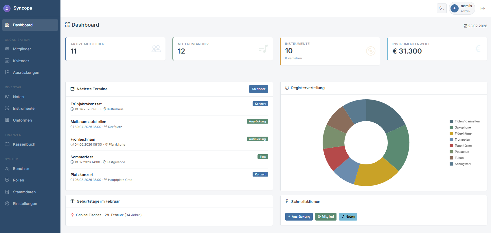

# 🎵 SYNCOPA - Musikvereinsverwaltung

[](https://github.com/yourname/syncopa)
[](https://php.net)
[](LICENSE)
[]()

Eine moderne, umfassende Webapplikation zur Verwaltung von Musikvereinen. Entwickelt mit PHP 8, Bootstrap 5 und MySQL.


---

## DEMO

https://syncopa.dannerbam.eu/

Admin Login

- Benutzer: admin
- Passwort: admin123

## 📋 Inhaltsverzeichnis

1. [Funktionsübersicht](#funktionsübersicht)
2. [Systemvoraussetzungen](#systemvoraussetzungen)
3. [Installation](#installation)
4. [Konfiguration](#konfiguration)
5. [Benutzerrollen](#benutzerrollen--berechtigungen)
6. [Module im Detail](#module-im-detail)
7. [API-Dokumentation](#api-dokumentation)
8. [Datenbankstruktur](#datenbankstruktur)
9. [Sicherheit](#sicherheit)
10. [Troubleshooting](#troubleshooting)

---

## 🎯 Funktionsübersicht

### Kernmodule

| Modul | Beschreibung |
|-------|--------------|
| **Mitglieder** | Vollständige Stammdatenverwaltung mit Instrumentenzuordnung |
| **Instrumente** | Inventarverwaltung, Verleih und Wartungshistorie |
| **Noten** | Digitaler Notenkatalog mit Archivnummern |
| **Ausrückungen** | Termine, Anwesenheit und Programmplanung |
| **Kalender** | Interaktiver Kalender mit iCal-Export |
| **Finanzen** | Einnahmen, Ausgaben und Mitgliedsbeiträge |
| **Uniformen** | Trachtenverwaltung und Ausgabehistorie |
| **Benutzer** | Rollenbasierte Zugriffsverwaltung |

---

## ✨ Features

### Kernfunktionen

- **👥 Mitgliederverwaltung** - Stammdaten, Instrumente, Register, Status
- **🎺 Instrumenteninventar** - Verleih, Wartung, Versicherungswerte
- **🎼 Notenarchiv** - PDF-Upload, Schwierigkeitsgrade, Archivnummern
- **📅 Kalender & Ausrückungen** - Termine, Anwesenheit, iCal-Export
- **💰 Finanzen** - Kassenbuch, Mitgliedsbeiträge, Berichte
- **👔 Uniformverwaltung** - Trachten, Größen, Ausgabe/Rückgabe
- **🔐 Benutzerverwaltung** - Rollen, Berechtigungen, Google OAuth

### Highlights

- 🌓 **Dark/Light Mode** - Automatisch oder manuell umschaltbar
- 📱 **Responsive Design** - Optimiert für Desktop, Tablet & Smartphone
- 🔔 **Dashboard** - Geburtstage, anstehende Termine, Statistiken
- 📊 **Charts** - Visualisierung von Mitglieder- und Finanzstatistiken
- 📤 **iCal-Export** - Kalender-Abo für Google Calendar, Outlook, etc.

---

## 🚀 Schnellstart

### Voraussetzungen

- PHP 8.0+ mit Extensions: `pdo_mysql`, `mbstring`, `json`, `fileinfo`
- MySQL 8.0+ oder MariaDB 10.4+
- Apache 2.4+ mit `mod_rewrite` oder Nginx

### Installation

- ZIP Datei von den Releases runterladen
- diese ZIP auf deinen Server in den gewünschten Ordner (syncopa) laden und entpacken (ggf. zuerst entpacken und dann hochladen falls der Server das Entpacken nicht unterstützt)
- wenn keine vorhanden ist dann eine Datenbank erstellen
- ```database.sql``` von der ZIP importieren
- ```config.php``` Datei anpassen
- Verzeichnisrechte von ```uploads/``` auf 755 setzen

### Erster Login

| | |
|---|---|
| **URL** | `http://localhost/syncopa/` |
| **Benutzer** | `admin` |
| **Passwort** | `admin123` |

⚠️ **Wichtig:** Passwort nach dem ersten Login sofort ändern!

---

## 📖 Dokumentation

### Konfiguration (config.php)

```php
// Datenbank
define('DB_HOST', 'localhost');
define('DB_NAME', 'syncopa');
define('DB_USER', 'syncopa_user');
define('DB_PASS', 'sicheres_passwort');

// Anwendung
define('APP_NAME', 'Syncopa');
define('BASE_URL', 'https://example.com/syncopa');

// mit folgendem Link einen gratis API Key erstellen - nötig für die automatische PDF Splittung von Stimmen
// https://ocr.space/ocrapi → „Get API Key FREE"
define('OCR_SPACE_API_KEY', 'KXXXXXXXXXX....');

// Optional: Google OAuth
define('GOOGLE_OAUTH_ENABLED', true);
define('GOOGLE_CLIENT_ID', 'your-client-id.apps.googleusercontent.com');
define('GOOGLE_CLIENT_SECRET', 'your-client-secret');
```

### Benutzerrollen

| Rolle | Beschreibung |
|-------|--------------|
| **Admin** | Vollzugriff auf alle Module und Systemeinstellungen |
| **Obmann** | Mitglieder- und Terminverwaltung |
| **Kapellmeister** | Noten, Ausrückungen, Programmplanung |
| **Kassier** | Finanzen und Beitragsverwaltung |
| **Instrumentenwart** | Instrumentenverwaltung und Wartung |
| **Trachtenwart** | Uniformverwaltung |
| **Mitglied** | Lesezugriff auf relevante Bereiche |

### Projektstruktur

```
syncopa/
├── api/                    # REST-API Endpunkte
│   ├── kalender.php
│   ├── kalender_termine.php
│   └── noten_*.php
├── assets/                 # Statische Dateien
│   ├── logo.svg
│   └── favicon.svg
├── classes/                # PHP-Klassen (OOP)
│   ├── Database.php
│   ├── Session.php
│   ├── Mitglied.php
│   ├── Instrument.php
│   ├── Noten.php
│   ├── Ausrueckung.php
│   ├── KalenderTermin.php
│   └── Uniform.php
├── includes/               # Header, Footer
├── uploads/                # Datei-Uploads
│   ├── noten/
│   ├── fotos/
│   └── dokumente/
├── config.php              # Konfiguration
├── database.sql            # DB-Schema + Demodaten
└── *.php                   # Seiten-Module
```

---

## 🛡️ Sicherheit

### Empfohlene Maßnahmen

1. **HTTPS aktivieren** - SSL-Zertifikat einrichten
2. **Passwörter ändern** - Admin-Passwort sofort nach Installation ändern
3. **Backups erstellen** - Regelmäßige Datenbank-Backups
4. **PHP-Fehler verbergen** - In Produktion: `display_errors = Off`
5. **Upload-Verzeichnis schützen**:

```apache
# uploads/.htaccess
Options -Indexes
<FilesMatch "\.php$">
    Deny from all
</FilesMatch>
```

---

## 📋 Changelog

### Version 2.2.1 (Februar 2026)

#### Neue Funktion
- ✨ **Notenverwaltung** - ein neuer Upload steht zur Verfügung wo eine Noten-PDF automatisch auf die Noten aufgesplittet wird

### Verbesserungen
- 🔧 **Notenverwaltung** - wenn ganze PDF mit allen Stimmen hochgeladen wurde kann diese auf die Stimmen automatisch gesplittet werden

### Version 2.1.0 (Februar 2026)

#### Neue Funktionen
- ✨ **Stammdaten-Verwaltung** - Register und Instrumententypen können jetzt bearbeitet werden
- ✨ **Löschfunktionen** - Kalendereinträge, Noten, Instrumente und Transaktionen können gelöscht werden
- ✨ **Instrumentenanzeige** - Mitgliederliste zeigt Anzahl der gespielten Instrumente (Tooltip mit Details)
- ✨ **Datum bei Instrumenten** - Beim Hinzufügen eines Instruments kann das "Spielt seit"-Datum gewählt werden

#### Verbesserungen
- 🔧 Admin-Benutzer haben jetzt automatisch alle Berechtigungen
- 🔧 Lösch-Buttons in allen relevanten Listen hinzugefügt
- 🔧 Kalender-Termine können jetzt bearbeitet und gelöscht werden
- 🔧 Verbesserte Berechtigungsprüfung (Admin-Rolle wird berücksichtigt)

#### Bugfixes
- 🐛 Kalender: Bearbeiten-Button für Termine funktioniert jetzt
- 🐛 Kalender: Löschen-Button wird jetzt korrekt angezeigt
- 🐛 Dashboard: Charts werden korrekt initialisiert

---

### Version 2.0.0 (Dezember 2025)

#### Neue Funktionen
- ✨ **Dark/Light Mode** - Theme-Umschaltung mit Persistierung
- ✨ **Responsive Design** - Mobile-optimierte Oberfläche
- ✨ **Google OAuth** - Login mit Google-Konto
- ✨ **iCal-Export** - Kalender-Abonnement für externe Apps
- ✨ **Dashboard** - Statistiken, Geburtstage, anstehende Termine
- ✨ **Anwesenheitsverwaltung** - Zu-/Absagen für Ausrückungen
- ✨ **Programmplanung** - Noten-Zuordnung zu Ausrückungen
- ✨ **Wartungshistorie** - Instrumentenwartung mit Erinnerungen

#### Verbesserungen
- 🔧 Komplett überarbeitetes UI mit Bootstrap 5
- 🔧 Neue Sidebar-Navigation
- 🔧 DataTables für alle Listen
- 🔧 Chart.js für Statistik-Visualisierung
- 🔧 FullCalendar Integration

---

### Version 1.0.0 (Oktober 2025)

- 🎉 **Erste Veröffentlichung**
- Mitgliederverwaltung
- Instrumenteninventar
- Notenarchiv
- Einfacher Kalender
- Benutzerverwaltung mit Rollen

---

## 🔧 Troubleshooting

| Problem | Lösung |
|---------|--------|
| **DB-Verbindung fehlgeschlagen** | Zugangsdaten in `config.php` prüfen |
| **Keine Berechtigung** | Benutzerrolle und Berechtigungen prüfen |
| **Upload fehlgeschlagen** | `chmod 755 uploads/` und PHP `upload_max_filesize` |
| **Kalender lädt nicht** | Browser-Console prüfen (F12), API testen |
| **Charts fehlen** | Chart.js wird im Header geladen, Cache leeren |

---

## 🤝 Contributing

Beiträge sind willkommen! Bitte erstelle einen Fork und einen Pull Request.

1. Fork des Repositories
2. Feature-Branch erstellen (`git checkout -b feature/NeuesFunktion`)
3. Änderungen committen (`git commit -m 'Neue Funktion hinzugefügt'`)
4. Branch pushen (`git push origin feature/NeuesFunktion`)
5. Pull Request erstellen

---

## 📄 Lizenz

Dieses Projekt ist unter der MIT-Lizenz lizenziert. Siehe [LICENSE](LICENSE) für Details.

---

## 🙏 Credits

Entwickelt mit:

- [PHP 8](https://php.net)
- [Bootstrap 5](https://getbootstrap.com)
- [MySQL](https://mysql.com)
- [FullCalendar](https://fullcalendar.io)
- [DataTables](https://datatables.net)
- [Chart.js](https://chartjs.org)
- [Bootstrap Icons](https://icons.getbootstrap.com)

---

<p align="center">
  <strong>🎵 SYNCOPA</strong><br>
  Entwickelt für österreichische (DACH) Musikvereine<br>
  <sub>Made with ❤️ in Austria</sub>
</p>
