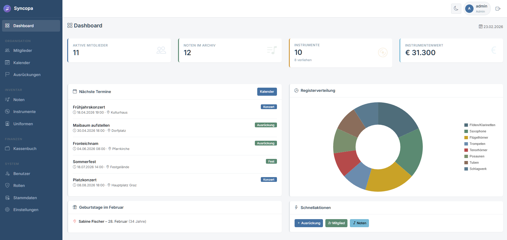

# 🎵 SYNCOPA - Musikvereinsverwaltung

[](https://github.com/Hanner72/syncopa)
[](https://php.net)
[](LICENSE)
[]()

Eine moderne, umfassende Webapplikation zur Verwaltung von Musikvereinen. Entwickelt mit PHP 8, Bootstrap 5 und MySQL.



---

## DEMO

https://syncopa.dannerbam.eu/

Admin Login

- Benutzer: admin
- Passwort: admin123

---

## 📋 Inhaltsverzeichnis

1. [Funktionsübersicht](#funktionsübersicht)
2. [Systemvoraussetzungen](#systemvoraussetzungen)
3. [Installation](#installation)
4. [Benutzerrollen](#benutzerrollen)
5. [System-Update](#system-update)
6. [Projektstruktur](#projektstruktur)
7. [Sicherheit](#sicherheit)
8. [Changelog](#changelog)

---

## 🎯 Funktionsübersicht

| Modul | Beschreibung |
|-------|--------------|
| **Mitglieder** | Vollständige Stammdatenverwaltung mit Instrumentenzuordnung |
| **Instrumente** | Inventarverwaltung, Verleih und Wartungshistorie |
| **Noten** | Digitaler Notenkatalog mit Archivnummern und PDF-Upload |
| **Ausrückungen** | Termine, Anwesenheit und Programmplanung |
| **Kalender** | Interaktiver Kalender mit iCal-Export |
| **Finanzen** | Einnahmen, Ausgaben und Mitgliedsbeiträge |
| **Uniformen** | Trachtenverwaltung und Ausgabehistorie |
| **Festverwaltung** | Stationen, Dienstplan, Einkäufe, Verträge, Abrechnung |
| **Benutzerverwaltung** | Mehrfachrollen, Berechtigungen, Google OAuth |

---

## ✨ Features

- 👥 **Mitgliederverwaltung** – Stammdaten, Instrumente, Register, Status
- 🎺 **Instrumenteninventar** – Verleih, Wartung, Versicherungswerte
- 🎼 **Notenarchiv** – PDF-Upload, Schwierigkeitsgrade, Archivnummern
- 📅 **Kalender & Ausrückungen** – Termine, Anwesenheit, iCal-Export
- 💰 **Finanzen** – Kassenbuch, Mitgliedsbeiträge, Berichte
- 👔 **Uniformverwaltung** – Trachten, Größen, Ausgabe/Rückgabe
- 🎪 **Festverwaltung** – vollständiges Modul zur Vereinsfest-Organisation
- 🔐 **Mehrfachrollen** – ein Benutzer kann mehrere Rollen gleichzeitig haben
- 🔄 **Automatische Updates** – direkt im Admin-Bereich via GitHub
- 🌓 **Dark/Light Mode** – automatisch oder manuell umschaltbar
- 📱 **Responsive Design** – optimiert für Desktop, Tablet & Smartphone

---

## 🚀 Installation

### Systemvoraussetzungen

| Komponente | Mindestanforderung |
|---|---|
| PHP | 8.0 oder höher |
| MySQL / MariaDB | 5.7 / 10.3 oder höher |
| Webserver | Apache (mod_rewrite) oder Nginx |
| PHP-Extensions | `pdo_mysql`, `intl`, `zip`, `gd`, `curl` |

### Schritte

1. ZIP aus den [Releases](https://github.com/Hanner72/syncopa/releases) herunterladen
2. Dateien auf den Server hochladen und entpacken
3. Datenbank anlegen
4. Installationsscript aufrufen: `https://deinserver.at/syncopa/install.php`
5. Installationsassistenten durchlaufen (DB-Daten, Vereinsdaten, Admin-Account)

### Erster Login

| | |
|---|---|
| **URL** | `https://deinserver.at/syncopa/` |
| **Benutzer** | gewählter Admin-Benutzername |
| **Passwort** | gewähltes Admin-Passwort |

> ⚠️ Passwort nach dem ersten Login sofort ändern!

---

## 📖 Benutzerrollen

Syncopa verwendet ein **Mehrfachrollen-System** – ein Benutzer kann gleichzeitig mehrere Rollen haben und erhält die kombinierten Berechtigungen aller zugewiesenen Rollen.

| Rolle | Beschreibung |
|-------|--------------|
| **Admin** | Vollzugriff auf alle Module und Systemeinstellungen |
| **Obmann** | Mitglieder- und Terminverwaltung |
| **Kapellmeister** | Noten, Ausrückungen, Programmplanung |
| **Kassier** | Finanzen und Beitragsverwaltung |
| **Instrumentenwart** | Instrumentenverwaltung und Wartung |
| **Trachtenwart** | Uniformverwaltung |
| **Mitglied** | Lesezugriff auf relevante Bereiche |

> Rollen und Berechtigungen sind individuell konfigurierbar. Die Reihenfolge der Rollen ist per Drag & Drop änderbar.

---

## 🔄 System-Update

Syncopa aktualisiert sich direkt aus dem Admin-Bereich heraus:

**Einstellungen → System-Update → Update prüfen → Jetzt updaten**

- Vergleicht die installierte Version mit der aktuellen Version auf GitHub
- Lädt das Update als ZIP herunter und überspielt alle Dateien automatisch
- `config.php` (Zugangsdaten) und `uploads/` werden dabei **nie** überschrieben

---

## 📁 Projektstruktur

```
syncopa/
├── api/                    # API-Endpunkte
│   ├── system_update.php   # Version prüfen & Update
│   ├── rollen_sortierung.php
│   └── ...
├── assets/                 # Statische Dateien (Logo, Favicon)
├── classes/                # PHP-Klassen
│   ├── Database.php
│   ├── Session.php         # Mehrfachrollen-Support
│   └── ...
├── docs/                   # Dokumentation
├── uploads/                # Datei-Uploads (nicht in git)
│   ├── noten/
│   ├── fotos/
│   ├── dokumente/
│   └── fest_vertraege/
├── config.php              # Umgebungsspezifisch (nicht in git)
├── config.app.php          # App-Konstanten (wird per Update aktualisiert)
├── config.example.php      # Vorlage für neue Installationen
├── database.sql            # Datenbankschema
└── install.php             # Installationsassistent
```

---

## 🛡️ Sicherheit

1. **HTTPS aktivieren** – SSL-Zertifikat einrichten
2. **Passwort ändern** – Admin-Passwort sofort nach Installation ändern
3. **Backups erstellen** – regelmäßige Datenbank-Backups
4. **PHP-Fehler verbergen** – in Produktion: `display_errors = Off`
5. **Upload-Verzeichnis schützen:**

```apache
# uploads/.htaccess
Options -Indexes
<FilesMatch "\.php$">
    Deny from all
</FilesMatch>
```

---

## 🔧 Troubleshooting

| Problem | Lösung |
|---------|--------|
| **DB-Verbindung fehlgeschlagen** | Zugangsdaten in `config.php` prüfen |
| **Keine Berechtigung** | Benutzerrollen und Berechtigungen prüfen |
| **Upload fehlgeschlagen** | `chmod 755 uploads/` und PHP `upload_max_filesize` prüfen |
| **Update schlägt fehl** | cURL und ZipArchive PHP-Extension aktivieren |
| **Kalender lädt nicht** | Browser-Console prüfen (F12), API testen |

---

## 📋 Changelog

Alle Änderungen: [CHANGELOG.md](./CHANGELOG.md)

---

## 🙏 Credits

Entwickelt mit:

- [PHP 8](https://php.net)
- [Bootstrap 5](https://getbootstrap.com)
- [Bootstrap Icons](https://icons.getbootstrap.com)
- [MySQL](https://mysql.com)
- [FullCalendar](https://fullcalendar.io)
- [SortableJS](https://sortablejs.github.io/Sortable/)
- [Chart.js](https://chartjs.org)
- [FPDI / FPDF](https://www.setasign.com/products/fpdi/about/)

---

<p align="center">
  <strong>🎵 SYNCOPA</strong><br>
  Entwickelt für deutschsprachige (DACH) Musikvereine<br>
  <sub>Made with ❤️ in Austria</sub>
</p>
