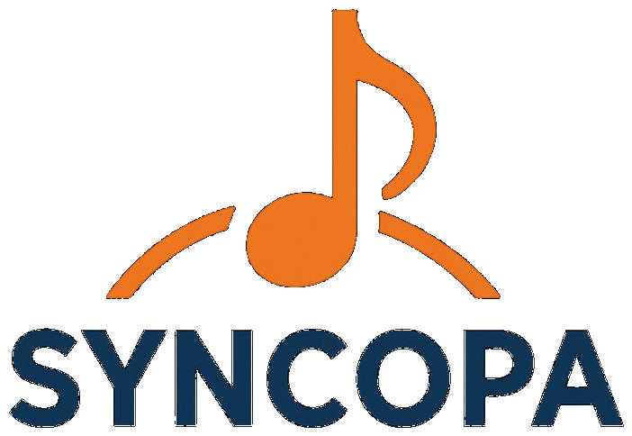

#  – Musikvereinsverwaltung

> **Version 2.3.0** · Benutzerhandbuch

Willkommen zur offiziellen Dokumentation von **Syncopa** – der Verwaltungssoftware für Musikvereine.

---

## Was kann Syncopa?

Syncopa vereint alle wichtigen Verwaltungsaufgaben eines Musikvereins in einer webbasierten Anwendung:

| Modul | Beschreibung |
|---|---|
| 👥 **Mitglieder** | Stammdaten, Register, Mitgliedsnummern, Geburtstage |
| 🎺 **Ausrückungen** | Termine planen, An-/Abmeldungen verwalten, iCal-Export |
| 📅 **Kalender** | Übersicht aller Termine, iCal-Export |
| 💰 **Finanzen** | Einnahmen & Ausgaben, Mitgliedsbeiträge |
| 🎼 **Noten** | Notenarchiv mit Kategorien |
| 🎻 **Instrumente** | Inventar, Wartungsfristen, Zuordnung |
| 👔 **Uniformen** | Bestand, Ausgabe und Rücknahme |
| 🔐 **Benutzerverwaltung** | Rollen, Berechtigungen, Google-Login |

---

## Schnellstart

1. **Installation** → [Einrichtung](einrichtung.md)
2. **Ersten Admin anlegen** → [Erster Login](erster-login.md)
3. **Mitglieder importieren** → [Mitglieder](mitglieder.md)
4. **Erste Ausrückung erstellen** → [Ausrückungen](ausrueckungen.md)

---

## Benutzerrollen auf einen Blick

Syncopa verwendet ein flexibles Rollensystem. Die wichtigsten vordefinierten Rollen sind:

| Rolle | Zugriff |
|---|---|
| **Admin** | Vollzugriff auf alle Bereiche inkl. Systemeinstellungen |
| **Obmann** | Mitglieder, Ausrückungen, Übersichten |
| **Kassier** | Finanzen, Beiträge |
| **Schriftführer** | Mitglieder, Noten, Protokolle |
| **Musiker** | Eigene Daten, Ausrückungsanmeldung |

> 💡 Rollen und deren Berechtigungen können unter **Administration → Rollen** individuell angepasst werden.

---

## Technische Basis

- **Sprache:** PHP 8+
- **Datenbank:** MySQL / MariaDB
- **Frontend:** Bootstrap 5, Bootstrap Icons
- **PDF-Export:** FPDI / FPDF
- **Authentifizierung:** Session-basiert + optionaler Google OAuth Login
