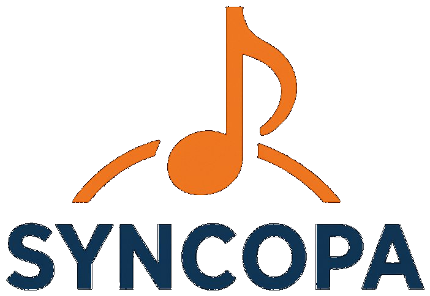

#  – Musikvereinsverwaltung

> **Version 2.4.4** · Benutzerhandbuch

Willkommen zur offiziellen Dokumentation von **Syncopa** – der Verwaltungssoftware für Musikvereine.

---

## Was kann Syncopa?

Syncopa vereint alle wichtigen Verwaltungsaufgaben eines Musikvereins in einer webbasierten Anwendung:

| Modul | Beschreibung |
|---|---|
| 👥 **Mitglieder** | Stammdaten, Register, Mitgliedsnummern, Geburtstage |
| 🏷️ **Formationen** | Mehrere Besetzungen/Gruppen pro Verein (z.B. Musikkapelle, Jugendkapelle, 7er-Partie) mit eigenem Formations-Switcher |
| 🎺 **Ausrückungen** | Termine planen, An-/Abmeldungen verwalten, iCal-Export |
| 📅 **Kalender** | Übersicht aller Termine, iCal-Export |
| 💰 **Finanzen** | Einnahmen & Ausgaben, Mitgliedsbeiträge |
| 🎼 **Noten** | Notenarchiv mit mehreren PDFs pro Stück, automatische Stimmen-Erkennung & -Aufteilung |
| 📚 **Notenbücher** | Private und geteilte Mappen aus mehreren Notenstücken |
| 📡 **Live-Probe** | Notenstück live an alle Musiker übertragen, jeder sieht automatisch seine eigene Stimme, mit Notizfunktion |
| 🎻 **Instrumente** | Inventar, Wartungsfristen, Zuordnung |
| 👔 **Uniformen** | Bestand, Ausgabe und Rücknahme |
| 🎪 **Festverwaltung** | Stationen, Dienstplan, Einkäufe, Verträge, Todos, Abrechnung |
| 🔐 **Benutzerverwaltung** | Rollen, Mehrfachrollen, Berechtigungen, Google-Login |

---

## Schnellstart

1. **Installation** → [Einrichtung](einrichtung.md)
2. **Ersten Admin anlegen** → [Erster Login](erster-login.md)
3. **Mitglieder importieren** → [Mitglieder](mitglieder.md)
4. **Formationen anlegen** (falls mehrere Besetzungen verwaltet werden) → [Formationen](formationen.md)
5. **Erste Ausrückung erstellen** → [Ausrückungen](ausrueckungen.md)
6. **Noten hochladen & Stimmen aufteilen** → [Noten](noten.md)
7. **Fest planen** → [Festverwaltung](festverwaltung.md)

---

## Benutzerrollen auf einen Blick

Syncopa verwendet ein flexibles **Mehrfachrollen-System** – ein Benutzer kann gleichzeitig mehrere Rollen haben. Die wichtigsten vordefinierten Rollen sind:

| Rolle | Zugriff |
|---|---|
| **Admin** | Vollzugriff auf alle Bereiche inkl. Systemeinstellungen |
| **Obmann** | Mitglieder, Ausrückungen, Übersichten |
| **Kassier** | Finanzen, Beiträge |
| **Schriftführer** | Mitglieder, Noten, Protokolle |
| **Musiker** | Eigene Daten, Ausrückungsanmeldung |

> 💡 Rollen und deren Berechtigungen können unter **Administration → Rollen** individuell angepasst werden. Die Reihenfolge der Rollen ist per Drag & Drop änderbar.

---

## System-Update

Syncopa kann sich direkt aus dem Admin-Bereich selbst aktualisieren:

**Einstellungen → System-Update → Update prüfen**

Das Update lädt die neue Version von GitHub herunter und installiert sie automatisch. Die `config.php` (Zugangsdaten) wird dabei nie überschrieben.

---

## Technische Basis

- **Sprache:** PHP 8+
- **Datenbank:** MySQL / MariaDB
- **Frontend:** Bootstrap 5, Bootstrap Icons, SortableJS
- **PDF-Export:** FPDI / FPDF
- **Authentifizierung:** Session-basiert + optionaler Google OAuth Login
- **Updates:** Automatisch via GitHub ZIP-Download
