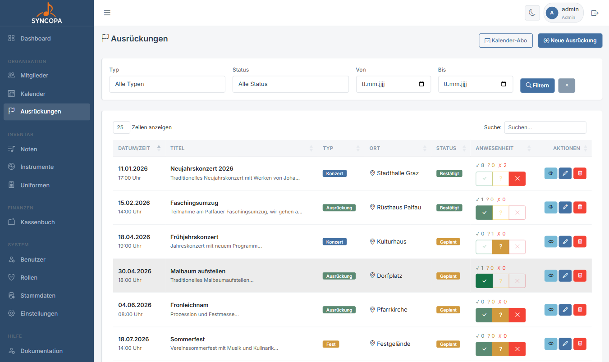
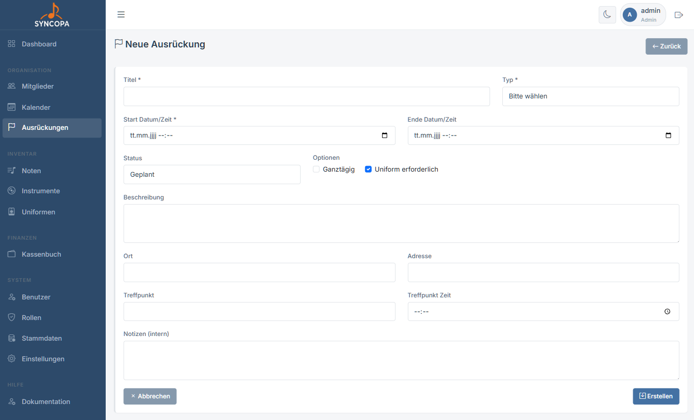
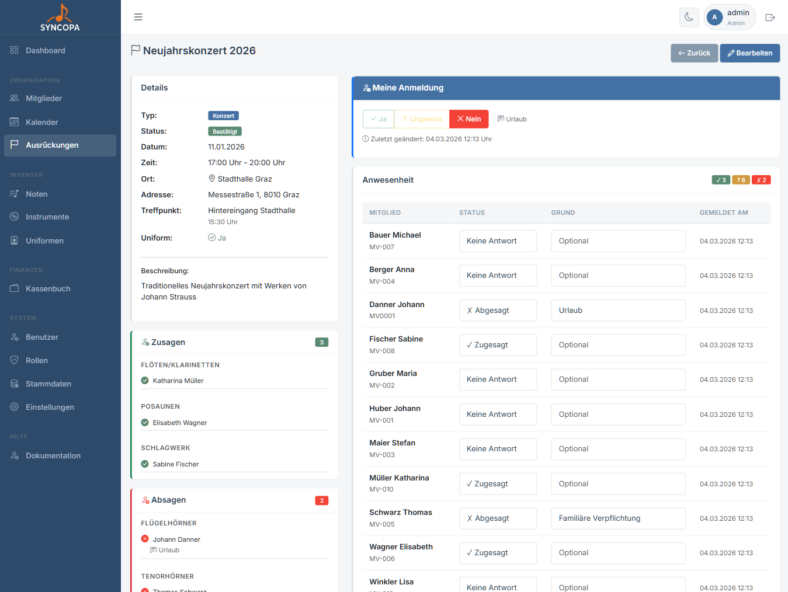
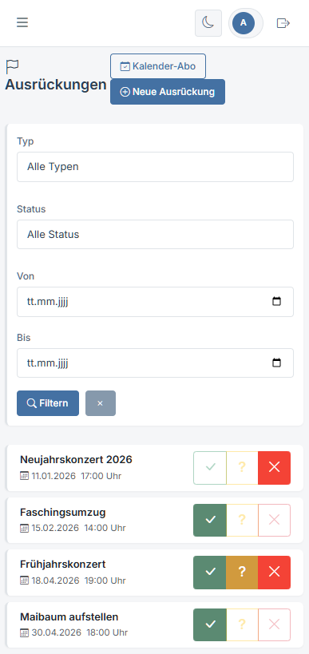
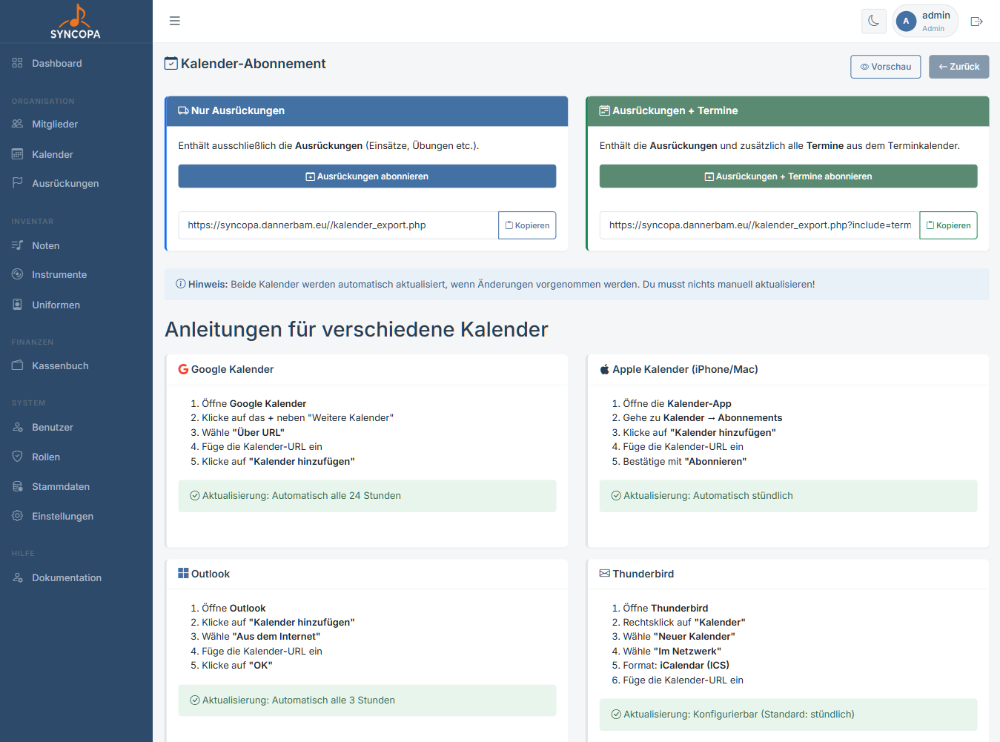

# Ausrückungen

**Datei:** `ausrueckungen.php`  
**Berechtigung:** `ausrueckungen – lesen`

Unter Ausrückungen werden alle öffentlichen und internen Auftritte des Vereins geplant und verwaltet.

---

## Übersicht

Die Übersicht zeigt alle Ausrückungen mit:

| Spalte | Beschreibung |
|---|---|
| Datum & Uhrzeit | Termin der Ausrückung |
| Titel | Name / Titel der Ausrückung |
| Typ | Typ der Veranstaltung |
| Ort | Veranstaltungsort |
| Status | `geplant` · `bestätigt` · `abgesagt` |
| Anwesenheit | Anzahl zugesagt / abgesagt / offen |
| | `ja` · `vielleicht` · `nein` |
| Aktionen | Detail · Bearbeiten · Löschen |

### Filter

- **Typen:** Filter nach den Typen der Ausrückung
- **Zeitraum:** Vergangene / aktuelle / zukünftige Ausrückungen
- **Status:** Nach Planungsstatus filtern

---

## Ausrückung anlegen

**Datei:** `ausrueckung_bearbeiten.php`  
**Berechtigung:** `ausrueckungen – schreiben`

1. Klicke auf **+ Neue Ausrückung**
2. Fülle das Formular aus
3. Klicke auf **Speichern**

### Formularfelder

| Feld | Pflicht | Beschreibung |
|---|---|---|
| Titel | ✅ | Name der Ausrückung |
| Start Datum | ✅ | Startdatum der Veranstaltung |
| Ende Datum | - | Enddatum der Veranstaltung |
| Uhrzeit | – | Beginn der Ausrückung |
| Treffpunkt-Uhrzeit | – | Vorankunft für Aufbau etc. |
| Ort | – | Veranstaltungsort |
| Adresse | – | Detaillierte Adresse |
| Status | ✅ | geplant / bestätigt / abgesagt |
| Beschreibung | – | Weitere Informationen |
| Uniform | – | Kleiderordnung für diesen Termin |

---

## Detailansicht einer Ausrückung

**Datei:** `ausrueckung_detail.php`

Die Detailseite zeigt:

- Alle Termindaten auf einen Blick
- **Anmeldeliste** mit Status jedes Mitglieds:
  - ✅ Zugesagt
  - ❌ Abgesagt  
  - ❓ Noch keine Antwort
- **Grund** der Mitglieder (z.B. Begründung bei Absage)
- Zusammenfassung: Wie viele haben zugesagt / abgesagt mit Registeraufteilung

---

## An- und Abmeldung

Mitglieder können sich selbst zu Ausrückungen an- oder abmelden:

1. Ausrückungen auf der Startseite
2. Auf ✅ oder ❓ oder ❌ klicken
3. Optional bei ❌: Grund hinterlassen
4. Status wird sofort gespeichert
5. Optimiert für Mobilgeräte (Smartphone)

Administratoren können den Status für beliebige Mitglieder auf der Ausrückung Detailseite setzen.

---

## Kalender abonnieren (iCal)

Mit dem iCal-Export können alle Vereinstermine in externe Kalender-Apps eingebunden werden:

### Export Auswahl

Es kann zwischen 1. "Ausrückungen abonnieren" und 2. "Ausrückungen + Termine" abonnieren gewählt werden

1. hier werden nur die Ausrückungen abonniert
2. hier werden auch die Termine aboniert (Sitzungen, sonstige Termine)

### Google Calendar

1. Navigiere zu **Kalender → Abonnement**
2. Kopiere die **iCal-URL**
3. Öffne Google Calendar
4. Klicke auf **„+"** neben „Andere Kalender"
5. Wähle **„Per URL"** und füge die URL ein
6. Klicke **Kalender hinzufügen**

### Apple Kalender (iOS / macOS)

1. Kopiere die iCal-URL aus Syncopa
2. Öffne auf dem iPhone: **Einstellungen → Kalender → Account hinzufügen → Andere → Kalenderabo hinzufügen**
3. Füge die URL ein → **Weiter** → **Sichern**

### Microsoft Outlook

1. Öffne Outlook
2. Klicke auf **Kalender hinzufügen → Aus dem Internet**
3. Füge die iCal-URL ein → **OK**

---

## Kalendervorschau

**Datei:** `kalender_vorschau.php`

Die Vorschau zeigt eine **öffentlich zugängliche** Ansicht des Kalenders (ohne Login), die z.B. auf der Vereinswebsite eingebettet werden kann.