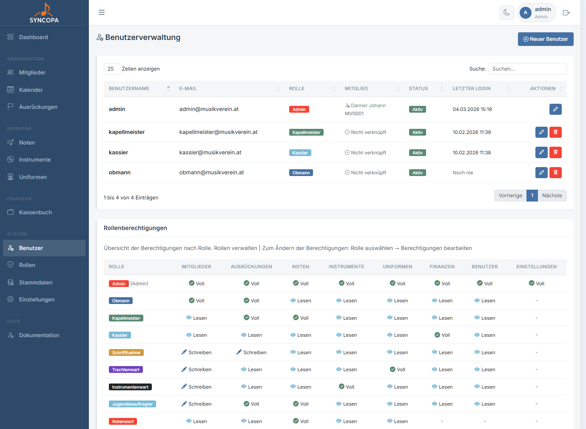
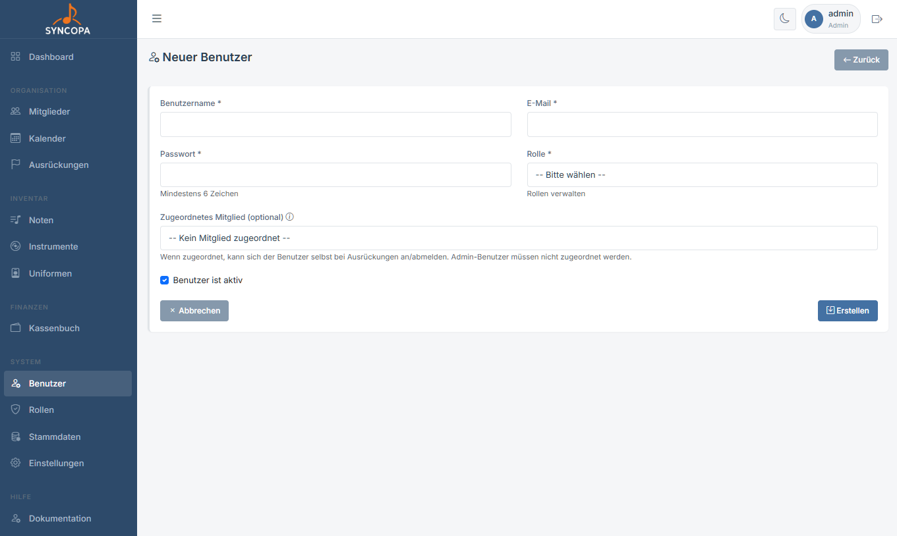
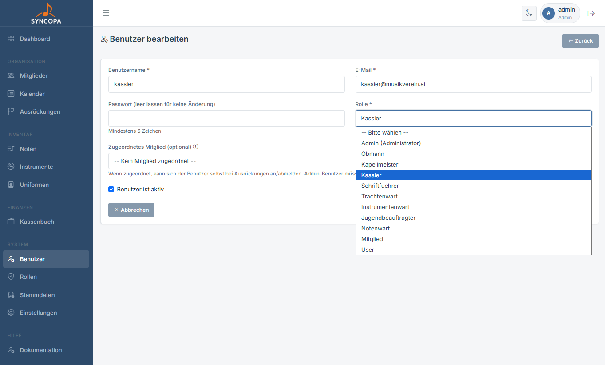
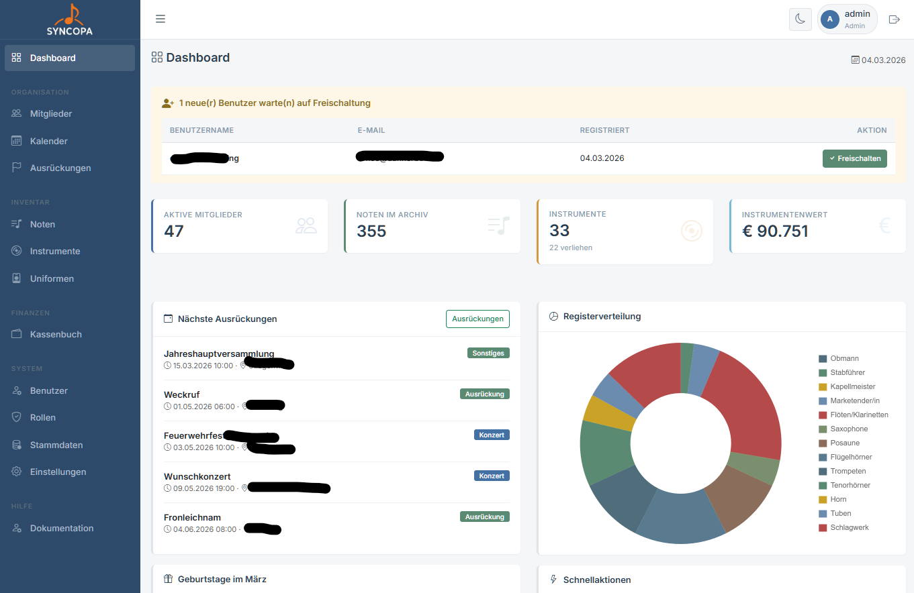
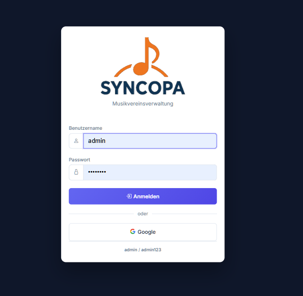

# Benutzerverwaltung

**Datei:** `benutzer.php`  
**Berechtigung:** Nur **Admin**

Die Benutzerverwaltung steuert, wer Zugriff auf Syncopa hat und welche Berechtigungen dieser Benutzer besitzt.

---

## Benutzerliste

Die Übersicht zeigt alle angelegten Benutzer-Konten.

---

## Neuen Benutzer anlegen

**Datei:** `benutzer_bearbeiten.php`

1. Klicke auf **+ Neuer Benutzer**
2. Fülle das Formular aus
3. Weise dem Benutzer eine **Rolle** zu
4. Optional: Verknüpfe den Benutzer mit einem **Vereinsmitglied** (ermöglicht Ausrückungs-Anmeldung)
5. Benutzer aktiv (Konto aktiviert / deaktiviert)?
6. **Speichern**

### Formularfelder

| Feld | Pflicht | Beschreibung |
|---|---|---|
| Benutzername | ✅ | Eindeutiger Loginname |
| E-Mail | ✅ | E-Mail-Adresse |
| Passwort | ✅ (neu) | Mindestens 8 Zeichen |
| Rolle | ✅ | Zugriffsrolle aus der Rollenverwaltung |
| Mitglied | – | Verknüpftes Vereinsmitglied |
| Aktiv | – | Konto aktiviert / deaktiviert |

---

## Benutzer befördern

**Datei:** `benutzer_bearbeiten.php`

Schnelle Rollen-Zuweisung für einen bestehenden Benutzer:

1. Klicke in der Benutzerliste auf **„Bearbeiten"**
2. Wähle die neue Rolle
3. **Speichern**

---

## Selbstregistrierung

Wenn Musiker sich selbst registrieren (über den Login-Button „Registrieren"), erhalten sie zunächst die Basisrolle `user`. 

Dieser User kann nur das Dashboard sehen mit dem hinweis, dass die Anmeldung noch von einem Admin freigeschaltet werden muss.

> 💡 **Info:** Momentan nur über einen Google-Account möglich. Neue Benutzer können jedoch von jedem angelegt der Schreibrechte bei den Rollenberechtigungen hat.

Im Dashboard erscheint für Admins und Obmänner eine **Benachrichtigung** über neue Benutzer ohne zugewiesene Rolle:

Bei einem Klick auf **Freischalten** wird dem User der Benutzer `Mitglied` zugewiesen.

---

## Google Login

Wenn Google OAuth aktiviert ist (`config.php`), können sich Benutzer auch mit ihrem Google-Konto anmelden.

- Beim ersten Google-Login wird automatisch ein Konto angelegt
- Das Konto erhält die Rolle `user`
- Ein Admin muss dem Konto manuell eine Rolle zuweisen

