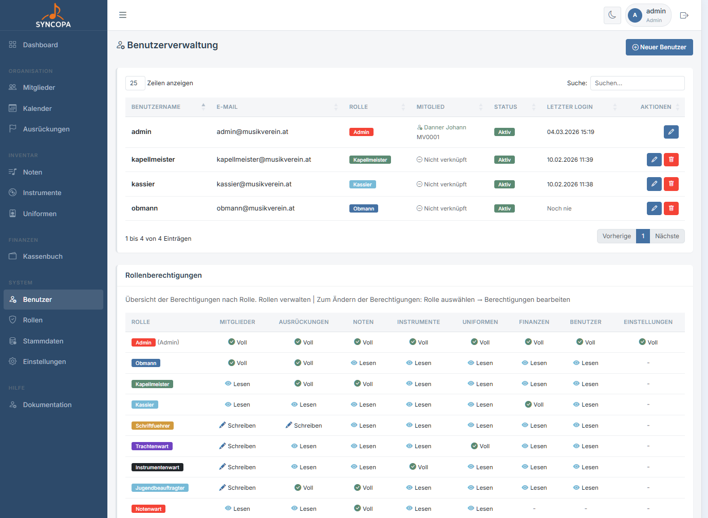
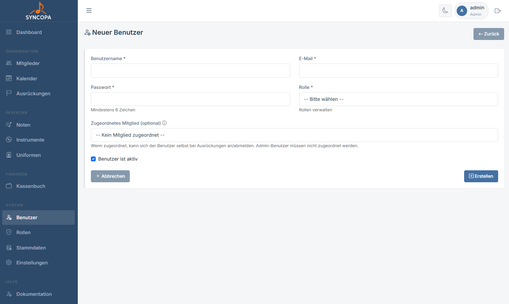
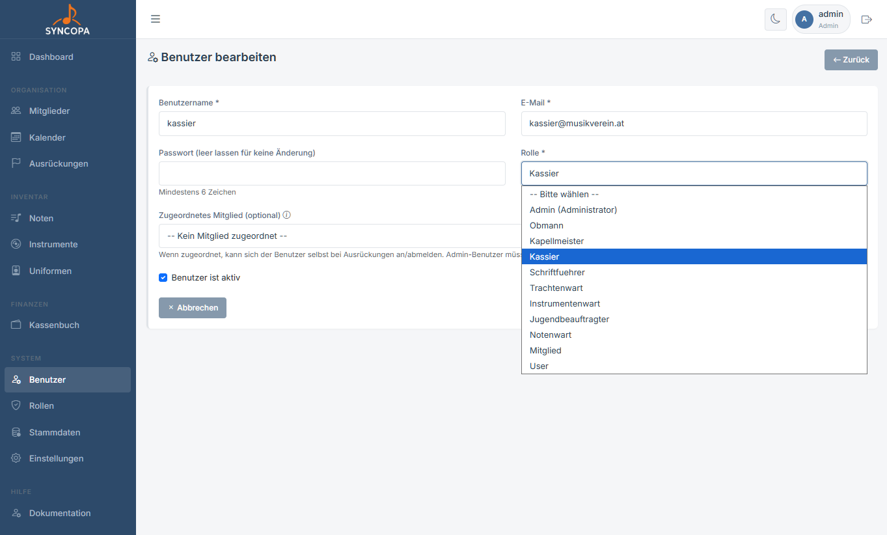
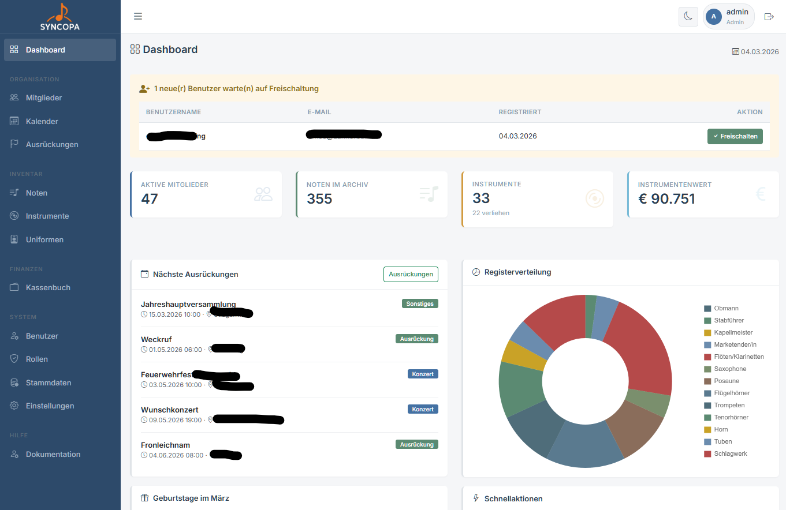

# Benutzerverwaltung

**Datei:** `benutzer.php`
**Berechtigung:** Nur **Administratoren**

Die Benutzerverwaltung steuert, wer sich bei Syncopa anmelden kann und welche Rollen (und damit Berechtigungen) dieser Benutzer besitzt.

> 💡 **Benutzer ≠ Mitglied:** Ein *Benutzer* ist ein Login-Konto (Benutzername/Passwort oder Google-Konto). Ein *Mitglied* ist ein Datensatz in der Mitgliederverwaltung. Beides kann, muss aber nicht miteinander verknüpft sein – siehe [Benutzer mit einem Mitglied verknüpfen](#benutzer-mit-einem-mitglied-verknüpfen).

---

## Benutzerliste



Die Übersicht zeigt alle angelegten Benutzer-Konten:

| Spalte | Beschreibung |
|---|---|
| Benutzername | Login-Name |
| E-Mail | E-Mail-Adresse des Benutzers |
| Rolle | Alle zugewiesenen Rollen als farbige Badges (ein Benutzer kann **mehrere** haben) |
| Mitglied | Verknüpftes Vereinsmitglied, falls vorhanden |
| Status | `Aktiv` oder `Inaktiv` |
| Letzter Login | Datum/Uhrzeit der letzten Anmeldung |
| Aktionen | Bearbeiten · Löschen |

---

## Neuen Benutzer anlegen

**Datei:** `benutzer_bearbeiten.php`
**Berechtigung:** Nur **Administratoren**



1. Klicke auf **+ Neuer Benutzer**
2. Fülle Benutzername, E-Mail und Passwort aus
3. Setze Häkchen bei einer oder **mehreren Rollen**
4. Optional: Wähle ein **Vereinsmitglied** zur Verknüpfung
5. Kontrolliere, ob **„Benutzer ist aktiv"** angehakt ist
6. Klicke auf **Erstellen**

### Formularfelder

| Feld | Pflicht | Beschreibung |
|---|---|---|
| Benutzername | ✅ | Eindeutiger Login-Name |
| E-Mail | ✅ | E-Mail-Adresse |
| Passwort | ✅ (bei Neuanlage) | Mindestens 6 Zeichen. Beim Bearbeiten leer lassen, um es nicht zu ändern |
| Rollen | ✅ | Eine oder mehrere Rollen per Checkbox – siehe unten |
| Zugeordnetes Mitglied | – | Optional, ermöglicht die Anmeldung bei Ausrückungen |
| Benutzer ist aktiv | – | Deaktivierte Konten können sich nicht mehr einloggen |

---

## Mehrfachrollen pro Benutzer

Ein Benutzer ist in Syncopa **nicht auf eine einzige Rolle beschränkt**. Beim Anlegen/Bearbeiten kannst du beliebig viele Rollen gleichzeitig ankreuzen (z.B. „Kassier" **und** „Schriftführer").

- Die Berechtigungen **aller** zugewiesenen Rollen werden kombiniert: Ein Benutzer darf alles, was **irgendeine** seiner Rollen erlaubt.
- Die zuerst angekreuzte Rolle gilt intern als **Primärrolle** (u.a. für die Anzeige im Dashboard-Titel).
- In der Benutzerliste werden alle Rollen als farbige Badges nebeneinander angezeigt.

> 💡 **Tipp:** Statt für jede Kombination eine eigene Rolle anzulegen (z.B. „Kassier+Schriftführer"), einfach die beiden bestehenden Rollen gleichzeitig zuweisen.

---

## Rollen eines Benutzers ändern

**Datei:** `benutzer_bearbeiten.php`



1. Klicke in der Benutzerliste bei dem gewünschten Benutzer auf das **Stift-Symbol**
2. Haken bei den gewünschten Rollen setzen bzw. entfernen
3. Klicke auf **Aktualisieren**

Die Änderung gilt **sofort** ab dem nächsten Seitenaufruf des Benutzers.

---

## Benutzer mit einem Mitglied verknüpfen

Im Bearbeiten-Formular kann ein Benutzer optional mit einem bestehenden **Vereinsmitglied** verknüpft werden (Feld „Zugeordnetes Mitglied").

- **Mit Verknüpfung:** Das Mitglied kann sich selbst einloggen, sich z.B. bei Ausrückungen an- und abmelden und sieht seine eigenen Daten.
- **Ohne Verknüpfung:** Das Login-Konto existiert unabhängig von der Mitgliederverwaltung. Das ist z.B. für **Administrator-Konten** oder für **externe Gastmusiker** (Rolle `extern`) sinnvoll, die nicht als reguläres Vereinsmitglied geführt werden.

> ⚠️ **Achtung:** Ein Gastmusiker mit der Rolle `extern` benötigt trotzdem **einen Mitglieds-Datensatz** (z.B. mit Status „Aktiv"), da die Zuordnung zu einer Formation immer über das Mitglied läuft (siehe nächster Abschnitt). Ohne Formationszuordnung wird der Gastmusiker beim Login abgewiesen.

---

## Formationszuordnung eines Benutzers

Vereine mit mehreren Formationen (z.B. Stammkapelle + Jugendkapelle) können festlegen, welcher Formation ein Mitglied angehört. Das steuert, welche Ausrückungen, Noten usw. dem Benutzer angezeigt werden.

Die Zuordnung erfolgt **nicht** direkt am Benutzer, sondern am verknüpften **Mitglied**:

1. Öffne **Formationen** → die gewünschte Formation → **Mitglieder**
2. Wähle das Mitglied unter „Mitglied hinzufügen" aus
3. Optional: Trage eine Rolle innerhalb der Formation ein (z.B. „Stimmführer")

Gehört ein Benutzer **genau einer** Formation an, wird sie beim Login automatisch aktiv. Bei mehreren Formationen kann oben in der Navigationsleiste zwischen ihnen gewechselt werden.

> ⚠️ **Achtung:** Benutzer mit der Rolle `extern` (Gastmusiker) **müssen** einer Formation zugeordnet sein – ohne Formation werden sie nach dem Login automatisch abgemeldet bzw. zurück zum Login geschickt.

---

## Selbstregistrierung & Freischaltung neuer Benutzer

Wenn sich jemand selbst über den Login mit einem **Google-Konto** registriert (siehe unten), wird automatisch ein Benutzerkonto mit der Basisrolle `user` angelegt. Dieses Konto sieht **nur das Dashboard** mit dem Hinweis, dass das Konto noch nicht freigeschaltet wurde.

Admins und Obmänner sehen dazu am Dashboard eine **Benachrichtigung**:



1. Klicke bei dem neuen Benutzer auf **Freischalten**
2. Der Benutzer erhält damit die Basisrolle „Mitglied"

> 💡 **Tipp:** Die Schaltfläche „Freischalten" vergibt nur die Basisrolle. Öffne den Benutzer danach über **Bearbeiten**, um ihm zusätzlich passende Rollen zuzuweisen (z.B. „Kapellmeister", „Kassier") und die Zuweisung zu **speichern** – erst dann greifen die passenden Modul-Berechtigungen.

---

## Google-Login

Benutzer können sich zusätzlich zum normalen Login auch mit ihrem **Google-Konto** anmelden, sofern diese Funktion aktiviert ist.

> **Für Administratoren:** Google-Login wird in der `config.php` aktiviert:
> ```php
> define('GOOGLE_OAUTH_ENABLED',  true);
> define('GOOGLE_CLIENT_ID',      '...');
> define('GOOGLE_CLIENT_SECRET',  '...');
> ```
> Die Zugangsdaten (Client-ID/Secret) werden in der [Google Cloud Console](https://console.cloud.google.com/apis/credentials) erstellt. Als Redirect-URI muss `https://deine-domain.at/login_google_callback.php` hinterlegt werden. Eine Anleitung dazu gibt es auch bei der [Installation](einrichtung.md).

**Was beim ersten Google-Login eines neuen Benutzers passiert:**

1. Der Benutzer klickt auf der Login-Seite auf **„Google"**
2. Existiert noch kein Konto mit dieser E-Mail-Adresse, wird automatisch eines angelegt (Benutzername aus dem Google-Namen abgeleitet)
3. Das neue Konto erhält die Basisrolle `user` – es ist **noch nicht freigeschaltet**
4. Ein Administrator oder Obmann muss das Konto wie oben beschrieben über **Freischalten** aktivieren und ihm passende Rollen zuweisen

Existiert bereits ein Benutzerkonto mit derselben E-Mail-Adresse, wird beim ersten Google-Login einfach die Google-ID am bestehenden Konto hinterlegt – der Benutzer kann sich danach wahlweise mit Passwort **oder** Google anmelden.

---

## Benutzer löschen

**Datei:** `benutzer_loeschen.php`
**Berechtigung:** Nur **Administratoren**

> ⚠️ **Achtung:** Das Löschen eines Benutzers kann nicht rückgängig gemacht werden. Der eigene, gerade eingeloggte Benutzer kann sich nicht selbst löschen.

1. Klicke in der Benutzerliste auf das **Papierkorb-Symbol**
2. Bestätige die Sicherheitsabfrage

> 💡 **Tipp:** Wenn ein Vereinsmitglied nur vorübergehend keinen Zugriff mehr haben soll, reicht es, das Häkchen bei „Benutzer ist aktiv" zu entfernen, statt das Konto zu löschen.
