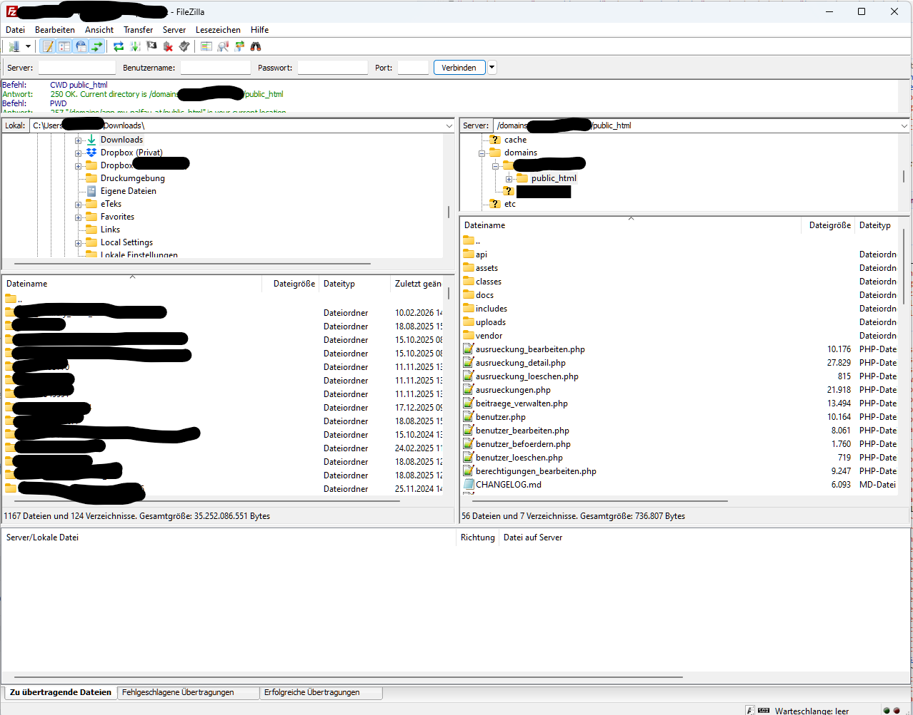
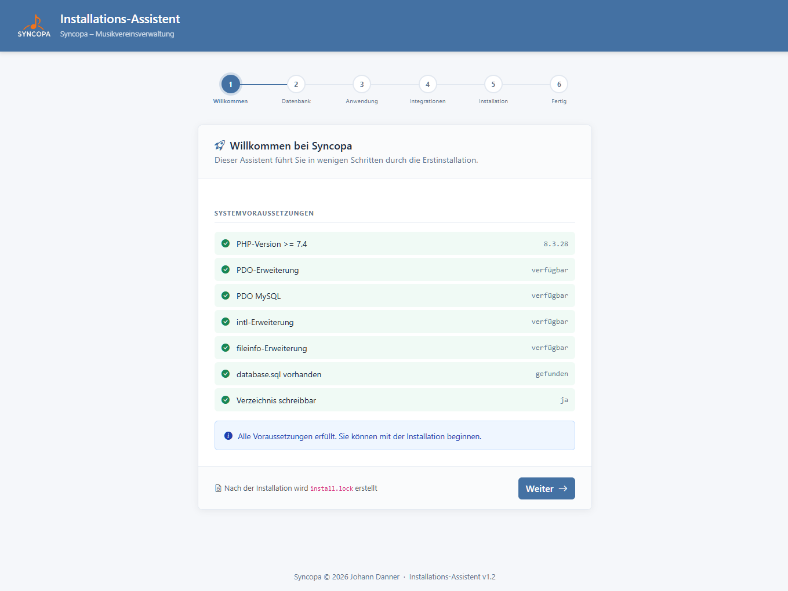
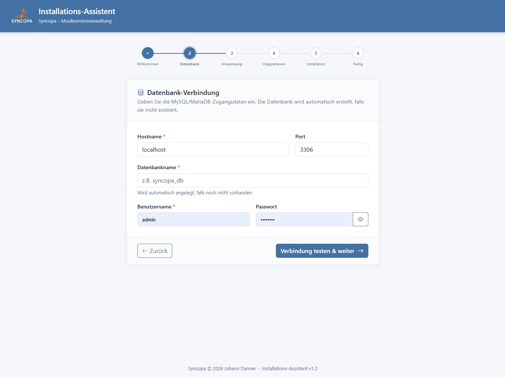
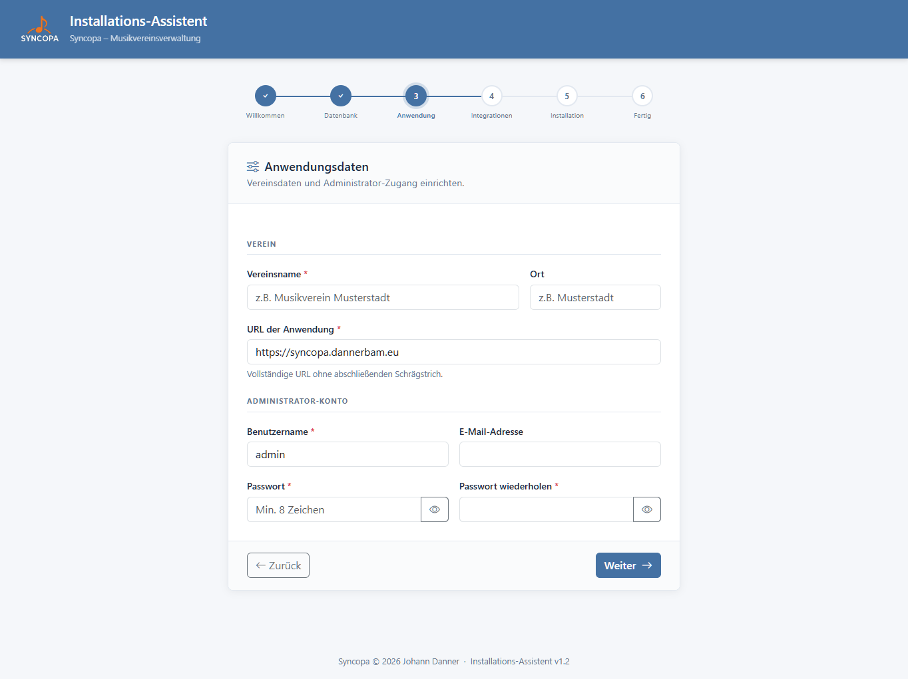
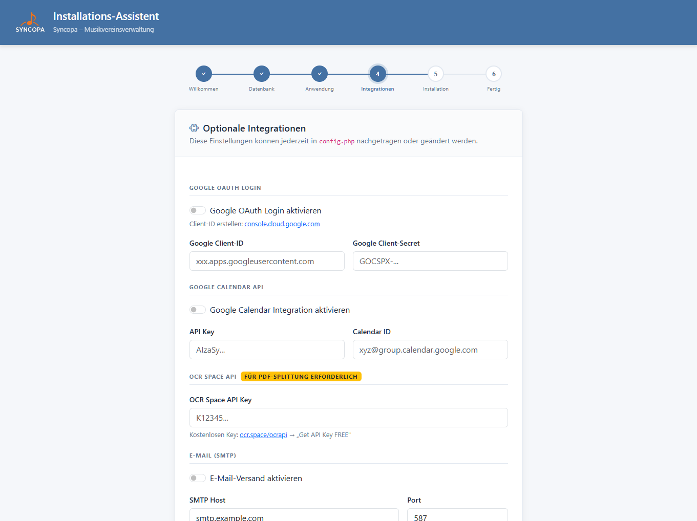
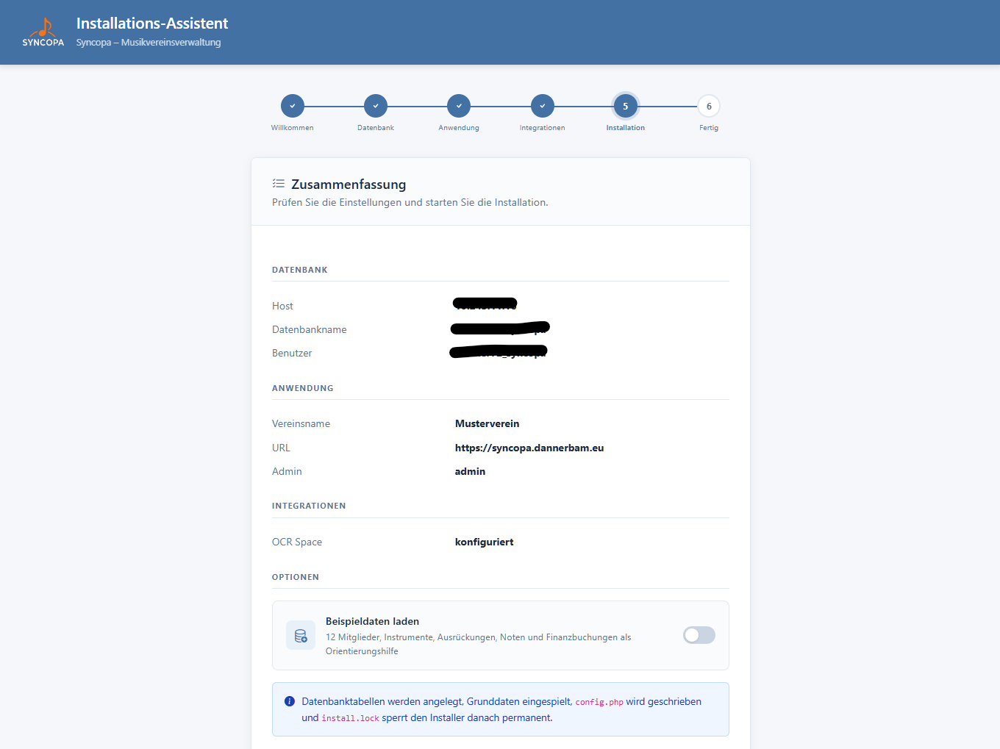
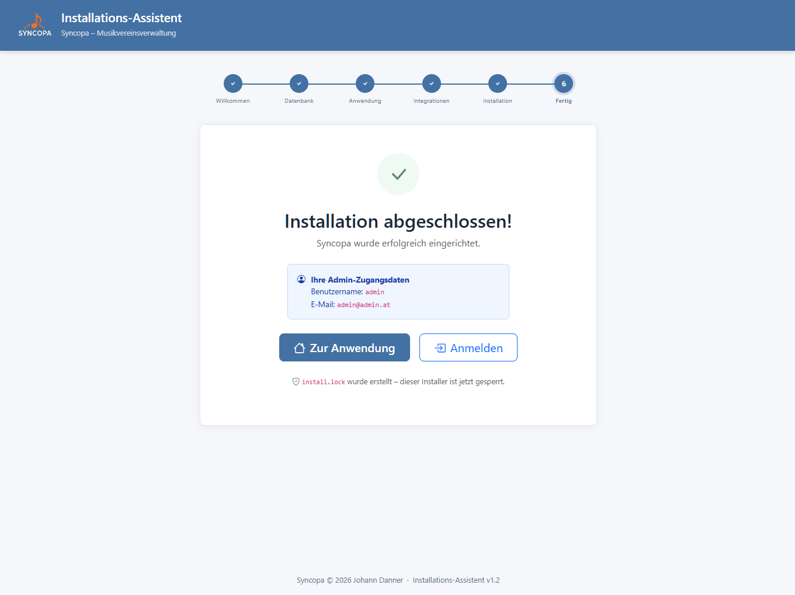
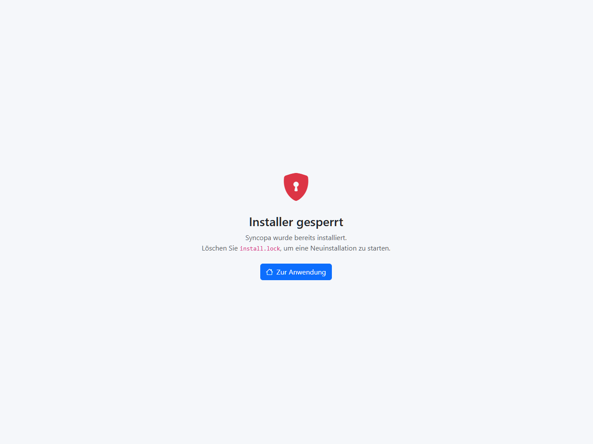
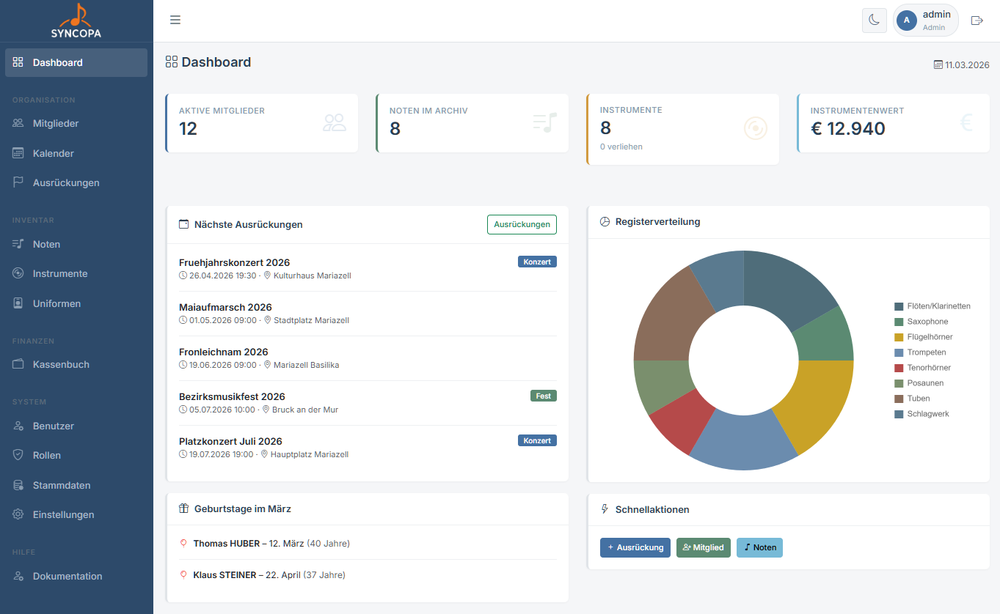

# Installation & Einrichtung

Für eine leichte Installation wurde ein komplettes Installationsscript implementiert.

## Systemvoraussetzungen

| Komponente | Mindestanforderung |
|---|---|
| PHP | 7.4 oder höher |
| MySQL / MariaDB | 5.7 / 10.3 oder höher |
| Webserver | Apache (mod_rewrite) oder Nginx |
| PHP-Extensions | `pdo_mysql`, `intl`, `zip`, `gd` |

---

## 1. Dateien hochladen

Lade alle Dateien aus dem Projektordner in dein Webserver-Verzeichnis hoch, z.B.:

```
/var/www/html/syncopa/
```

oder in ein Unterverzeichnis (je nach Server):

```
/domains/deineDomain/public_html/meinverein/
```



---

## 2. Datenbank anlegen

Erstelle eine neue MySQL-Datenbank und einen dedizierten Datenbankbenutzer per MQSQL Script oder ganz einfach in der Server Admin Oberfläche.

Zugangsdaten zur Datenbank notieren, wird in Folge bei der Installation benötigt.

MySQL-Script:
```sql
CREATE DATABASE syncopa CHARACTER SET utf8mb4 COLLATE utf8mb4_unicode_ci;
```

---

### 3.1 Installation starten

Navigiere per Browser zur install.php um die Installation zu starten.

```
https://meinverein.at/syncopa/install.php
```



Falls Systemvoraussetzungen nicht erfüllt werden, bitte die Servereinstellungen ändern, andernfalls kann die Installation nicht fortgesetzt werden.

---

### 3.2 Datenbankverbindung

Hier einfach deine Zugangsdaten zur Datenbank eintragen und auf **Verbindung testen & weiter** klicken



---

### 3.3 Anwendungsdaten

Hier die Vereinsdaten eintragen und den Adminbenutzer anlegen.

Dies kann später in den Einstellungen in der Applikation nochmal geändert werden.



---

### 3.4 Integrationen

Google OAuth wird verwendet damit sich User per Google anmelden können. Einfach Client-ID anlegen und hier eintragen. Tutorials dazu gibt es auf [Youtube](https://youtu.be/D8DMj2lQMwo?si=ZrmyEeRz5g5ueB8V).



Mit der Google Calendar API können Google Kalender Termine angezeigt werden (noch nicht getestet!).

Die OCR Space API wird benötigt um die Aufsplittung der Noten auf die einzelnen Stimmen mit Benennung zu ermöglichen. Ohne dieses API werden alle Stimmen gleich benannt.

Beim Email-Versand werden Mails bei Benutzeranmeldungen etc. dem Admin gesendet.

---

### 3.5 Installation

Hier wird die Zusammenfassung der Anwendung angezeigt.

Weiters kann hier angeklickt werden ob Beispieldaten geladen werden sollen. Dies ist hilfreich beim ersten Kennenlernen der Anwendung.



---

### 3.6 fertige Installation

Die Installation ist abgeschlossen und die Anwendung kann geöffnet werden.



---

### 3.7 Konfigurationsdateien

Nach der Installation gibt es zwei Konfigurationsdateien:

| Datei | Zweck | Wird bei Update überschrieben? |
|---|---|---|
| `config.php` | DB-Zugangsdaten, BASE_URL, API-Keys | **Nein** |
| `config.app.php` | App-Konstanten, Autoloader, Hilfsfunktionen | Ja |

> ⚠️ Eigene Anpassungen nur in `config.php` vornehmen – `config.app.php` wird bei jedem System-Update automatisch aktualisiert.

---

### 4 Neuistallation

Bei nochmaligem Aufruf der install.php wird eine Meldung angezeigt dass SYNCOPA schon installiert ist. Wenn trotzdem neu installiert werden soll, muss einfach die Datei **install.lock** gelöscht werden.

> 💡 Die Datenbanktabellen müssen ebenfalls gelöscht werden da dies sonst auch eine Fehlermeldung wegen doppelter Tabelleneinträge hervorruft!



---

## 5. Erster Aufruf

Rufe die Anwendung im Browser auf:

```
https://meinverein.at/syncopa/
```


Du wirst zur Login-Seite weitergeleitet. Weiter geht es unter [Erster Login →](erster-login.md)

---

## 6. erster Start


