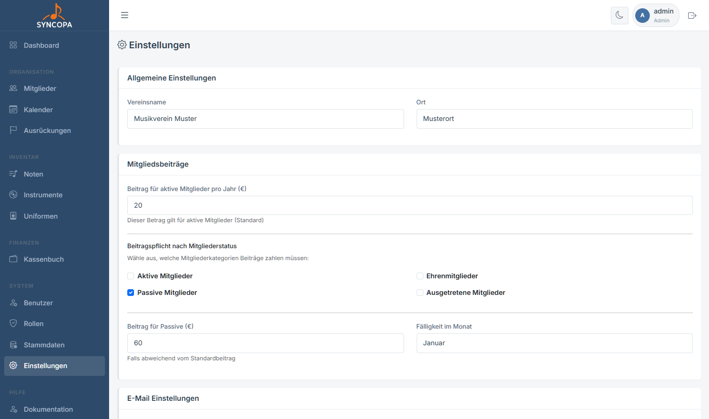

# Einstellungen

**Datei:** `einstellungen.php`  
**Berechtigung:** Nur **Admin**

Unter Einstellungen wird das globale Verhalten der Applikation konfiguriert.

---

## Vereinseinstellungen

### Vereinsdaten

| Feld | Beschreibung |
|---|---|
| Vereinsname | Erscheint in der Navigation und im PDF-Export |
| Ort | Vereinsort |
| Mitgliedsbeiträge | nur bei dem Mitgliederstatus der ein Häkchen bekommt werden auch die Mitgliedsbeiträge im Modul Finanzen -> Kassabuch -> Beiträge verwalten generiert

---

## E-Mail-Einstellungen

> 📸 **Screenshot:** *SMTP-Konfigurationsformular*

Falls Syncopa E-Mail-Benachrichtigungen versenden soll (z.B. für neue Benutzerregistrierungen):

| Feld | Beschreibung |
|---|---|
| SMTP-Server | Mailserver-Adresse |
| SMTP-Port | Meist 587 (TLS) oder 465 (SSL) |
| SMTP-Benutzer | E-Mail-Adresse / Loginname |
| SMTP-Passwort | Passwort des E-Mail-Kontos |
| Absender-Name | z.B. „Musikverein Syncopa" |
| Absender-Adresse | E-Mail-Adresse des Absenders |

> ⚠️ **Hinweis:** Diese Einstellungen bitte in der config.php vornehmen. Die E,ail Einstellungsverwaltung wird bei den Einstellungen erst später eingebaut.

---

## Google Calendar Integration

Diese Funktion ist noch nicht eingebaut - Coming soon...

---

## System-Update

**Datei:** `update.php`

Syncopa kann sich direkt aus dem Admin-Bereich heraus auf die neueste Version aktualisieren.

1. Navigiere zu **Einstellungen → System-Update**
2. Klicke auf **„Update prüfen"** – die installierte Version wird mit der aktuellen Version auf GitHub verglichen
3. Werden neue Änderungen angezeigt, klicke auf **„Jetzt updaten"**
4. Das Update-Protokoll wird live angezeigt

**Was passiert beim Update:**
- Die neue Version wird als ZIP von GitHub heruntergeladen
- Alle Dateien werden automatisch überschrieben
- `config.php` (Zugangsdaten, API-Keys) wird **nicht** überschrieben
- Das Upload-Verzeichnis (`uploads/`) wird **nicht** überschrieben
- `APP_VERSION` in der `config.php` wird automatisch auf die neue Version gesetzt

> ℹ️ Die Versionsnummer wird aus dem `CHANGELOG.md` auf GitHub gelesen. Voraussetzung: der Server hat eine aktive Internetverbindung und cURL/ZipArchive sind aktiviert.