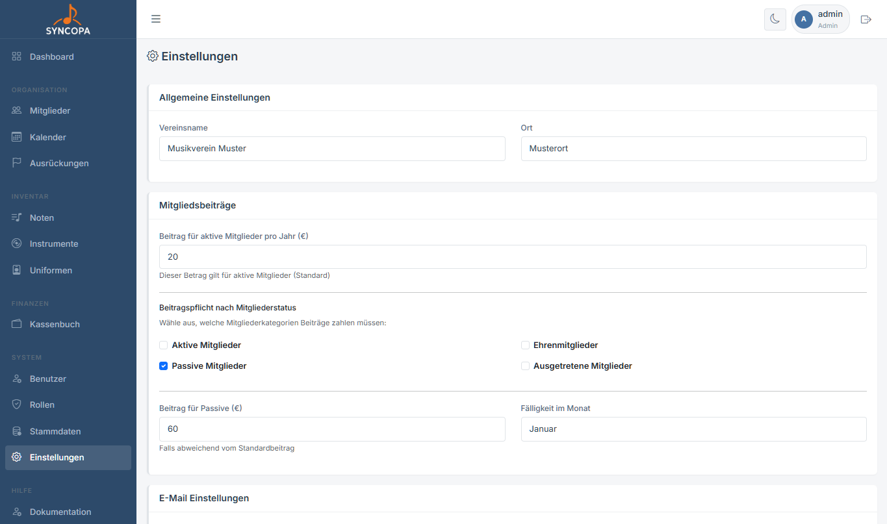

# Einstellungen

**Datei:** `einstellungen.php`
**Berechtigung:** Nur **Administratoren**

Unter Einstellungen wird das globale Verhalten der Applikation konfiguriert.



---

## Vereinseinstellungen

| Feld | Beschreibung |
|---|---|
| Vereinsname | Erscheint in der Navigation und im PDF-Export |
| Ort | Vereinsort |

---

## Mitgliedsbeiträge

Hier wird festgelegt, wie hoch der jährliche Mitgliedsbeitrag ist und für welche Mitgliederkategorien er anfällt.

| Feld | Beschreibung |
|---|---|
| Beitrag für aktive Mitglieder pro Jahr (€) | Standardbetrag |
| Beitrag für Passive (€) | Abweichender Betrag, falls gewünscht |
| Fälligkeit im Monat | Monat, in dem der Beitrag fällig wird |
| Beitragspflicht nach Status | Häkchen bei „Aktive", „Passive", „Ehrenmitglieder", „Ausgetretene" – nur angehakte Kategorien erhalten automatisch generierte Beiträge |

> 💡 **Tipp:** Nur bei dem Mitgliedsstatus, der hier ein Häkchen bekommt, werden im Modul **Finanzen → Kassabuch → Beiträge verwalten** automatisch Beiträge generiert.

---

## E-Mail-Einstellungen

Falls Syncopa E-Mail-Benachrichtigungen versenden soll (z.B. bei neuen Benutzerregistrierungen), können hier SMTP-Server, Port und Absender-Adresse hinterlegt werden.

> **Für Administratoren:** Die eigentlichen Zugangsdaten (SMTP-Benutzer/-Passwort) werden aus Sicherheitsgründen in der `config.php` gepflegt, nicht in diesem Formular:
> ```php
> define('EMAIL_ENABLED',   true);
> define('EMAIL_SMTP_HOST', 'smtp.example.com');
> define('EMAIL_SMTP_PORT', 587);
> define('EMAIL_SMTP_USER', '...');
> define('EMAIL_SMTP_PASS', '...');
> define('EMAIL_FROM',      'verein@beispiel.at');
> define('EMAIL_FROM_NAME', 'Musikverein');
> ```

---

## Google Calendar Integration

Diese Funktion ist derzeit noch in Entwicklung – „Coming soon".

---

## Nutzungsstatistik (Telemetrie)

Syncopa kann einmal täglich eine **anonyme** Nutzungsstatistik (Versionsnummer, Vereinsname) an den Syncopa-Server senden, um die Weiterentwicklung zu unterstützen. Es werden **keine personenbezogenen Daten** übertragen. Die Funktion kann jederzeit über den Schalter „Anonyme Nutzungsstatistik senden" aktiviert bzw. deaktiviert werden.

---

## Noten-Aufteilung: Instrument-Erkennung

Für das automatische Aufteilen von Noten-PDFs auf einzelne Stimmen verwendet Syncopa hinterlegte Erkennungsmuster pro Instrument. Diese werden über **Instrument-Pattern verwalten** (`noten_instrumente.php`) gepflegt.

Die vollständige Anleitung dazu findest du unter → [Noten – Erkennungsmuster verwalten](noten.md#erkennungsmuster-verwalten).

---

## Rollen & Berechtigungen

Über die Buttons **„Rollen verwalten"** und **„Berechtigungs-Matrix"** gelangst du direkt zur Rollen- und Rechteverwaltung.

→ Ausführliche Anleitung: [Rollen & Berechtigungen](rollen.md)

---

## Stammdaten

Register, Instrumententypen, Noten-Kategorien und weitere Grunddaten werden nicht hier, sondern unter **Stammdaten** gepflegt.

→ Ausführliche Anleitung: [Stammdaten](stammdaten.md)

---

## System-Informationen

Im Kasten „System-Informationen" sieht man auf einen Blick:

| Information | Beschreibung |
|---|---|
| PHP-Version | Auf dem Server installierte PHP-Version |
| MySQL-Version | Version der Datenbank |
| Anwendungs-Version | Aktuell installierte Syncopa-Version |
| Upload-Verzeichnis | Pfad des Upload-Ordners inkl. Hinweis, ob er beschreibbar ist |

> ⚠️ **Achtung:** Steht beim Upload-Verzeichnis „Nicht beschreibbar", können keine Dateien (Noten-PDFs, Fotos, Verträge etc.) hochgeladen werden. In diesem Fall müssen die Schreibrechte des Verzeichnisses auf dem Server angepasst werden.

---

## System-Update

**Datei:** `update.php`

Syncopa kann sich direkt aus dem Admin-Bereich heraus auf die neueste Version aktualisieren, ohne dass Dateien manuell per FTP hochgeladen werden müssen.

1. Navigiere zu **Einstellungen → System-Update** (oder direkt auf den Button „Update prüfen" bei den System-Informationen)
2. Beim Öffnen der Seite wird automatisch geprüft, ob eine neuere Version verfügbar ist – die installierte Version wird mit der aktuellsten Version auf GitHub verglichen
3. Ist eine neue Version verfügbar, werden die **Änderungen** (aus dem Changelog) zu dieser Version angezeigt
4. Klicke auf **„Jetzt auf neueste Version aktualisieren"** und bestätige die Sicherheitsabfrage
5. Das **Update-Protokoll** wird live angezeigt, während die neue Version heruntergeladen und installiert wird
6. Nach Abschluss erscheint „Update erfolgreich!" mit der neuen Versionsnummer

### Was passiert beim Update

- Die neueste Version wird als ZIP-Datei direkt von GitHub heruntergeladen
- Alle Programmdateien werden automatisch mit der neuen Version überschrieben
- Deine **eigene Konfigurationsdatei `config.php`** (Datenbank-Zugangsdaten, API-Keys) wird dabei **niemals überschrieben**
- Der **Upload-Ordner** (`uploads/` – Noten-PDFs, Fotos, Verträge etc.) bleibt vollständig erhalten
- Die Versionsnummer wird danach automatisch aktualisiert

> ⚠️ **Achtung:** Auch wenn `config.php` und Uploads sicher sind, empfehlen wir **vor jedem Update ein vollständiges Datenbank-Backup** zu erstellen – insbesondere wenn seit dem letzten Update neue Tabellen oder Spalten hinzugekommen sein könnten.

> ℹ️ Voraussetzung für das automatische Update ist eine aktive Internetverbindung des Servers sowie die aktivierten PHP-Erweiterungen `curl` (oder `allow_url_fopen`) und `ZipArchive`. Ist eine dieser Voraussetzungen nicht erfüllt, zeigt Syncopa einen Hinweis an, dass automatische Updates nicht verfügbar sind und die Dateien manuell aktualisiert werden müssen.

Das vollständige Changelog mit allen bisherigen Versionen lässt sich unten auf der Seite über **„Vollständiges Changelog"** aufklappen.
