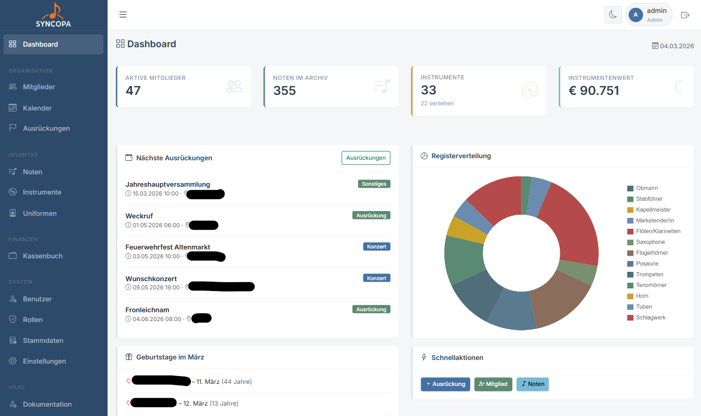

# Erster Login

## Admin-Konto anlegen

Mit dem Import der database.sql wird ein erster Admin Benutzer angelegt. 
Benutzer: admin
Passwort admin123

Falls nicht, lege einen ersten Administrator an:

```sql
INSERT INTO benutzer (benutzername, email, passwort, rolle, aktiv, erstellt_am)
VALUES (
  'admin',
  'admin@meinverein.at',
  '$2y$10$HASH_HIER',   -- mit PHP: password_hash('meinpasswort', PASSWORD_DEFAULT)
  'admin',
  1,
  NOW()
);
```

## Login-Vorgang


1. Öffne die Anwendung im Browser
2. Gib **Benutzername** und **Passwort** ein
3. Klicke auf **Anmelden**

Bei Erfolg wirst du zum **Dashboard** weitergeleitet.

---

## Das Dashboard



Das Dashboard zeigt auf einen Blick:

- 📊 **Statistiken** – Mitgliederanzahl, Notenbestand, Instrumente
- 📅 **Nächste Ausrückungen** – die kommenden 5 Termine
- 🎂 **Geburtstage** – Mitglieder mit Geburtstag in diesem und nächsten Monat
- 🔔 **Schnellaktionen** – Ausrückung, Mitglied, Noten anlegen *(nur wer Rechte dazu hat)*
- 🔧 **Fällige Wartungen** – Instrumente deren Wartungsdatum überschritten ist

---

## Passwort ändern

Nach dem ersten Login sollte der Admin das Passwort ändern:

1. Klicke links im Menü auf **Benutzer**
2. Ändere beim Benutzer **Admin** das Passwort (Stiftsymbol)
3. Trage das neue Passwort ein und bestätige es
4. Klicke **Speichern**

---

## Nächste Schritte empfohlen

Nach dem ersten Login empfehlen wir folgende Reihenfolge:

1. ⚙️ [Stammdaten einrichten](stammdaten.md) – Register, Instrumententypen
2. 👥 [Mitglieder anlegen](mitglieder.md)
3. 🔐 [Weitere Benutzer anlegen](benutzer.md)
4. 🎺 [Erste Ausrückung erstellen](ausrueckung-anlegen.md)
