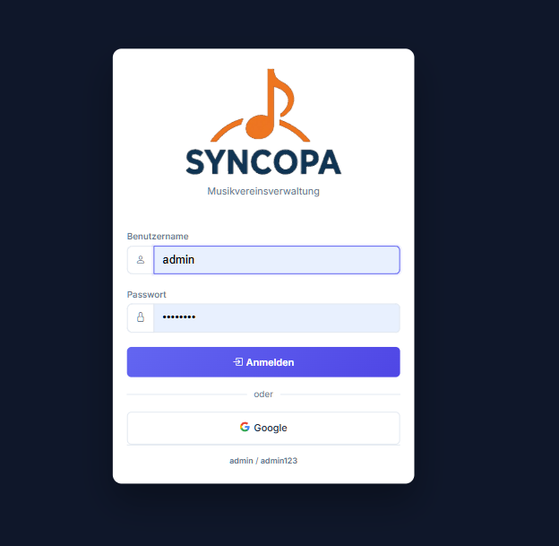
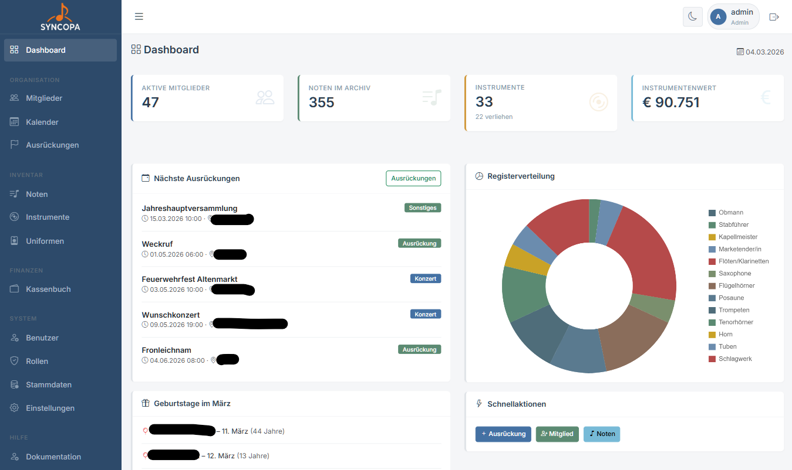

# Erster Login

## Admin-Konto anlegen

Der erste Administrator-Account wird bereits während der [Installation](einrichtung.md) angelegt – im Schritt **„Anwendungsdaten"** des Installationsassistenten (`install.php`) trägst du dort Benutzername, E-Mail und Passwort für den ersten Admin ein.

> 💡 **Wichtig:** Es gibt keinen fixen Standard-Zugang – verwende genau den Benutzernamen und das Passwort, die du bei der Installation selbst festgelegt hast.

> **Für Administratoren:** Wurde Syncopa ausnahmsweise **nicht** über `install.php` eingerichtet (z.B. bei einer manuellen Entwickler-Installation direkt aus `database.sql`), kann ein erster Admin auch per SQL angelegt werden:
> ```sql
> INSERT INTO benutzer (benutzername, email, passwort_hash, rolle, rolle_id, aktiv, erstellt_am)
> VALUES (
>   'admin',
>   'admin@meinverein.at',
>   '$2y$10$HASH_HIER',   -- mit PHP erzeugen: password_hash('meinpasswort', PASSWORD_DEFAULT)
>   'admin',
>   1,                    -- id der Rolle "admin" in der Tabelle "rollen"
>   1,
>   NOW()
> );
> INSERT INTO benutzer_rollen (benutzer_id, rolle_id) VALUES (LAST_INSERT_ID(), 1);
> ```
> Der zweite INSERT ist wichtig: Ohne einen Eintrag in `benutzer_rollen` erhält der Benutzer keine Berechtigungen (siehe [Rollen & Berechtigungen](rollen.md)).

---

## Login-Vorgang



1. Öffne die Anwendung im Browser (die Adresse, unter der du Syncopa hochgeladen hast)
2. Du wirst automatisch zur Login-Seite weitergeleitet
3. Gib **Benutzername** und **Passwort** ein (die du bei der Installation vergeben hast)
4. Klicke auf **Anmelden**

Bei Erfolg wirst du zum **Dashboard** weitergeleitet.

> ⚠️ **Achtung:** Bei falschem Benutzername oder Passwort erscheint die Meldung „Ungültige Anmeldedaten". Achte auf Groß-/Kleinschreibung – beides wird exakt geprüft.

---

## Das Dashboard



Das Dashboard zeigt auf einen Blick:

- 📊 **Statistiken** – Mitgliederanzahl, Notenbestand, Instrumente
- 📅 **Nächste Ausrückungen** – die kommenden Termine
- 🎂 **Geburtstage** – Mitglieder mit Geburtstag in diesem und nächsten Monat
- 🔔 **Schnellaktionen** – Ausrückung, Mitglied, Noten anlegen *(nur wer Rechte dazu hat)*
- 🔧 **Fällige Wartungen** – Instrumente, deren Wartungsdatum überschritten ist

Zusätzlich erscheint für Admins und Obmänner ganz oben eine Benachrichtigung, sobald sich neue Benutzer selbst registriert haben und auf Freischaltung warten – siehe [Benutzerverwaltung – Selbstregistrierung & Freischaltung](benutzer.md#selbstregistrierung--freischaltung-neuer-benutzer).

---

## Passwort ändern

Aus Sicherheitsgründen sollte nach dem ersten Login (spätestens aber, sobald mehrere Personen Zugriff haben) das Admin-Passwort überprüft bzw. geändert werden:

1. Klicke links im Menü auf **Benutzer**
2. Klicke beim Benutzer **Admin** auf das **Stift-Symbol** (Bearbeiten)
3. Trage im Feld **Passwort** ein neues Passwort ein (leer lassen, wenn du es nicht ändern willst)
4. Klicke auf **Aktualisieren**

---

## Nächste Schritte empfohlen

Nach dem ersten Login empfehlen wir folgende Reihenfolge:

1. ⚙️ [Stammdaten einrichten](stammdaten.md) – Register, Instrumententypen, Noten-Kategorien
2. 🔐 [Weitere Benutzer und Rollen anlegen](benutzer.md)
3. 👥 [Mitglieder anlegen](mitglieder.md)
4. 🎺 [Erste Ausrückung erstellen](ausrueckungen.md)
