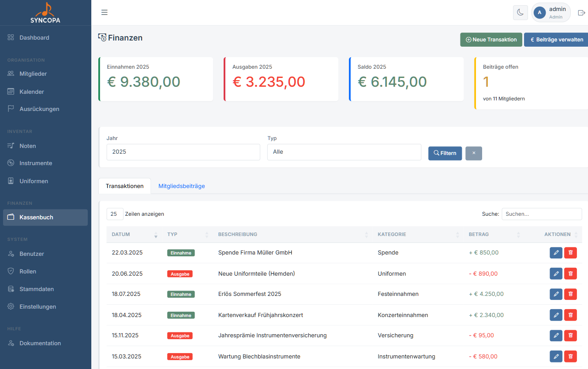
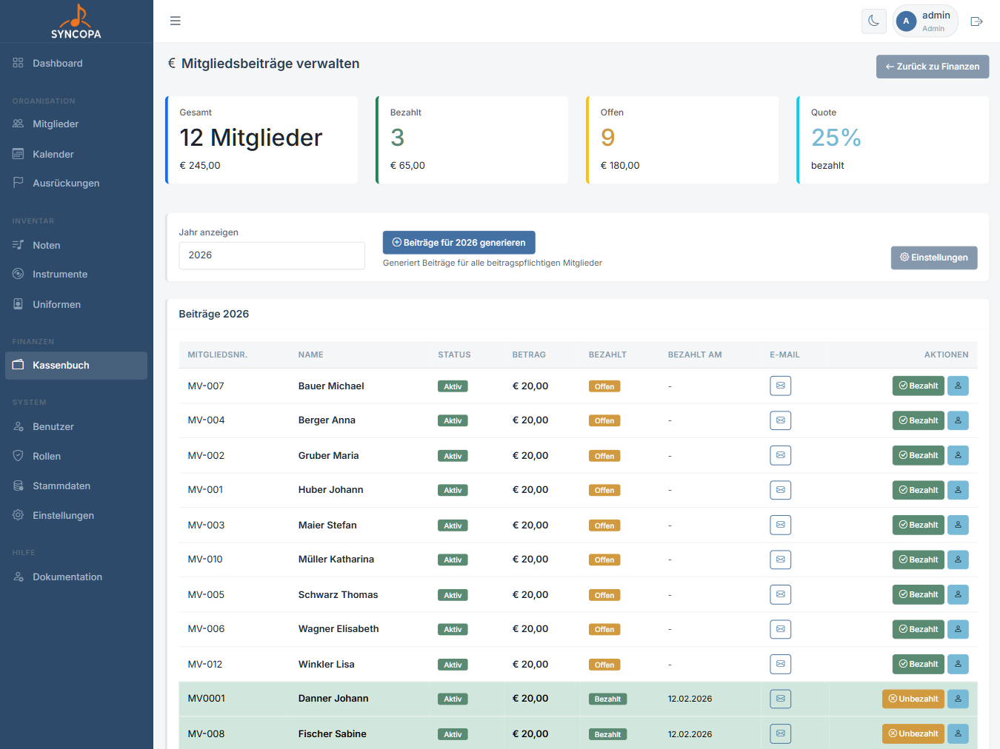

# Finanzen

**Datei:** `finanzen.php`  
**Berechtigung:** `finanzen – lesen`

Die Finanzverwaltung ermöglicht die Erfassung und Auswertung aller Einnahmen und Ausgaben des Vereins.

---

## Übersicht

Die Übersicht zeigt:

- Alle Transaktionen chronologisch
- **Einnahmen** in Grün, **Ausgaben** in Rot
- Aktuellen **Kontostand / Saldo**
- Summen nach Zeitraum und Typ filterbar

---

## Transaktion erfassen

**Datei:** `transaktion_bearbeiten.php`  
**Berechtigung:** `finanzen – schreiben`

1. Klicke auf **+ Neue Transaktion**
2. Wähle **Einnahme** oder **Ausgabe**
3. Fülle Datum, Betrag, Kategorie, Beschreibung und Belegnummer aus
4. Klicke **Speichern**

### Formularfelder

| Feld | Pflicht | Beschreibung |
|---|---|---|
| Typ | ✅ | Einnahme oder Ausgabe |
| Datum | ✅ | Buchungsdatum |
| Betrag | ✅ | Betrag in Euro (ohne Währungssymbol) |
| Kategorie | – | Buchungskategorie |
| Zahlungsart | - | wie wurde der Betrag beglichen |
| Beschreibung | – | Verwendungszweck |
| Beleg-Nr. | – | Referenz zu einem Beleg |

---

## Mitgliedsbeiträge verwalten

**Datei:** `beitraege_verwalten.php`  
**Berechtigung:** `finanzen – schreiben`

Über die Beitragsverwaltung können Mitgliedsbeiträge für das aktuelle (oder vergangene) Jahr erfasst werden:

1. Navigiere zu **Finanzen → Mitgliedsbeiträge**
2. Wähle das **Jahr**
3. Setze für jedes Mitglied den Status: `bezahlt` / `unbezahlt`
4. Änderungen werden automatisch gespeichert

> 💡 **Tipp:** Mitgliederbeiträge können in den Einstellungen festgelegt werden. Für den Status `aktiv` kann ein Beitrag eingetragen werden, sowie für alle anderen Mitgliedstypen. Weiters kann festgelegt werden welcher Mitgliedstyp Beiträge zahlen muss.
