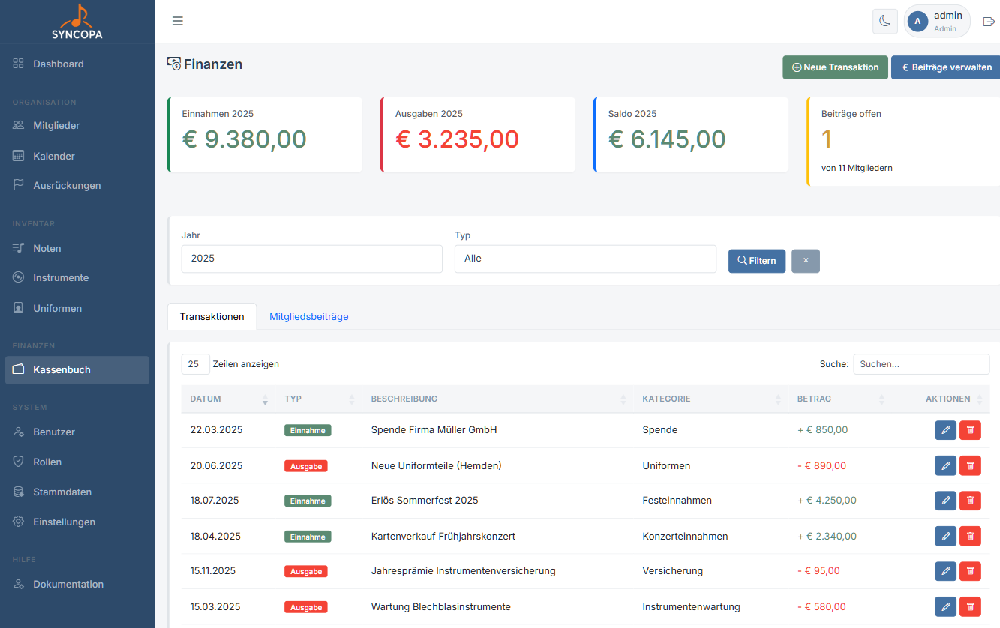
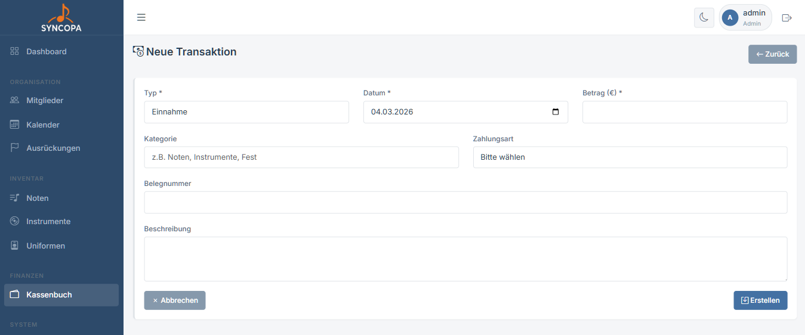
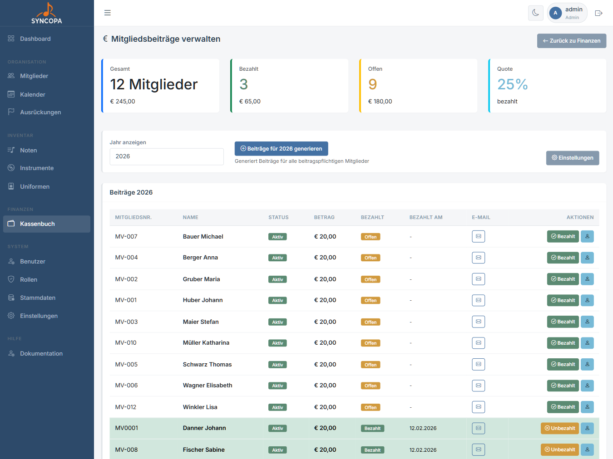

# Finanzen

**Datei:** `finanzen.php`  
**Berechtigung:** `finanzen – lesen`

Die Finanzverwaltung ermöglicht die Erfassung und Auswertung aller Einnahmen und Ausgaben des Vereins sowie die Verwaltung der Mitgliedsbeiträge.

---

## Übersicht

Am oberen Rand der Seite zeigen vier Karten auf einen Blick:

| Karte | Bedeutung |
|---|---|
| Einnahmen (Jahr) | Summe aller Einnahmen des gewählten Jahres |
| Ausgaben (Jahr) | Summe aller Ausgaben des gewählten Jahres |
| Saldo (Jahr) | Einnahmen minus Ausgaben |
| Beiträge offen | Anzahl noch nicht bezahlter Mitgliedsbeiträge |

Darunter kann nach **Jahr** und **Typ** (Einnahme/Ausgabe) gefiltert werden. Zwei Reiter gliedern die Seite:

- **Transaktionen** – alle einzelnen Buchungen
- **Mitgliedsbeiträge** – Beitragsstatus je Mitglied für das gewählte Jahr

---

## Transaktion erfassen

**Datei:** `transaktion_bearbeiten.php`  
**Berechtigung:** `finanzen – schreiben`

1. Klicke auf **+ Neue Transaktion**
2. Wähle **Einnahme** oder **Ausgabe**
3. Fülle Datum, Betrag, Kategorie, Zahlungsart, Belegnummer und Beschreibung aus
4. Klicke **Speichern**

### Formularfelder

| Feld | Pflicht | Beschreibung |
|---|---|---|
| Typ | ✅ | Einnahme oder Ausgabe |
| Datum | ✅ | Buchungsdatum |
| Betrag | ✅ | Betrag in Euro (ohne Währungssymbol) |
| Kategorie | – | Freitext, z.B. „Noten", „Instrumente", „Fest" |
| Zahlungsart | – | `bar` · `überweisung` · `lastschrift` · `kreditkarte` |
| Beleg-Nr. | – | Referenz zu einem Beleg |
| Beschreibung | – | Verwendungszweck |

Eine Transaktion kann jederzeit über den Stift in der Liste geändert und über den Papierkorb gelöscht werden (Berechtigung `finanzen – schreiben` bzw. `finanzen – loeschen`).

---

## Finanzen und Formationen

Vereine mit **mehreren Formationen** (siehe [Formationen](stammdaten.md)) können Einnahmen und Ausgaben einer bestimmten Formation zuordnen. In der Übersichtsliste sieht ein Benutzer nur Transaktionen seiner aktiven Formation sowie Transaktionen, die **keiner** Formation zugeordnet sind (diese gelten als vereinsweit sichtbar).

> 💡 **Hinweis:** Beim Erfassen einer neuen Transaktion über `transaktion_bearbeiten.php` gibt es aktuell kein Auswahlfeld für die Formation – neu angelegte Buchungen sind daher automatisch für **alle** Formationen sichtbar. Eine formationsspezifische Zuordnung kann bei Bedarf nur direkt in der Datenbank vorgenommen werden.

---

## Mitgliedsbeiträge verwalten

**Datei:** `beitraege_verwalten.php`  
**Berechtigung:** `finanzen – schreiben`

Mitgliedsbeiträge werden **jahresweise generiert** und danach einzeln als bezahlt bzw. unbezahlt markiert. Sie sind **nicht** formationsspezifisch – Beiträge gehören immer zum Gesamtverein.

### Beiträge für ein Jahr generieren

1. Navigiere zu **Finanzen → Beiträge verwalten**
2. Wähle oben das gewünschte **Jahr**
3. Klicke auf **„Beiträge für [Jahr] generieren"**
4. Bestätige die Abfrage

Syncopa legt daraufhin für jedes beitragspflichtige Mitglied automatisch einen offenen Beitrag in der passgenauen Höhe an. Bereits vorhandene Beiträge für dieses Jahr werden dabei übersprungen, es entstehen also keine doppelten Einträge.

> 💡 **Tipp:** Welche Mitgliedstypen (aktiv, passiv, Ehrenmitglied, ausgetreten) überhaupt Beiträge zahlen und wie hoch der Jahresbeitrag ist, wird in den **Einstellungen** festgelegt. Für den Status „aktiv" und „passiv" können unterschiedliche Beträge hinterlegt werden.

### Beitrag als bezahlt markieren

Für jedes Mitglied zeigt die Liste Mitgliedsnummer, Name, Status, Betrag und aktuellen Zahlungsstatus:

1. Finde das Mitglied in der Liste (offene Beiträge stehen standardmäßig oben)
2. Klicke auf **„Bezahlt"**, sobald der Beitrag eingelangt ist – das Datum wird automatisch auf heute gesetzt
3. Falls ein Beitrag versehentlich als bezahlt markiert wurde, kann er über **„Unbezahlt"** wieder zurückgesetzt werden

Über das Brief-Symbol lässt sich direkt eine E-Mail an das Mitglied öffnen, über das Personen-Symbol gelangt man zur Mitgliederdetailseite.

Vier Statistik-Karten zeigen zusätzlich Gesamtanzahl, bezahlte und offene Beiträge sowie die Zahlungsquote in Prozent.

---

## Berechtigungen im Überblick

| Aktion | Benötigte Berechtigung |
|---|---|
| Finanzübersicht ansehen | `finanzen – lesen` |
| Transaktion anlegen/bearbeiten, Beiträge generieren/markieren | `finanzen – schreiben` |
| Transaktion löschen | `finanzen – loeschen` |
