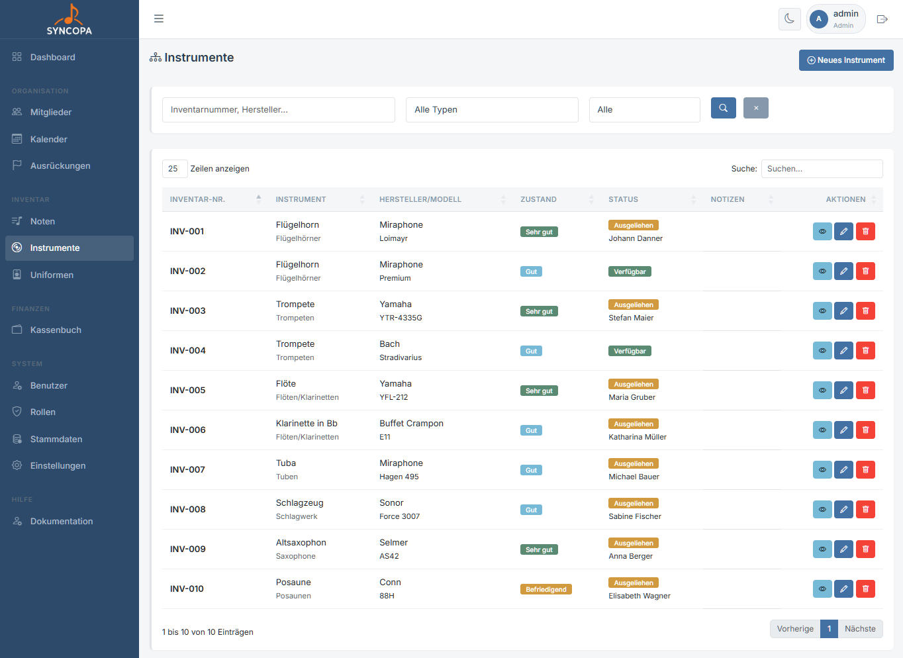
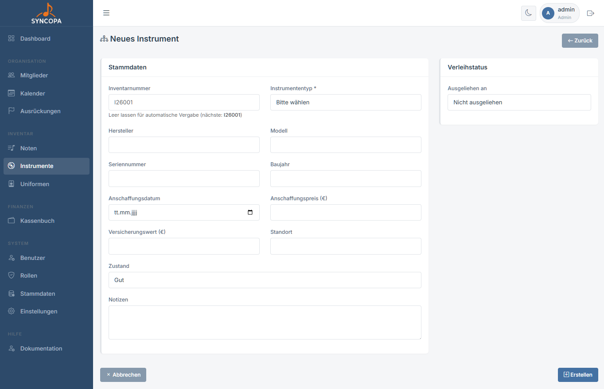
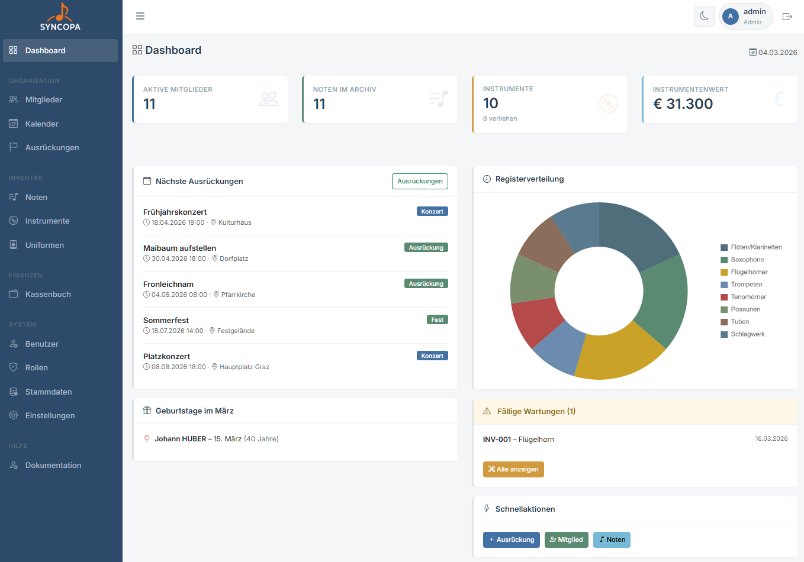
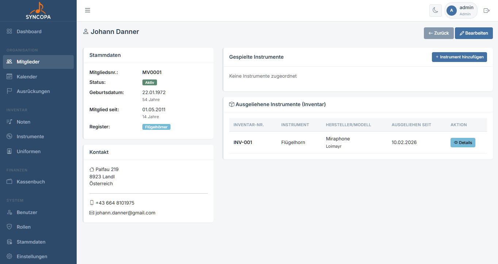

# Instrumente

**Datei:** `instrumente.php`  
**Berechtigung:** `instrumente – lesen`

Die Instrumentenverwaltung erfasst das komplette Instrumenteninventar des Vereins, inklusive Wartungsfristen und Mitgliederzuordnung.

---

## Inventarübersicht

| Spalte | Beschreibung |
|---|---|
| Inventarnummer | Eindeutige Nummer |
| Instrument | Register / Instrument |
| Hersteller/Modell | Hersteller und Modell |
| Zustand | `gut` · `reparaturbedürftig` · `außer Betrieb` |
| Status | Verfügbar oder aktuell ausgeliehenes Mitglied |
| Notizen | optionale Notizen, z.B. Kinder B-Klarinette kurz |
| Aktionen | Buttons zum Warten und ändern |

---

## Instrument erfassen

**Datei:** `instrument_bearbeiten.php`  
**Berechtigung:** `instrumente – schreiben`

1. Klicke auf **+ Neues Instrument**
2. Wähle den **Instrumententyp** (aus Stammdaten)
3. Ergänze Seriennummer, Kaufdatum und Zustand
4. Optional: Ausgeliehen an falls dieses Instrument jemand ausgeliehen hat
5. **Erstellen**

### Formularfelder

| Feld | Pflicht | Beschreibung |
|---|---|---|
| Inventarnummer | – | Wird vorgeschlagen ||
| Instrumententyp | ✅ | Aus den Stammdaten |
| Hersteller | - | | Instrumentenhersteller
| Modell | - | | Modellnummer des Herstellers
| Seriennummer | – | Hersteller-ID |
| Baujahr | - | Jahr wann das Instrument gebaut wurde |
| Anschaffungsdatum | – | Datum der Anschaffung |
| Anschaffungspreis | – | Anschaffungskosten |
| Versicherungswert | - | optional |
| Standort | - | wo wird das Instrument gelagert |
| Zustand | – | Aktueller Zustand |
| Notizen | – | Interne Anmerkungen |

---

## Wartungen {#wartungen}

Wartung werden in den Instrumentendetails gewartet.

Das System erinnert automatisch an fällige Wartungen:

- Im **Dashboard** erscheint eine Warnung bei überfälligen Instrumenten
- In der Instrumentenliste werden fällige Wartungen **rot** markiert
- Nach einer Wartung: Datum in `instrument_bearbeiten.php` aktualisieren und neues Datum setzen

> 💡 **Empfehlung:** Trage für alle Instrumente ein Wartungsdatum ein, damit das System automatisch erinnern kann.

---

## Mitglied zuordnen

Ein Instrument einem Mitglied zuordnen (Ausleihe):

1. Bearbeite das Instruments (`instrument_bearbeiten.php`)
2. Klicke auf **„Ausgeliehen an"**
3. Wähle das Mitglied aus der Liste
4. Optional: Ausleihdatum und Notizen ergänzen
5. **Speichern**

Das Instrument erscheint nun in der Mitgliederdetailseite unter dem Reiter **Instrumente**.

