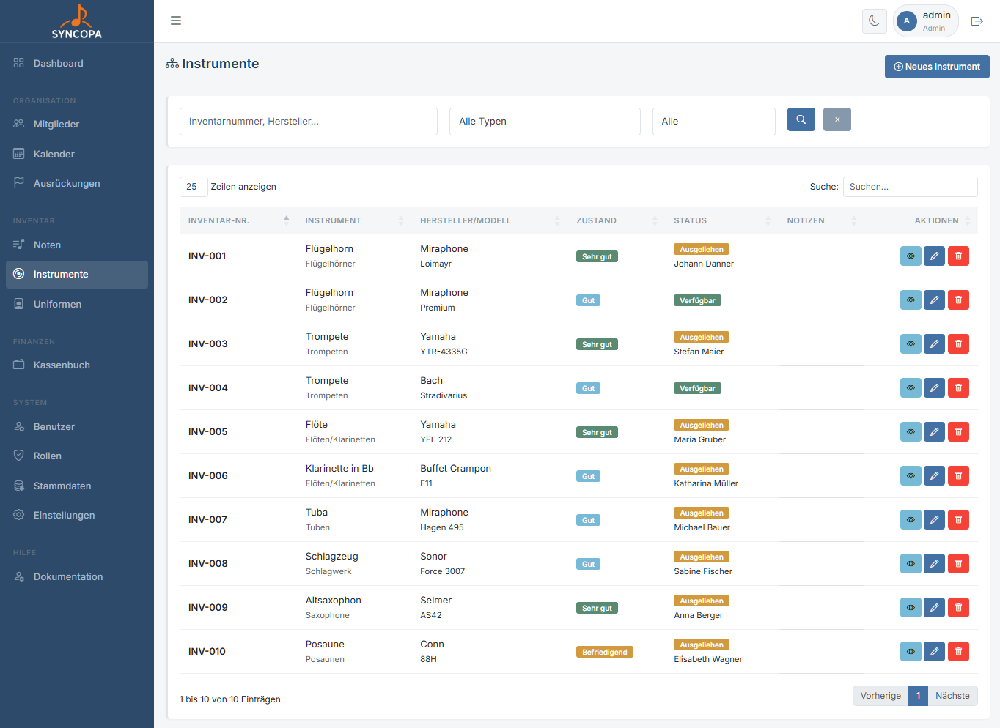
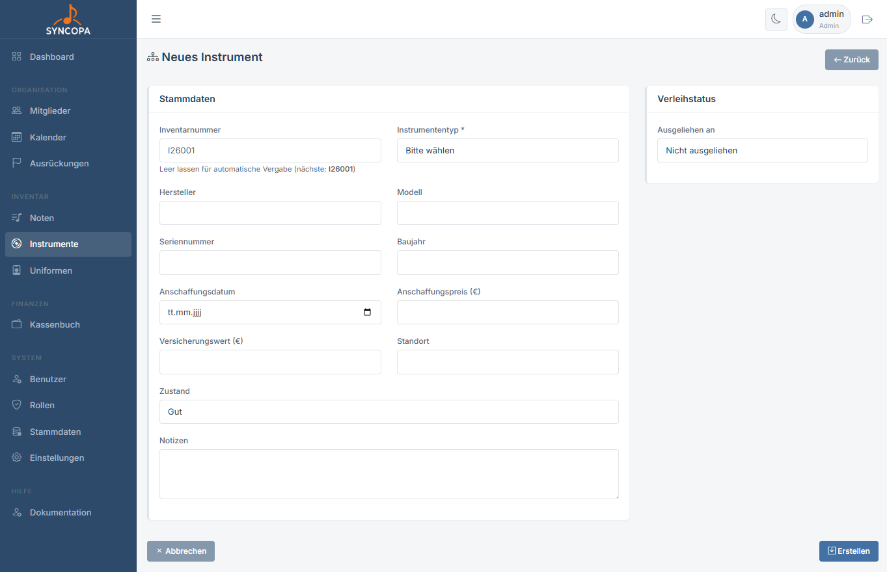
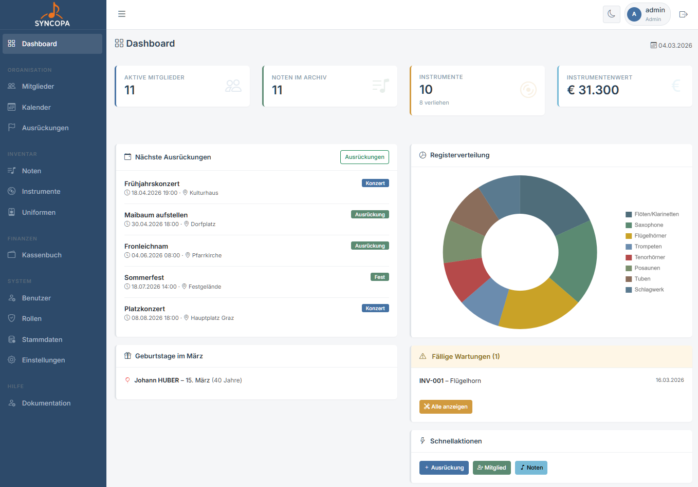
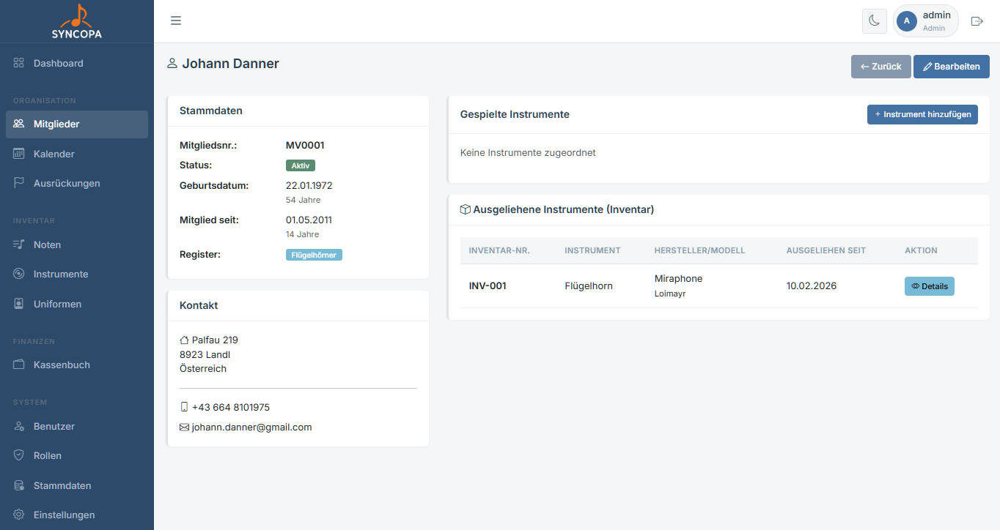

# Instrumente

**Datei:** `instrumente.php`  
**Berechtigung:** `instrumente – lesen`

Die Instrumentenverwaltung erfasst das komplette Instrumenteninventar des Vereins, inklusive Wartungsfristen und Mitgliederzuordnung.

---

## Inventarübersicht

| Spalte | Beschreibung |
|---|---|
| Inventarnummer | Eindeutige Nummer |
| Instrument | Register / Instrument |
| Hersteller/Modell | Hersteller und Modell |
| Zustand | `sehr gut` · `gut` · `befriedigend` · `schlecht` · `defekt` |
| Status | Verfügbar oder aktuell ausgeliehenes Mitglied |
| Notizen | optionale Notizen, z.B. Kinder B-Klarinette kurz |
| Aktionen | Buttons zum Warten und ändern |

---

## Instrument erfassen

**Datei:** `instrument_bearbeiten.php`  
**Berechtigung:** `instrumente – schreiben`

1. Klicke auf **+ Neues Instrument**
2. Wähle den **Instrumententyp** (aus Stammdaten)
3. Ergänze Seriennummer, Kaufdatum und Zustand
4. Optional: Ausgeliehen an falls dieses Instrument jemand ausgeliehen hat
5. **Erstellen**

### Formularfelder

| Feld | Pflicht | Beschreibung |
|---|---|---|
| Inventarnummer | – | Wird vorgeschlagen (Nummernkreis, in den Stammdaten änderbar) |
| Instrumententyp | ✅ | Aus den Stammdaten, nach Register gruppiert |
| Hersteller | – | Instrumentenhersteller |
| Modell | – | Modellnummer des Herstellers |
| Seriennummer | – | Hersteller-ID |
| Baujahr | – | Jahr, in dem das Instrument gebaut wurde |
| Anschaffungsdatum | – | Datum der Anschaffung |
| Anschaffungspreis | – | Anschaffungskosten in Euro |
| Versicherungswert | – | Wert für die Vereinsversicherung, optional |
| Standort | – | Wo das Instrument normalerweise gelagert wird |
| Zustand | – | `sehr gut` · `gut` · `befriedigend` · `schlecht` · `defekt` |
| Notizen | – | Interne Anmerkungen |

Im selben Formular kann rechts auch gleich das **Ausgeliehen an**-Feld gesetzt werden – damit muss man nach dem Anlegen nicht extra auf die Detailseite wechseln, um das Instrument zu verleihen.

---

## Instrument im Detail ansehen

**Datei:** `instrument_detail.php`

Klickt man in der Übersicht auf das Lupe-Symbol, öffnet sich die Detailseite mit allen Informationen zu einem Instrument:

- **Stammdaten** – Inventarnummer, Typ, Register, Hersteller, Modell, Seriennummer, Baujahr, Zustand
- **Finanzen** – Anschaffungsdatum, Anschaffungspreis und Versicherungswert
- **Status** – ob das Instrument gerade verfügbar oder ausgeliehen ist (siehe Tipp unten)
- **Notizen** – falls vorhanden
- **Wartungshistorie** – alle bisherigen Wartungen und Reparaturen

---

## Wartungen {#wartungen}

Wartungen werden direkt auf der Instrument-Detailseite erfasst.

1. Öffne die **Detailseite** des Instruments (`instrument_detail.php`)
2. Klicke im Bereich **Wartungshistorie** auf **„Wartung hinzufügen"**
3. Fülle das Formular aus
4. **Speichern**

### Formularfelder Wartung

| Feld | Pflicht | Beschreibung |
|---|---|---|
| Datum | ✅ | Datum der Wartung/Reparatur |
| Art | ✅ | `Wartung` · `Reparatur` · `Überholung` · `Reinigung` |
| Beschreibung | – | Was wurde gemacht |
| Kosten | – | Kosten in Euro |
| Durchgeführt von | – | Werkstatt oder Person |
| Nächste Wartung | – | Datum, an das erinnert werden soll |

Das System erinnert automatisch an fällige Wartungen:

- Im **Dashboard** erscheint eine Warnung, wenn eine „Nächste Wartung" innerhalb der nächsten 30 Tage fällig ist
- Trägt man bei einer Wartung ein Datum bei **„Nächste Wartung"** ein, taucht das Instrument rechtzeitig in dieser Erinnerung auf

> 💡 **Empfehlung:** Trage bei jeder Wartung ein Datum für die nächste fällige Wartung ein, damit das System rechtzeitig erinnern kann.

---

## Mitglied zuordnen

Ein Instrument einem Mitglied zuordnen (Ausleihe):

1. Bearbeite das Instruments (`instrument_bearbeiten.php`)
2. Klicke auf **„Ausgeliehen an"**
3. Wähle das Mitglied aus der Liste
4. Optional: Ausleihdatum und Notizen ergänzen
5. **Speichern**

Das Instrument erscheint nun in der Mitgliederdetailseite unter dem Reiter **Instrumente**.

Ein ausgeliehenes Instrument wird zurückgenommen, indem man es einfach erneut bearbeitet und bei **„Ausgeliehen an"** wieder **„Nicht ausgeliehen"** auswählt.

> 💡 **Tipp:** Auf der Detailseite (`instrument_detail.php`) wird der Status **„Ausgeliehen an"** bzw. **„Verfügbar"** dauerhaft als Hinweisbox angezeigt und blendet sich – anders als andere Meldungen in Syncopa – nicht nach ein paar Sekunden automatisch aus. So ist auf einen Blick immer erkennbar, wer ein Instrument gerade hat.