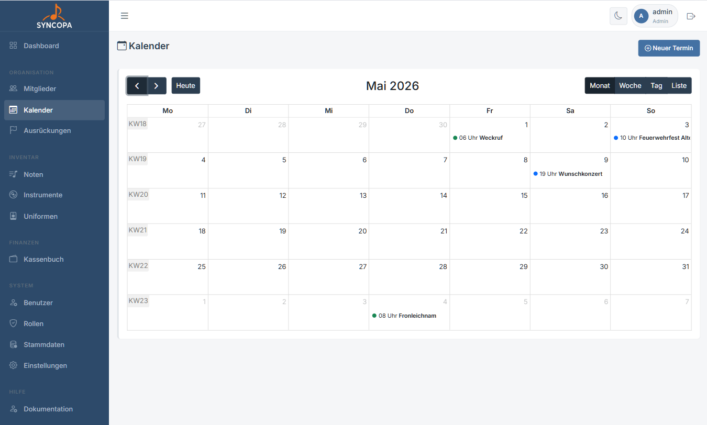
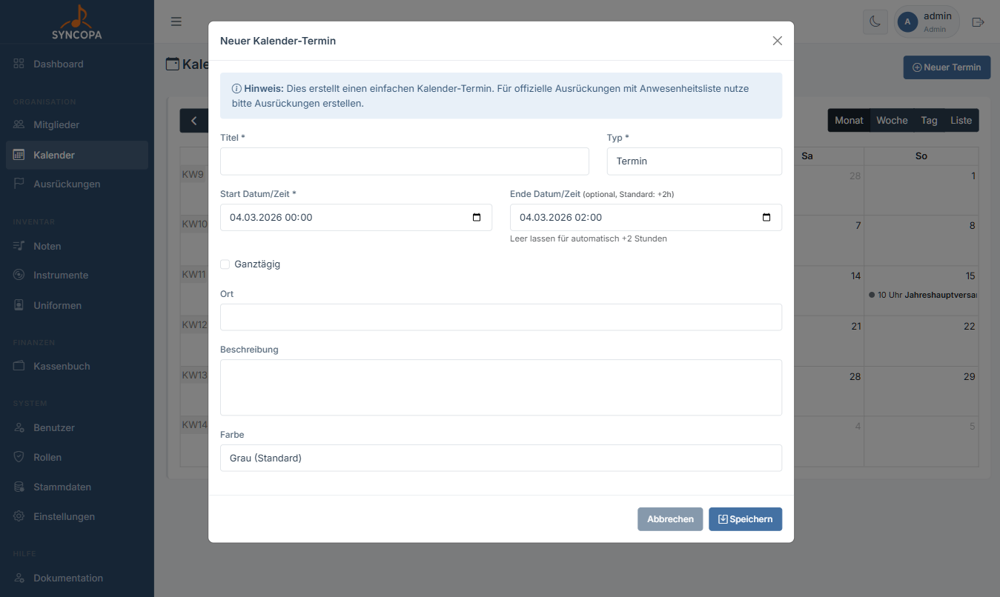
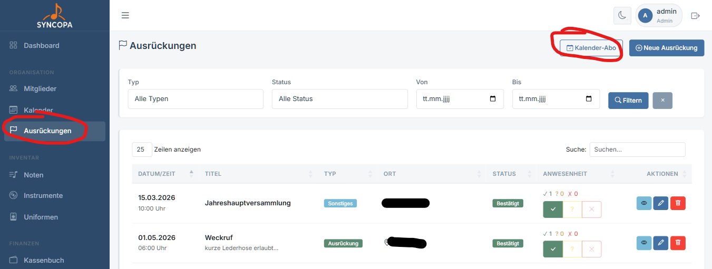
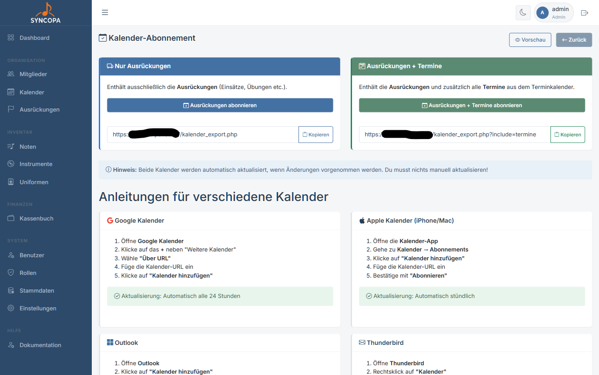

# Kalender

Der Kalender bietet eine visuelle Übersicht aller Vereinstermine und ermöglicht den Export als iCal-Feed (Menü -> Ausrückungen -> Kalender Abo).

---

## Kalenderansicht

Der Kalender zeigt:

- Alle **Ausrückungen** aus dem Ausrückungsmodul
- Zusätzliche **Vereinstermine** (Probe, Sitzung, etc.)
- Farbliche Unterscheidung nach Typ und variable Farben bei Terminen

---

## Termin hinzufügen

1. Klicke im Kalender auf ein **Datum** oder den Button **+ Termin**
2. Fülle Bezeichnung, Datum und Uhrzeit aus
3. Wähle den **Termintyp** (Probe / Sitzung / Sonstiges)
4. **Speichern**

> ℹ️ **Hinweis:** Ausrückungen werden automatisch aus dem Ausrückungsmodul in den Kalender übernommen – sie müssen nicht separat eingetragen werden.

---

## Kalender abonnieren (iCal)

Mit dem iCal-Export können alle Vereinstermine in externe Kalender-Apps eingebunden werden.

Zu erreichen im Menüpunkt unter Ausrückungen.

Eine Beschreibung von Abos zu verschiedenen Programmen ist auf der Seite vorhanden.

