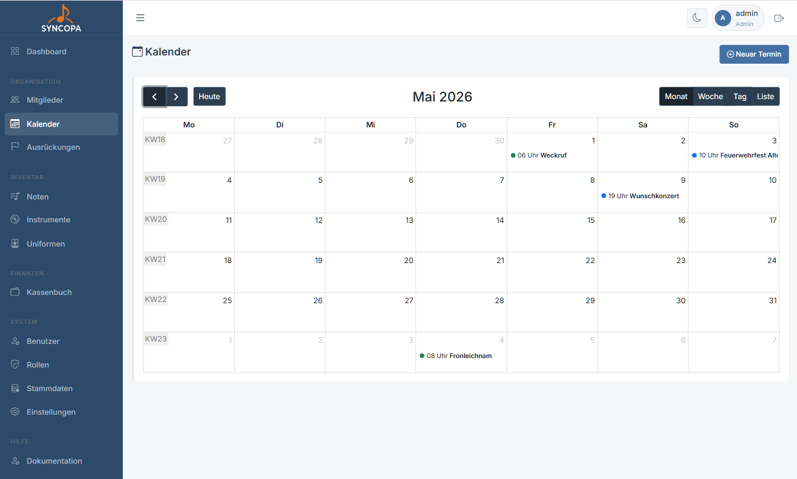
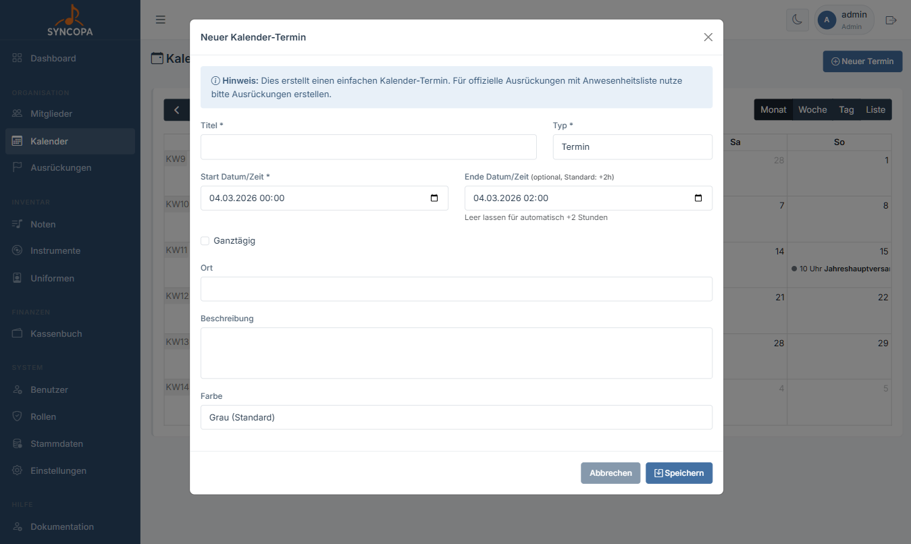
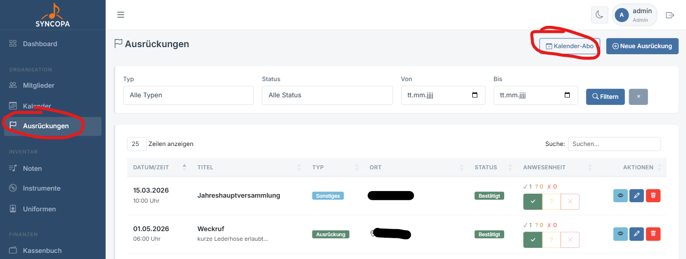
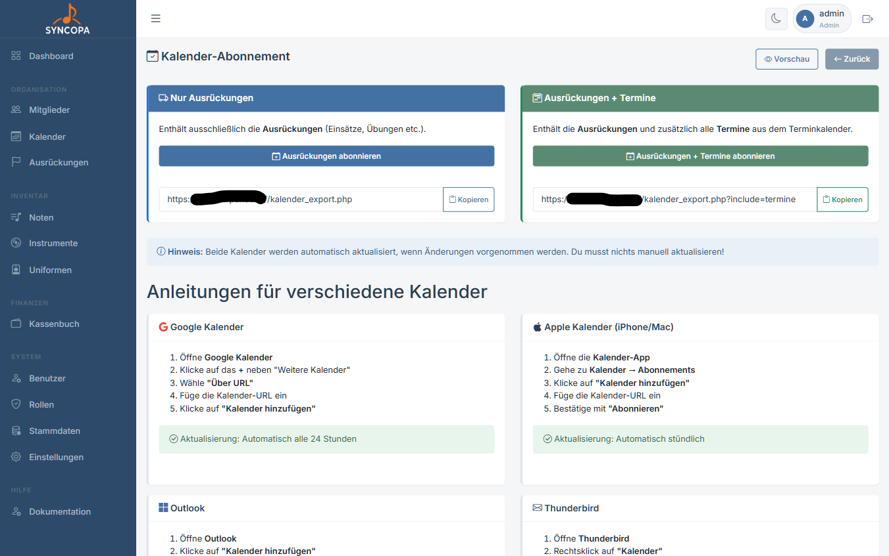

# Kalender

**Datei:** `kalender.php`
**Berechtigung:** `ausrueckungen – lesen`

Der Kalender bietet eine visuelle Gesamtübersicht **aller** Vereinstermine an einem Ort – sowohl der Ausrückungen aus dem Ausrückungsmodul als auch zusätzlicher, freier Kalendertermine (z.B. Sitzungen). Zusätzlich lässt sich der Kalender als iCal-Feed abonnieren, sodass er automatisch auf dem Handy oder in Outlook/Google Calendar erscheint.

---

## Kalenderansicht

Der Kalender zeigt zwei Arten von Einträgen zusammen in einer Ansicht:

- **Ausrückungen** – werden automatisch aus dem Ausrückungsmodul übernommen (→ [Ausrückungen](ausrueckungen.md)), farblich nach Typ eingefärbt (Probe, Konzert, Ausrückung, Fest, Wertung, Sonstiges). Eine abgesagte Ausrückung erscheint rot.
- **Kalendertermine** – frei angelegte Termine wie Sitzungen, Besprechungen, Geburtstage oder Erinnerungen, mit frei wählbarer Farbe

Über die Ansichts-Buttons oben rechts kann zwischen **Monat**, **Woche**, **Tag** und **Liste** gewechselt werden.

> 💡 **Tipp:** Ist oben in der Kopfzeile eine Formation aktiv, zeigt der Kalender nur die Ausrückungen dieser Formation (plus formationsübergreifende Ausrückungen). Mehr dazu: → [Formationen](formationen.md)

Ein Klick auf einen Termin öffnet ein Detail-Fenster mit Art, Datum, Ort und – bei Ausrückungen – Treffpunkt, Uniformpflicht und Status. Von dort aus lässt sich (mit entsprechender Berechtigung) direkt zum Bearbeiten oder Löschen springen.

---

## Termin hinzufügen

**Datei:** `api/kalender_termine.php` (Speichern per Modal aus `kalender.php`)
**Berechtigung:** `ausrueckungen – schreiben`

1. Klicke im Kalender auf ein **Datum** oder oben auf den Button **+ Neuer Termin**
2. Fülle **Titel** und **Termintyp** aus (Termin / Besprechung / Geburtstag / Feiertag / Reminder / Sonstiges)
3. Trage **Start-Datum/Zeit** ein. Das **Ende** ist optional – bleibt es leer, werden automatisch **+2 Stunden** angenommen
4. Bei mehrtägigen bzw. datumslosen Terminen die Option **Ganztägig** aktivieren
5. Optional: **Ort**, **Beschreibung** und eine **Farbe** für die Darstellung im Kalender wählen
6. **Speichern**

> ℹ️ **Hinweis:** Diese einfachen Kalendertermine haben **keine** Anwesenheitsliste. Für offizielle Auftritte mit An-/Abmeldung der Mitglieder immer eine **Ausrückung** anlegen (→ [Ausrückungen](ausrueckungen.md)) – Ausrückungen erscheinen automatisch mit im Kalender und müssen nicht zusätzlich als Termin eingetragen werden.

---

## Kalender abonnieren (iCal)

**Datei:** `kalender_abonnement.php`

Mit dem iCal-Export lässt sich der Syncopa-Kalender in externe Kalender-Apps (Google Calendar, Apple Kalender, Outlook, Thunderbird, …) einbinden. Der Kalender aktualisiert sich dort danach **automatisch**, ohne dass man jemals wieder etwas exportieren müsste.

Öffne dazu **Kalender → Kalender abonnieren** (oder in den Ausrückungen den Button **Kalender-Abo**).

### Zwei Varianten zur Auswahl

1. **Nur Ausrückungen** – enthält ausschließlich die Ausrückungen (Einsätze, Proben, Konzerte etc.)
2. **Ausrückungen + Termine** – enthält zusätzlich auch alle freien Kalendertermine (Sitzungen, Besprechungen etc.)

Für jede Variante gibt es einen Button **„… abonnieren"** (öffnet direkt die passende Kalender-App) sowie ein Textfeld mit der Adresse zum manuellen Kopieren.

> 💡 **Tipp:** Gehören dir mehrere Formationen an, findest du unter „Formationsspezifische Abonnements" außerdem eigene Abo-Links je Formation – so kann sich z.B. ein Jugendkapellen-Mitglied nur die Termine der Jugendkapelle in sein Handy holen.

### Schritt für Schritt: Google Calendar

1. Öffne **Google Calendar**
2. Klicke auf das **„+"** neben „Weitere Kalender"
3. Wähle **„Über URL"**
4. Füge die kopierte Kalender-Adresse aus Syncopa ein
5. Klicke auf **„Kalender hinzufügen"**

Google aktualisiert den abonnierten Kalender automatisch ca. alle 24 Stunden.

### Schritt für Schritt: Apple Kalender (iPhone / Mac)

1. Öffne die **Kalender-App**
2. Gehe zu **Kalender → Abonnements** (bzw. am iPhone: **Einstellungen → Kalender → Account hinzufügen → Andere → Kalenderabo hinzufügen**)
3. Klicke auf **„Kalender hinzufügen"**
4. Füge die Kalender-Adresse ein
5. Bestätige mit **„Abonnieren"** bzw. **„Sichern"**

Aktualisierung erfolgt automatisch, üblicherweise stündlich.

### Schritt für Schritt: Microsoft Outlook

1. Öffne **Outlook**
2. Klicke auf **„Kalender hinzufügen" → „Aus dem Internet"**
3. Füge die Kalender-Adresse ein
4. Bestätige mit **„OK"**

### Schritt für Schritt: Thunderbird

1. Rechtsklick auf **„Kalender"** → **„Neuer Kalender"**
2. Wähle **„Im Netzwerk"**, Format **iCalendar (ICS)**
3. Füge die Kalender-Adresse ein

### Einmaliger Download ohne Abo

Wer den Kalender nur einmalig importieren möchte (ohne automatische Aktualisierung), kann über die Buttons **„… (ICS)"** unten auf der Abo-Seite eine `.ics`-Datei herunterladen und in eine beliebige Kalender-App importieren.

> ⚠️ **Achtung:** Beim einmaligen Download werden spätere Änderungen (neue, geänderte oder gelöschte Termine) **nicht** automatisch übernommen. Für laufend aktuelle Termine immer den Abo-Link verwenden.

---

## Kalendervorschau

**Datei:** `kalender_vorschau.php`

Über den Button **Vorschau** auf der Abo-Seite gelangt man zu einer Liste aller **zukünftigen Ausrückungen**, die im iCal-Export enthalten sind (Login erforderlich). Sie dient dazu, vor dem Abonnieren zu prüfen, ob alle erwarteten Termine tatsächlich exportiert werden.
