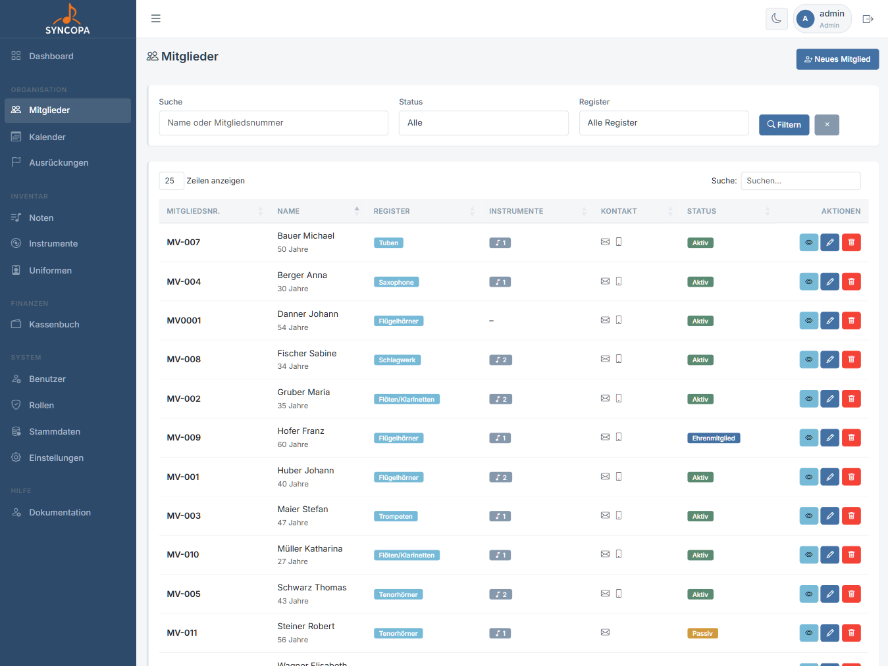
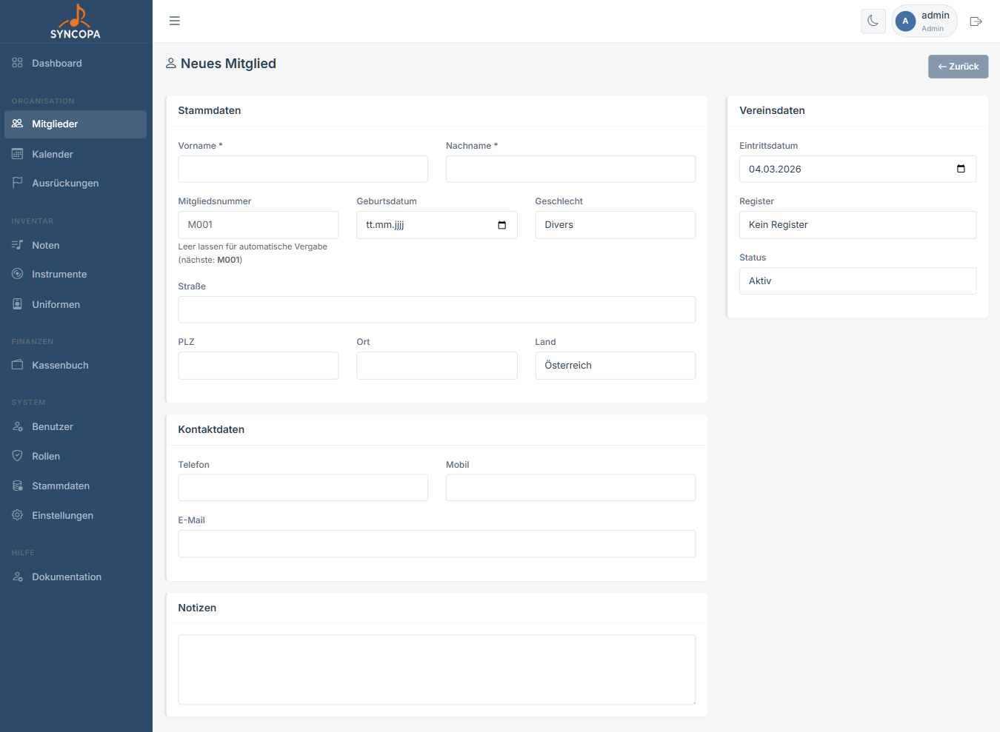
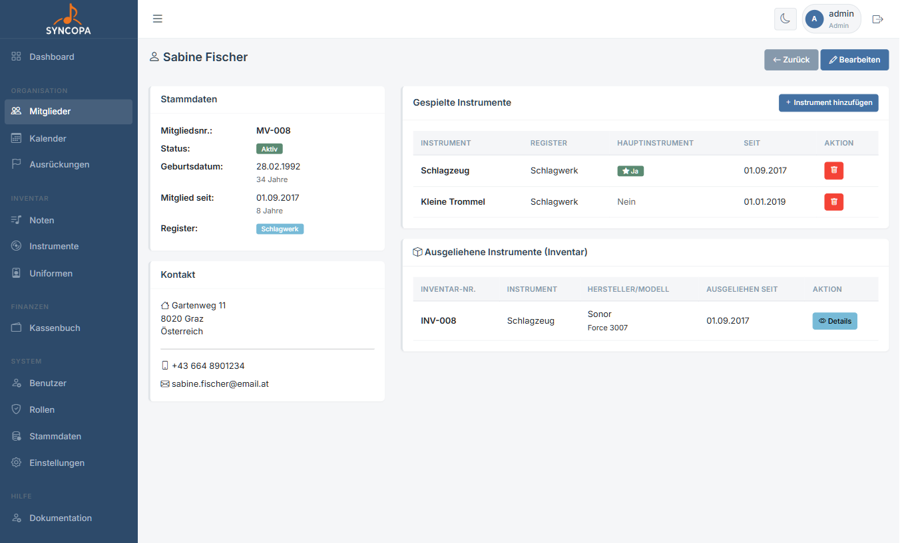
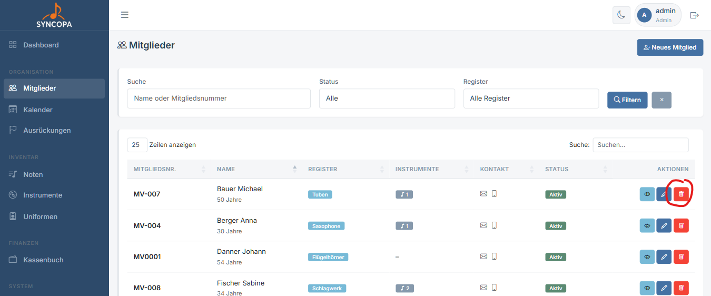

# Mitglieder

**Datei:** `mitglieder.php`  
**Berechtigung:** `mitglieder – lesen`

Die Mitgliederverwaltung ist das Herzstück von Syncopa. Hier werden alle Stammdaten der Vereinsmitglieder gepflegt.

---

## Mitgliederliste

Die Übersichtstabelle zeigt alle Mitglieder mit folgenden Informationen:

| Spalte | Beschreibung |
|---|---|
| Mitgliedsnummer | Automatisch vergeben* oder manuell gesetzt |
| Name | Vor- und Nachname, Alter |
| Register | Musikalisches Register (z.B. Trompete, Klarinette) |
| Instrumente | welche(s) Instrument(e) spielt(e) das Mitglied |
| Status | `aktiv`, `inaktiv`, `Ehrenmitglied` |
| Kontakt | Mail-Adresse und Tel.-Nr. |
| Aktionen | Anzeigen · Bearbeiten · Löschen |

*Nummmernkreise können in denStammdaten angepasst werden

### Filtern & Suchen

- **Suchfeld:** Freitext-Suche über Name, E-Mail, Mitgliedsnummer
- **Statusfilter:** Nur aktive / nur inaktive / alle anzeigen
- **Registerfilter:** Nach musikalischem Register filtern

---

## Mitglied anlegen

**Datei:** `mitglied_bearbeiten.php`  
**Berechtigung:** `mitglieder – schreiben`

1. Klicke in der Mitgliederliste auf **+ Neues Mitglied**
2. Fülle das Formular aus (Pflichtfelder mit `*` markiert)
3. Klicke auf **Speichern**

### Formularfelder

**Persönliche Daten**

| Feld | Pflicht | Hinweis |
|---|---|---|
| Vorname | ✅ | |
| Nachname | ✅ | |
| Mitgliedsnummer | – | Wird automatisch vorgeschlagen |
| Geburtsdatum | – | Format: TT.MM.JJJJ |
| Geschlecht | – | m / w / d |

**Adresse**

| Feld | Hinweis |
|---|---|
| Straße | Straße und Hausnummer |
| PLZ | Postleitzahl |
| Ort | Wohnort |
| Land | Standard: Österreich |

**Kontakt**

| Feld | Hinweis |
|---|---|
| Telefon | Festnetz |
| Mobil | Mobilnummer |
| E-Mail | Wird auch für Benachrichtigungen verwendet |

**Vereinsdaten**

| Feld | Hinweis |
|---|---|
| Eintrittsdatum | Datum des Vereinseintritts |
| Register | Musikalisches Register (aus Stammdaten) |
| Status | aktiv / inaktiv / Ehrenmitglied |
| Notizen | Interne Anmerkungen |

---

## Mitglied anzeigen

**Datei:** `mitglied_detail.php`

Die Detailseite eines Mitglieds zeigt:

- **Stammdaten** – alle Felder auf einen Blick
- **Ausrückungen** – Teilnahme-Historie
- **Zugeordnete Uniform** – ausgegebene Kleidungsstücke
- **Zugeordnete Instrumente** – verliehene Instrumente

---

## Mitglied löschen

**Datei:** `mitglied_loeschen.php`  
**Berechtigung:** `mitglieder – löschen`

> ⚠️ **Achtung:** Das Löschen eines Mitglieds entfernt **alle verknüpften Daten** (Ausrückungsteilnahmen, Uniformzuordnungen etc.). Diese Aktion kann nicht rückgängig gemacht werden!

Alternativ empfiehlt es sich, das Mitglied auf **inaktiv** zu setzen statt es zu löschen.
