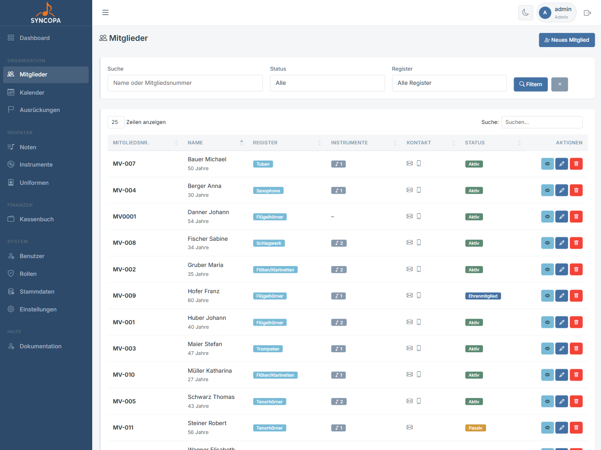
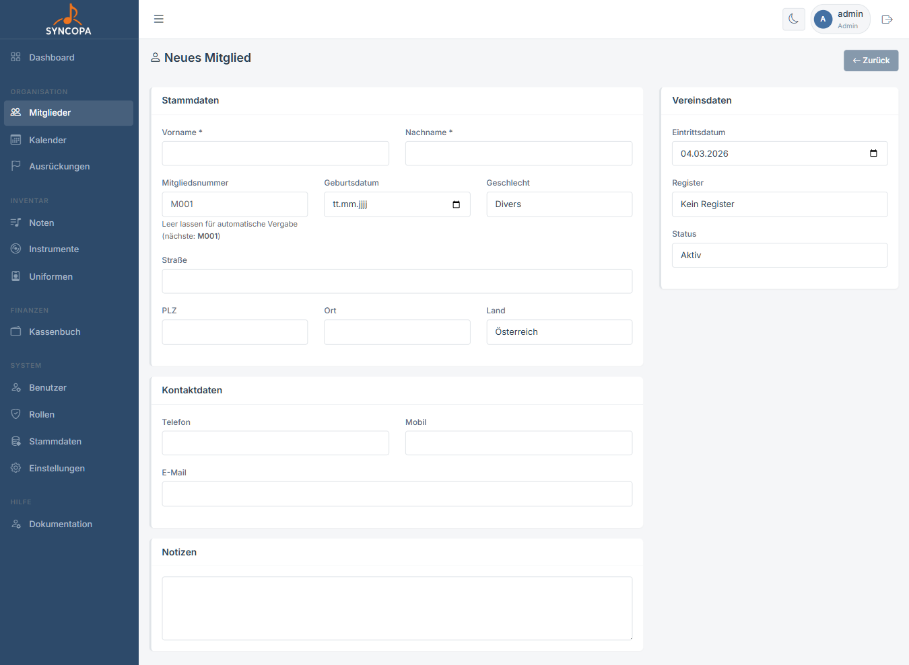
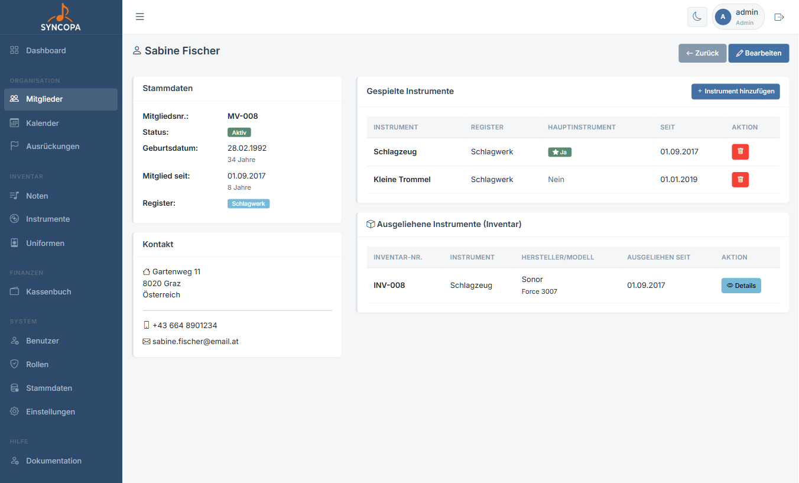
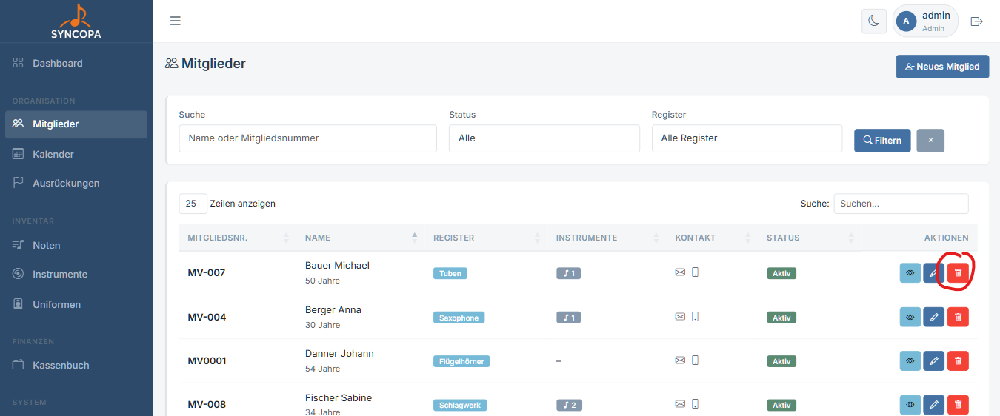

# Mitglieder

**Datei:** `mitglieder.php`  
**Berechtigung:** `mitglieder – lesen`

Die Mitgliederverwaltung ist das Herzstück von Syncopa. Hier werden alle Stammdaten der Vereinsmitglieder gepflegt.

---

## Mitgliederliste

Die Übersichtstabelle zeigt alle Mitglieder mit folgenden Informationen:

| Spalte | Beschreibung |
|---|---|
| Mitgliedsnummer | Automatisch vergeben* oder manuell gesetzt |
| Name | Vor- und Nachname, Alter |
| Register | Musikalisches Register (z.B. Trompete, Klarinette) |
| Instrumente | welche(s) Instrument(e) spielt(e) das Mitglied |
| Status | `aktiv`, `passiv`, `ausgetreten`, `ehrenmitglied` |
| Kontakt | Mail-Adresse und Tel.-Nr. |
| Aktionen | Anzeigen · Bearbeiten · Löschen |

*Nummmernkreise können in den Stammdaten angepasst werden

> 💡 **Tipp:** Ist oben in der Kopfzeile eine Formation ausgewählt (siehe → [Formationen](formationen.md)), zeigt die Mitgliederliste **nur die Mitglieder dieser Formation** an. Bei "Alle Formationen" siehst du alle Mitglieder des Vereins.

### Filtern & Suchen

- **Suchfeld:** Freitext-Suche über Name, E-Mail, Mitgliedsnummer
- **Statusfilter:** Nur aktive / nur inaktive / alle anzeigen
- **Registerfilter:** Nach musikalischem Register filtern

---

## Mitglied anlegen

**Datei:** `mitglied_bearbeiten.php`  
**Berechtigung:** `mitglieder – schreiben`

1. Klicke in der Mitgliederliste auf **+ Neues Mitglied**
2. Fülle das Formular aus (Pflichtfelder mit `*` markiert)
3. Klicke auf **Speichern**

### Formularfelder

**Persönliche Daten**

| Feld | Pflicht | Hinweis |
|---|---|---|
| Vorname | ✅ | |
| Nachname | ✅ | |
| Mitgliedsnummer | – | Wird automatisch vorgeschlagen |
| Geburtsdatum | – | Format: TT.MM.JJJJ |
| Geschlecht | – | m / w / d |

**Adresse**

| Feld | Hinweis |
|---|---|
| Straße | Straße und Hausnummer |
| PLZ | Postleitzahl |
| Ort | Wohnort |
| Land | Standard: Österreich |

**Kontakt**

| Feld | Hinweis |
|---|---|
| Telefon | Festnetz |
| Mobil | Mobilnummer |
| E-Mail | Wird auch für Benachrichtigungen verwendet |

**Vereinsdaten**

| Feld | Hinweis |
|---|---|
| Eintrittsdatum | Datum des Vereinseintritts (nur beim Anlegen) |
| Register | Musikalisches Register (aus Stammdaten). Gilt als **Standard**, wenn keine formationsspezifische Angabe hinterlegt ist |
| Register in `<Formation>` | Nur sichtbar, wenn oben in der Kopfzeile eine Formation aktiv ist. Überschreibt das Standard-Register **nur für diese eine Formation** (z.B. spielt jemand in der Stammkapelle Trompete, in der Jugendkapelle aber noch Flügelhorn) |
| Status | aktiv / passiv / ausgetreten / ehrenmitglied |
| Notizen | Interne Anmerkungen |

> 💡 **Tipp:** Das formationsspezifische Register erscheint nur beim **Bearbeiten** eines bestehenden Mitglieds und nur, wenn oben eine Formation ausgewählt ist. Mehr zum Formations-Konzept: → [Formationen](formationen.md)

---

## Mitglied einer Formation zuordnen

Ein Mitglied kann **mehreren Formationen gleichzeitig** angehören (z.B. der Stammkapelle **und** der Jugendkapelle). Diese Zuordnung erfolgt **nicht** im Mitglieder-Formular, sondern über die Formationsverwaltung:

1. Gehe zu **Formationen** in der Navigation
2. Öffne die gewünschte Formation und klicke auf **Mitglieder zuordnen** (bzw. auf die Mitglieder-Zahl in der Liste)
3. Wähle rechts das Mitglied aus der Liste **„Mitglied hinzufügen"** aus
4. Optional: Trage eine **Rolle in der Formation** ein (z.B. „Stimmführer", „Jugendleiter")
5. Das Mitglied erscheint nun links in der Liste der zugeordneten Mitglieder dieser Formation, inklusive dem Datum „seit wann" es dabei ist

Ausführliche Anleitung: → [Formationen](formationen.md#mitglieder-einer-formation-zuordnen)

> ⚠️ **Achtung:** Ein Mitglied, das **keiner** Formation zugeordnet ist, taucht in formationsgefilterten Ansichten (Mitgliederliste, Ausrückungen, Noten, Finanzen usw.) nicht auf, solange oben eine bestimmte Formation aktiv ist. Nur bei „Alle Formationen" sind alle Mitglieder sichtbar.

---

## Mitglied anzeigen

**Datei:** `mitglied_detail.php`

Die Detailseite eines Mitglieds zeigt:

- **Stammdaten** – alle Felder auf einen Blick
- **Kontakt** – Adresse, Telefon, E-Mail
- **Gespielte Instrumente** – siehe unten
- **Ausgeliehene Instrumente (Inventar)** – konkrete Instrumente aus dem Inventar, die diesem Mitglied ausgegeben wurden

### Gespielte Instrumente (formationsabhängig)

Die Tabelle „Gespielte Instrumente" zeigt, welche Instrumente ein Mitglied spielt. Jedes zugeordnete Instrument kann dabei entweder:

- **einer bestimmten Formation** zugeordnet sein (z.B. „spielt Tenorhorn nur in der Jugendkapelle"), erkennbar am farbigen Formations-Badge, oder
- **„Alle Formationen"** gelten (formationsübergreifend, z.B. „spielt Klarinette überall")

Ist oben in der Kopfzeile eine Formation aktiv, zeigt die Liste **nur** die Instrumente, die zu dieser Formation gehören oder formationsübergreifend gelten – ein Hinweis „(gefiltert nach aktiver Formation)" erscheint dann neben der Überschrift. Bei „Alle Formationen" werden alle Instrumentenzuordnungen angezeigt.

**Instrument hinzufügen:**

1. Klicke auf **+ Instrument hinzufügen**
2. Wähle das **Instrument** (gruppiert nach Register)
3. Wähle bei **„Gilt für Formation"**, ob das Instrument nur für eine bestimmte Formation oder für „Alle Formationen" gelten soll
4. Trage optional das Datum **„Spielt seit"** ein
5. Markiere bei Bedarf **„Als Hauptinstrument"**
6. Klicke auf **Hinzufügen**

> 💡 **Tipp:** Nutze „Alle Formationen", wenn ein Mitglied sein Instrument unabhängig von der jeweiligen Besetzung spielt. Wähle eine konkrete Formation, wenn sich das Instrument je nach Formation unterscheidet.

---

## Mitglied löschen

**Datei:** `mitglied_loeschen.php`  
**Berechtigung:** `mitglieder – löschen`

> ⚠️ **Achtung:** Das Löschen eines Mitglieds entfernt **alle verknüpften Daten** (Ausrückungsteilnahmen, Uniformzuordnungen etc.). Diese Aktion kann nicht rückgängig gemacht werden!

Alternativ empfiehlt es sich, das Mitglied auf **inaktiv** zu setzen statt es zu löschen.
