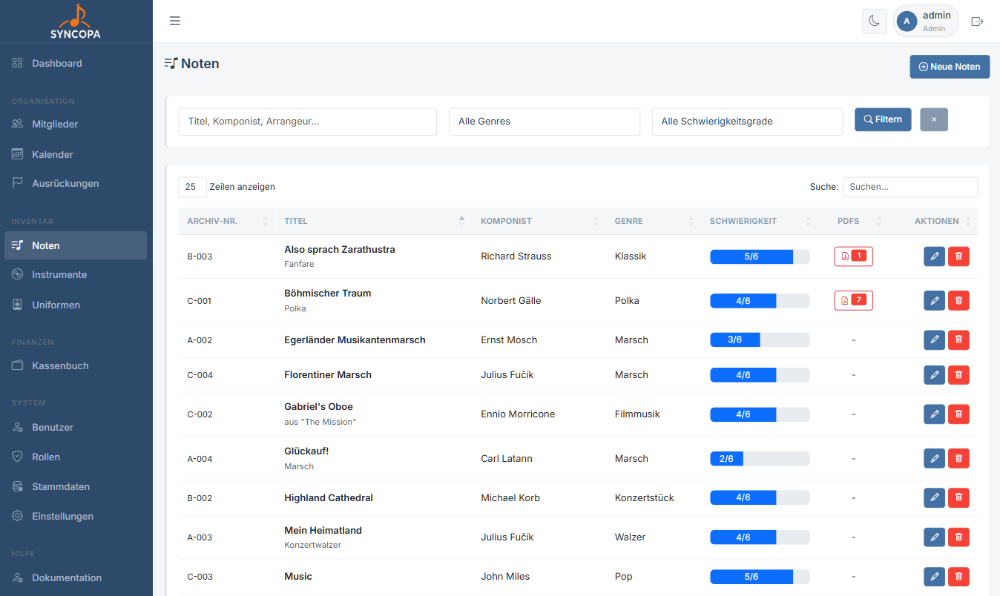
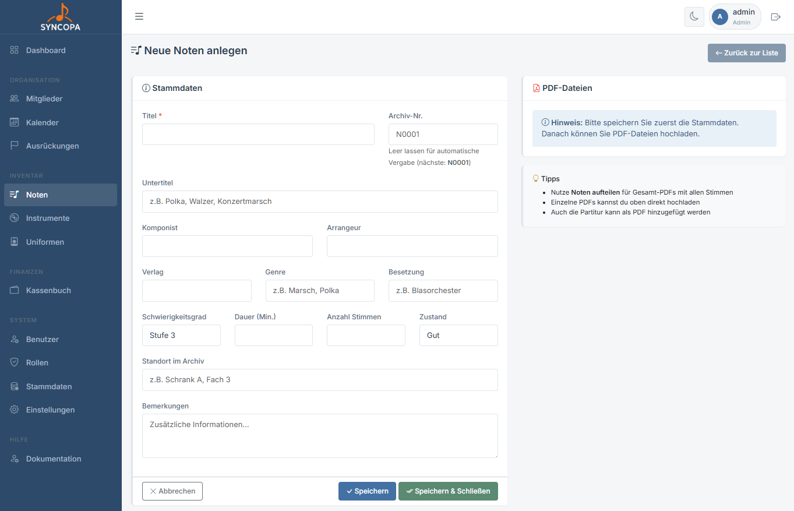
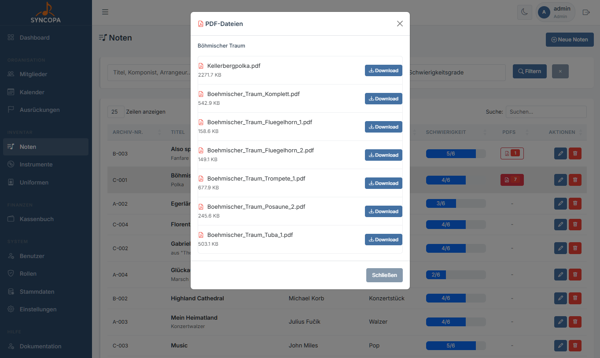

# Noten

**Datei:** `noten.php`  
**Berechtigung:** `noten – lesen`

Das Notenarchiv verwaltet den gesamten Notenbestand des Vereins.

---

## Übersicht

Die Tabelle listet alle erfassten Werke mit:

| Spalte | Beschreibung |
|---|---|
| Archivnummer | automatisch oder manuell - Nummernkreis kann in den Stammdaten geändert werden |
| Titel | Name des Musikstücks |
| Komponist / Arrangeur | Urheber |
| Kategorie | z.B. Marsch, Polka, Konzert |
| Schwierigkeit | Schwierigkeit gewählt vom Kapellmeister |
| PDFS | Anzahl der PDF Dateien |
| Aktionen | Anzeigen · Bearbeiten · Löschen |

---

## Noten erfassen

**Datei:** `noten_bearbeiten.php`  
**Berechtigung:** `noten – schreiben`

1. Klicke auf **+ Neue Noten**
2. Erfasse Titel, Komponist und Kategorie
3. Optional: Stimmenanzahl und Notizen ergänzen
4. **Speichern**
5. PDF Dateien hochladen
6. PDF Dateien splitten (wenn gewünscht werden die PDF´s automatisch nach Stimmen gesplittet und auch umbenannt)
7. **Speichern und Schließen**

### Formularfelder

| Feld | Pflicht | Beschreibung |
|---|---|---|
| Titel | ✅ | Name des Stücks |
| Komponist | – | Komponist oder Arrangeur |
| Kategorie | – | Musikgenre / Stücktyp |
| Katalognummer | – | Interne Archivnummer |
| Stimmen | – | Anzahl vorhandener Stimmhefte |
| Notizen | – | Interne Anmerkungen |

---

## Noten PDF anzeigen und ausdrucken

Noten können ganz bequem von der Notenlist ausgedruckt werden.

1. in der Liste auf die Anzahl der PDF´s klicken
2. Alle PDF (Stimmen werden angezeigt)
3. gewünschte Noten ausdrucken

> 💡 **Tipp:** Wenn ein Netzwerkfähiger Drucker im Probelokal Verfügbar ist können die Noten ganz leicht ausgedruckt werden.

---

## Kategorien verwalten

Notenarten / Kategorien werden in den **Stammdaten** verwaltet:  
→ [Stammdaten](stammdaten.md#noten-kategorien)

> 💡 **Tipp:** Vergib konsequente Katalognummern (z.B. `MAR-001`, `POL-047`), so findest du Noten bei der Ausgabe schnell wieder.
