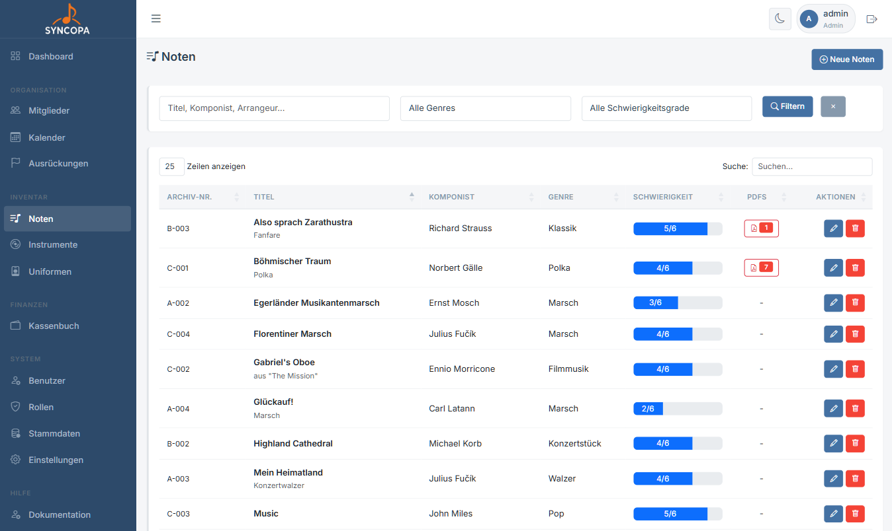
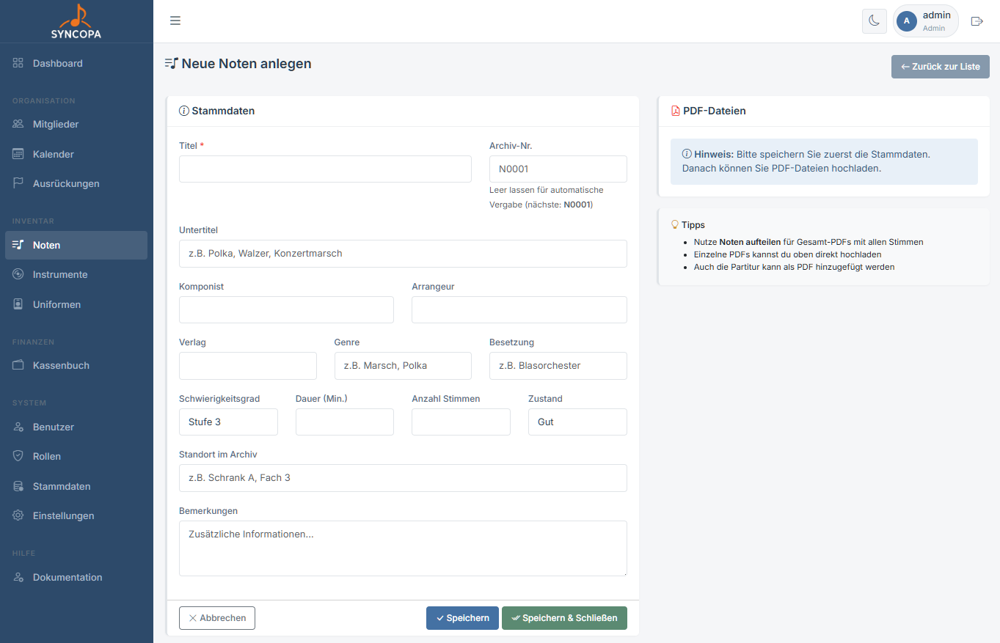
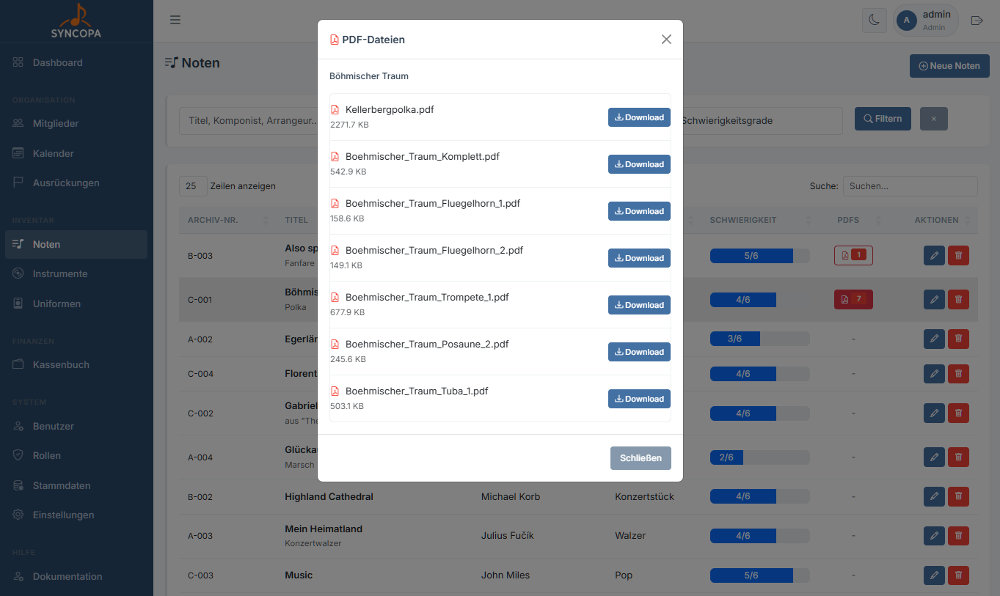

# Noten

**Datei:** `noten.php`
**Berechtigung:** `noten – lesen`

Das Notenarchiv verwaltet den gesamten Notenbestand des Vereins: Titel, Komponist, Schwierigkeit – und beliebig viele PDF-Dateien pro Stück (Partitur, Einzelstimmen, Klavierauszug usw.).

---

## Übersicht

Die Tabelle listet alle erfassten Werke mit:

| Spalte | Beschreibung |
|---|---|
| Archiv-Nr. | automatisch oder manuell – Nummernkreis kann in den Stammdaten geändert werden |
| Titel | Name des Musikstücks (inkl. Untertitel, z.B. „Polka") |
| Komponist | Urheber |
| Genre | z.B. Marsch, Polka, Konzertwerk |
| Schwierigkeit | Schwierigkeitsgrad 1–6, gewählt vom Kapellmeister |
| Formation | Für welche Formation das Stück gilt (siehe [Formations-Zuordnung](#formations-zuordnung)) |
| PDFs | Anzahl der hinterlegten PDF-Dateien – Klick öffnet eine Liste zum Ansehen/Herunterladen |
| Aktionen | Bearbeiten · Löschen |

### Filtern & Suchen

- **Suchfeld:** Freitext-Suche über Titel, Komponist, Arrangeur
- **Genre-Filter:** Nach Musikgenre filtern
- **Schwierigkeitsgrad-Filter:** Nach Stufe 1–6 filtern

---

## Noten erfassen

**Datei:** `noten_bearbeiten.php`
**Berechtigung:** `noten – schreiben`

1. Klicke auf **+ Neue Noten**
2. Fülle mindestens den **Titel** aus
3. Klicke auf **Speichern** (die restlichen Felder können auch später ergänzt werden)
4. Erst nach dem ersten Speichern erscheint rechts der Bereich zum Hochladen von PDF-Dateien
5. Lade eine oder mehrere PDF-Dateien hoch (siehe unten)
6. Optional: Ein Gesamt-PDF automatisch in einzelne Stimmen aufteilen lassen (siehe [PDF nach Stimmen aufteilen](#pdf-nach-stimmen-aufteilen))
7. **Speichern & Schließen**, um zur Liste zurückzukehren

### Formularfelder

| Feld | Pflicht | Beschreibung |
|---|---|---|
| Titel | ✅ | Name des Stücks |
| Archiv-Nr. | – | Wird automatisch vergeben, wenn leer gelassen |
| Formation | – | Nur sichtbar, wenn du mehreren Formationen zugeordnet bist (siehe unten) |
| Untertitel | – | z.B. „Polka", „Walzer", „Konzertmarsch" |
| Komponist | – | |
| Arrangeur | – | |
| Verlag | – | |
| Genre | – | z.B. Marsch, Polka, Konzertwerk (mit Vorschlagsliste) |
| Besetzung | – | z.B. „Blasorchester" |
| Schwierigkeitsgrad | – | Stufe 1–6 |
| Dauer (Min.) | – | Ungefähre Spieldauer |
| Anzahl Stimmen | – | Anzahl vorhandener Stimmhefte |
| Zustand | – | sehr gut / gut / befriedigend / schlecht |
| Standort im Archiv | – | z.B. „Schrank A, Fach 3" |
| Bemerkungen | – | Interne Anmerkungen |

### Formations-Zuordnung

Ein Notenstück kann **einer bestimmten Formation** zugeordnet werden (z.B. „Jugendkapelle") – dann sehen nur Mitglieder dieser Formation das Stück. Lässt man das Feld **Formation** leer bzw. wählt „– Alle Formationen –" (nur für Administratoren wählbar), ist das Stück **für alle Formationen sichtbar**.

> 💡 **Tipp:** Wenn dein Verein nur eine einzige Formation hat, wird das Feld erst gar nicht angezeigt – alle Noten sind dann automatisch für alle sichtbar.

---

## PDF-Dateien verwalten

Zu jedem Notenstück können **beliebig viele PDF-Dateien** hochgeladen werden – z.B. die Partitur, mehrere Einzelstimmen, ein Klavierauszug. Jede Datei kann einzeln angesehen, heruntergeladen oder gelöscht werden.

### PDFs hochladen

1. Öffne das Notenstück über **Bearbeiten**
2. Ziehe eine oder mehrere PDF-Dateien in das Feld **„PDF-Dateien hierher ziehen"** – oder klicke auf **Datei(en) auswählen**
3. Der Upload-Fortschritt wird als Balken angezeigt
4. Nach dem Hochladen erscheint jede Datei als eigener Eintrag in der Liste, mit Größe und Upload-Datum

> ⚠️ **Achtung:** Es sind ausschließlich PDF-Dateien erlaubt, bis zu der auf der Seite angezeigten maximalen Dateigröße.

### PDFs ansehen, herunterladen, löschen

Bei jeder Datei stehen folgende Aktionen zur Verfügung:

| Symbol | Aktion |
|---|---|
| 🔍 Auge | PDF direkt im Browser ansehen |
| ⬇️ Download | PDF herunterladen |
| ✂️ Schere | Diese Datei automatisch nach Stimmen aufteilen (siehe unten) |
| 🗑️ Papierkorb | Datei löschen |

Von der **Notenübersicht** aus lassen sich alle PDFs eines Stücks auch bequem in einem Fenster ansehen und ausdrucken:

1. In der Liste auf die Zahl bei „PDFs" klicken
2. Alle Dateien werden angezeigt
3. Gewünschte Datei ansehen, ausdrucken oder herunterladen

> 💡 **Tipp:** Wenn im Probelokal ein netzwerkfähiger Drucker verfügbar ist, können die Noten direkt von dort ausgedruckt werden.

---

## PDF nach Stimmen aufteilen

Das ist die zentrale Zeitspar-Funktion des Notenarchivs: Statt jede Instrumentenstimme einzeln aus dem Verlagsheft auszuschneiden und einzeln hochzuladen, lädt man **ein einziges Gesamt-PDF** hoch, in dem alle Stimmen hintereinander enthalten sind (so wie sie z.B. vom Verlag geliefert werden). Syncopa erkennt automatisch anhand der Beschriftung auf jeder Seite, welches Instrument dort steht (z.B. „1. Klarinette in B", „Tenorhorn"), und erzeugt daraus **automatisch eine eigene, sinnvoll benannte PDF-Datei pro Stimme**.

### So funktioniert es

**Variante A – neues Gesamt-PDF hochladen:**

1. Öffne das Notenstück über **Bearbeiten**
2. Im blauen Kasten **„Noten automatisch aufteilen"** eine PDF-Datei hineinziehen oder auswählen
3. Die Software liest jede Seite, erkennt den oben stehenden Instrumentennamen und gruppiert zusammenhängende Seiten der gleichen Stimme
4. Für jede erkannte Stimme wird automatisch eine neue Datei angelegt, z.B. `Konzertmarsch_Fluegelhorn_1.pdf`
5. Nach ein paar Sekunden erscheint das Ergebnis: eine Liste aller erzeugten Dateien mit dem Hinweis **„erkannt"** (grün) oder **„bitte umbenennen"** (gelb)

**Variante B – bereits hochgeladene Datei nachträglich aufteilen:**

Wurde ein Gesamt-PDF bereits ganz normal als einzelne Datei hochgeladen, kann es jederzeit nachträglich aufgeteilt werden:

1. Bei der betreffenden Datei in der Liste auf das **Scheren-Symbol** klicken
2. Bestätigen – die Originaldatei bleibt dabei unverändert erhalten, es werden nur zusätzlich die einzelnen Stimmen-PDFs erzeugt
3. Das Ergebnis erscheint wie bei Variante A

> 💡 **Tipp:** Das Scheren-Symbol ist ausgegraut, wenn die Datei bereits selbst eine erkannte Einzelstimme ist – sie muss nicht nochmal aufgeteilt werden.

### Wenn die Erkennung nicht klappt

Nicht jedes PDF lässt sich automatisch zuordnen – zum Beispiel wenn es sich um einen **eingescannten** oder **handschriftlichen** Notensatz handelt, oder wenn ein Instrumentenname verwendet wird, den das System noch nicht kennt. In diesem Fall:

- Die Software erkennt, dass es sich um einen Scan handelt, und legt trotzdem **für jede Seite eine eigene Datei** an (z.B. `Konzertmarsch_Seite_1.pdf`)
- Diese Dateien sind im Ergebnis gelb markiert mit dem Hinweis **„bitte umbenennen"**
- Die Beschreibung/den Dateinamen kann man danach jederzeit manuell anpassen (Datei löschen und mit passendem Namen neu hochladen, oder über die Stimmenverwaltung in der → [Live-Probe](live-probe.md) einer Stimme zuordnen)

> ⚠️ **Achtung:** Wird kein einziges Instrument auf der ganzen Datei erkannt, wertet Syncopa das gesamte PDF als Scan und legt eine Datei pro Seite an. Bei einem sehr langen Heft können so viele Einzeldateien entstehen – am besten danach gezielt zusammenfassen bzw. sinnvoll benennen.

### Erkennungsmuster verwalten

Welche Textstücke zu welchem Instrument gehören, ist **nicht fest im Programm einprogrammiert**, sondern wird in einer Verwaltungsseite gepflegt:

**Datei:** `noten_instrumente.php`
**Berechtigung:** Nur Administratoren

Hier legt der Notenwart bzw. Administrator fest, nach welchen Wörtern auf den PDF-Seiten gesucht werden soll.

**Ein neues Instrument-Muster hinzufügen:**

1. Gehe zu **Einstellungen → Instrument-Pattern** (bzw. direkt `noten_instrumente.php`)
2. Klicke auf **+ Neues Instrument**
3. Trage bei **Instrument** einen sprechenden Namen ein, z.B. „Trompete"
4. Trage bei **Pattern** den Instrumentennamen so ein, wie er typischerweise oben auf den Noten steht, z.B. `Trompete`
5. Optional: Reihenfolge und Beschreibung anpassen (siehe Hinweis unten)
6. **Speichern**

Die Software ergänzt automatisch die üblichen Zusätze selbst – man muss also **nicht** extra an „1.", „in B" oder römische Ziffern denken. Wird z.B. das Muster `Trompete` angelegt, erkennt Syncopa automatisch auch „1. Trompete", „Trompete in B" und „Trompete II".

Ein paar einfache Beispiele, falls ein Instrument unter mehreren Schreibweisen vorkommt:

| Ziel | Was man ins Pattern-Feld einträgt |
|---|---|
| „Flöte" und „Flute" erkennen | `Fl[öu]te` |
| „Trompete" und „Trompeten" erkennen | `Trompete[n]?` |
| „Es-Klarinette" oder „Klarinette in Es" erkennen | `Klarinette` (der Zusatz „in Es" wird automatisch erkannt) |

> ⚠️ **Achtung – Reihenfolge beachten:** Die Muster werden von oben nach unten geprüft, das erste Treffer gewinnt. Ähnliche Instrumentennamen müssen daher in der richtigen Reihenfolge stehen – z.B. muss „Baritonsaxophon" **vor** „Saxophon" stehen und „Tenorhorn" **vor** „Horn", sonst wird das spezifischere Instrument nie erkannt. Die Reihenfolge lässt sich mit den Pfeil-Symbolen in der Liste ändern.

> 💡 **Tipp:** Ein Muster lässt sich über das Häkchen-Symbol vorübergehend deaktivieren, ohne es zu löschen – praktisch zum Testen.

> 💡 **Tipp für Fortgeschrittene:** Wer sich mit regulären Ausdrücken (Regex) auskennt, kann im Pattern-Feld auch komplexere Muster verwenden – die eingebaute Hilfebox auf der Seite „Pattern-Hilfe" zeigt die wichtigsten Bausteine.

### Für Administratoren

> 📌 Für manche PDF-Formate (insbesondere neuere, komprimierte PDFs) benötigt das automatische Aufteilen zusätzlich die Server-Werkzeuge **qpdf** und **pdftotext** (Teil von *poppler-utils*). Sind diese nicht installiert, meldet Syncopa beim Aufteilen einen entsprechenden Fehlerhinweis. Bitte den Hoster/Serveradministrator kontaktieren, falls diese Meldung dauerhaft erscheint.

---

## Notenbücher & Live-Probe

Notenstücke lassen sich zu Mappen zusammenfassen und während der Probe „live" an alle Musiker verteilen:

- → [Notenbücher](notenbucher.md) – eigene und geteilte Mappen aus mehreren Stücken
- → [Live-Probe](live-probe.md) – jeder Musiker sieht während der Probe automatisch die richtige Stimme

---

## Genre / Kategorie

Das Feld **Genre** (z.B. Marsch, Polka, Konzertstück) ist ein Freitextfeld – es gibt keine feste Liste zum Pflegen. Beim Tippen schlägt Syncopa automatisch bereits verwendete Genres zur Auswahl vor, damit sich mit der Zeit einheitliche Bezeichnungen einspielen.

> 💡 **Tipp:** Vergib konsequente Katalognummern (z.B. `MAR-001`, `POL-047`), so findest du Noten bei der Ausgabe schnell wieder.
