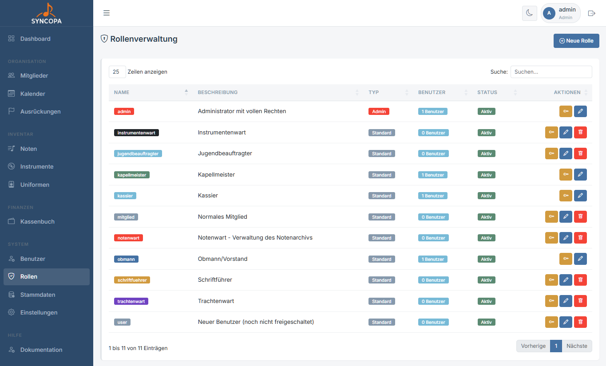
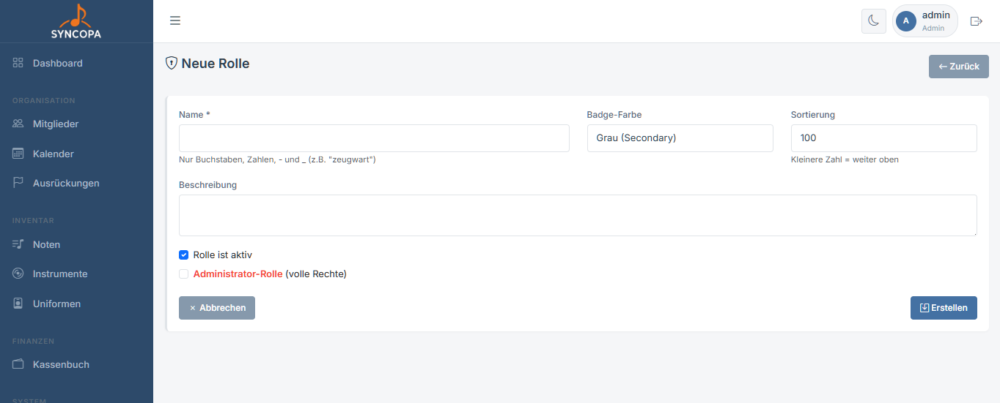
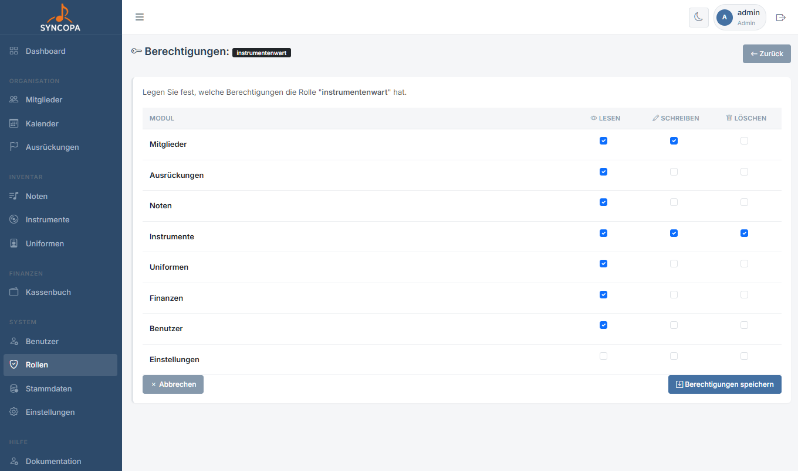

# Rollen & Berechtigungen

**Datei:** `rollen.php`  
**Berechtigung:** Nur **Admin**

Das Rollen-Berechtigungssystem steuert granular, wer welche Aktionen in Syncopa durchführen darf.

---

## Konzept

Jeder Benutzer hat genau **eine Rolle**. Jede Rolle hat für jedes Modul drei Berechtigungsstufen:

| Berechtigung | Beschreibung |
|---|---|
| `lesen` | Daten ansehen |
| `schreiben` | Daten anlegen und bearbeiten |
| `voll` | Datensätze löschen |

> ℹ️ Wer löschen darf, muss auch lesen und schreiben können. Das System prüft die Berechtigungen bei jedem Seitenaufruf.

---

## Module mit Berechtigungen

| Modul | Beschreibung |
|---|---|
| `mitglieder` | Mitgliederverwaltung |
| `ausrueckungen` | Ausrückungsplanung |
| `finanzen` | Einnahmen & Ausgaben |
| `noten` | Notenarchiv |
| `instrumente` | Instrumenteninventar |
| `uniformen` | Uniformverwaltung |

---

## Rollenübersicht (Beispiel)

| Rolle | Mitglieder | Ausrückungen | Finanzen | Noten | Instrumente | Uniformen |
|---|---|---|---|---|---|---|
| Admin | ✅✅✅ | ✅✅✅ | ✅✅✅ | ✅✅✅ | ✅✅✅ | ✅✅✅ |
| Obmann | ✅✅✅ | ✅✅✅ | 👁️ | ✅✅ | ✅✅ | ✅✅ |
| Kassier | 👁️ | 👁️ | ✅✅✅ | – | – | – |
| Schriftführer | ✅✅ | ✅✅ | – | ✅✅✅ | 👁️ | 👁️ |
| Musiker | 👁️ | 👁️ | – | 👁️ | – | – |

> 👁️ = nur Lesen · ✅✅ = Lesen + Schreiben · ✅✅✅ = Vollzugriff

---

## Neue Rolle erstellen

**Datei:** `rolle_bearbeiten.php`

1. Navigiere zu **Administration → Rollen**
2. Klicke auf **+ Neue Rolle**
3. Vergib einen **Namen** für die Rolle
4. Badge-Farbe für optische Zwecke
5. Optional: Häkchen bei **„Ist Admin"** für Vollzugriff
6. **Speichern**

---

## Admin-Rolle

Die Admin-Rolle hat immer **Vollzugriff** und kann nicht gelöscht werden. Sie gibt außerdem Zugriff auf:

- Benutzerverwaltung
- Rollenverwaltung
- Stammdaten
- Systemeinstellungen

> ⚠️ **Sicherheitshinweis:** Vergib die Admin-Rolle nur an absolut vertrauenswürdige Personen. Im Normalbetrieb sollten Obmänner etc. eigene Rollen mit eingeschränkten Rechten bekommen.

---

## Rechte einer Rolle zuweisen

Die Rechte können einer Rolle ganz individuell zugewiesen werden

**Datei:** `berechtigungen_bearbeiten.php`

1. Auf den Schlüssel einer Rolle klicken zum Bearbeiten
2. Haken bei den gewünschten Rechten setzen
3. **Berechtigungen speichern**

---

## Berechtigung wird verweigert

Wenn ein Benutzer auf eine Seite zugreift, für die er keine Berechtigung hat, wird er mit einer Fehlermeldung zur Startseite weitergeleitet.

Wenn ein Vereinsmitglied Zugriff auf ein Modul benötigt:
1. **Admin → Rollen** öffnen
2. Die Rolle des Benutzers auswählen
3. Die fehlende Berechtigung aktivieren
4. **Speichern** – die Änderung gilt sofort
