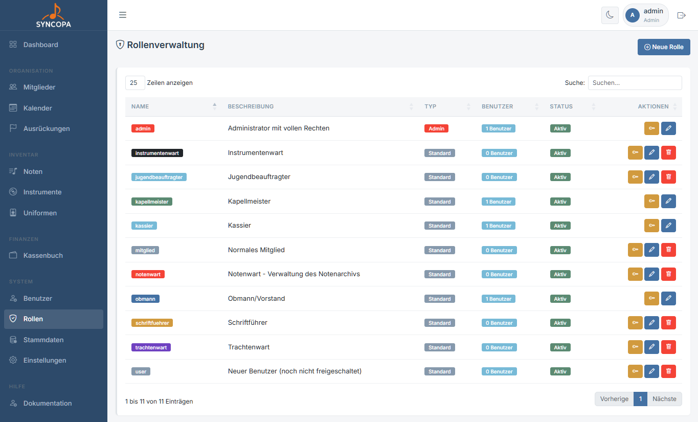
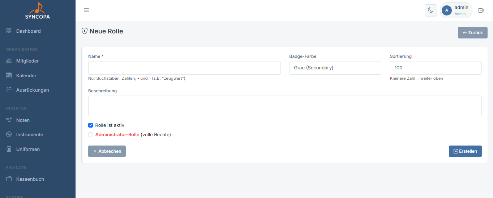
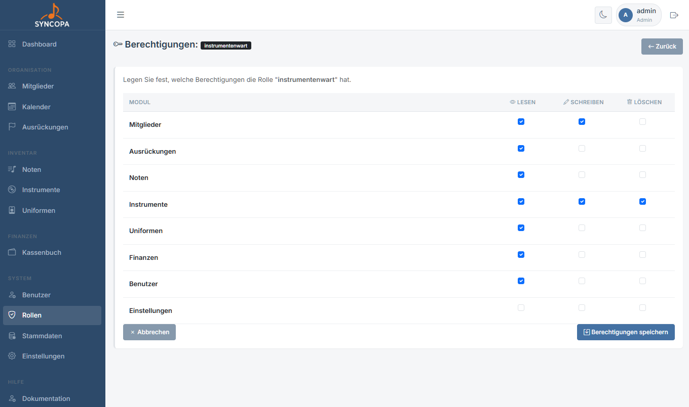

# Rollen & Berechtigungen

**Datei:** `rollen.php`
**Berechtigung:** Nur **Administratoren**

Das Rollen-Berechtigungssystem steuert granular, wer welche Aktionen in Syncopa durchführen darf.

---

## Konzept: Mehrfachrollen

Ein Benutzer kann in Syncopa **mehrere Rollen gleichzeitig** haben (z.B. gleichzeitig „Kassier" und „Schriftführer"). Es gelten dann die **kombinierten Berechtigungen aller** zugewiesenen Rollen – ein Benutzer darf alles, was mindestens eine seiner Rollen erlaubt.

Jede Rolle hat für jedes Modul (Mitglieder, Noten, Finanzen, …) drei Berechtigungsstufen:

| Berechtigung | Beschreibung |
|---|---|
| Lesen | Daten ansehen |
| Schreiben | Daten anlegen und bearbeiten (erfordert Lesen) |
| Löschen | Datensätze löschen (erfordert Lesen und Schreiben) |

> ℹ️ Wer löschen darf, muss auch lesen und schreiben können – das System aktiviert die niedrigeren Stufen automatisch mit. Die Berechtigung wird bei **jedem** Seitenaufruf neu geprüft; Änderungen wirken sofort.

Wie einem Benutzer mehrere Rollen zugewiesen werden, steht unter [Benutzerverwaltung – Mehrfachrollen](benutzer.md#mehrfachrollen-pro-benutzer).

---

## Module mit Berechtigungen

| Modul | Beschreibung |
|---|---|
| Mitglieder | Mitgliederverwaltung |
| Ausrückungen | Ausrückungsplanung |
| Noten | Notenarchiv |
| Live (Notenansicht) | Proben-/Live-Modul (Noten-PDF-Ansicht) |
| Instrumente | Instrumenteninventar |
| Uniformen | Uniformverwaltung |
| Finanzen | Einnahmen & Ausgaben |
| Formationen | Verwaltung mehrerer Formationen |
| Festverwaltung | Fest-/Veranstaltungslogistik |
| Benutzer | Benutzerverwaltung |
| Einstellungen | Systemeinstellungen |

---

## Rollen sortieren

Die Reihenfolge der Rollen in der Übersicht kann per **Drag & Drop** geändert werden: Zeile an der Griffleiste (Symbol ⠿) links greifen und verschieben. Die neue Reihenfolge wird automatisch im Hintergrund gespeichert – ein Klick auf „Speichern" ist nicht nötig.

---

## Neue Rolle erstellen

**Datei:** `rolle_bearbeiten.php`

1. Navigiere im Menü zu **System → Rollen**
2. Klicke auf **+ Neue Rolle**
3. Vergib einen **Namen** (nur Buchstaben, Zahlen, `-` und `_`, z.B. `zeugwart`)
4. Wähle eine **Badge-Farbe** zur optischen Unterscheidung
5. Optional: Häkchen bei **„Administrator-Rolle"** für automatischen Vollzugriff auf alle Module
6. **Erstellen**

### Formularfelder

| Feld | Pflicht | Beschreibung |
|---|---|---|
| Name | ✅ | Interner Name der Rolle |
| Badge-Farbe | – | Farbe des Rollen-Badges in Listen |
| Sortierung | – | Kleinere Zahl = weiter oben in der Liste |
| Beschreibung | – | Freitext zur Erläuterung |
| Administrator-Rolle | – | Vollzugriff auf alle Module, kann bei bestehenden Admin-Rollen nicht mehr entfernt werden |
| Rolle ist aktiv | – | Inaktive Rollen können keinem Benutzer mehr zugewiesen werden |

Nach dem Speichern kannst du direkt zu den **Berechtigungen** dieser Rolle springen.

---

## Berechtigungen einer Rolle festlegen

**Datei:** `berechtigungen_bearbeiten.php`

1. Klicke in der Rollenliste beim **Schlüssel-Symbol** einer Rolle
2. Setze pro Modul die Häkchen bei Lesen / Schreiben / Löschen
3. Klicke auf **Berechtigungen speichern**

> 💡 **Tipp:** Ein Klick auf „Schreiben" aktiviert automatisch „Lesen" mit, ein Klick auf „Löschen" aktiviert automatisch beide darunterliegenden Stufen mit – und umgekehrt wird beim Entfernen von „Lesen" auch „Schreiben"/„Löschen" entfernt.

### Berechtigungs-Matrix (alle Rollen auf einen Blick)

**Datei:** `berechtigungen_matrix.php`

Wer nicht Rolle für Rolle einzeln bearbeiten möchte, findet über **System → Rollen → Berechtigungs-Matrix** eine Gesamtübersicht: Alle Module als Zeilen, alle Rollen als Spalten mit den drei Kästchen **L** (Lesen) / **S** (Schreiben) / **D** (Löschen) direkt anklickbar. Ein Klick auf **„Berechtigungen speichern"** übernimmt alle Änderungen auf einmal.

---

## Sonderrolle „extern" (Gastmusiker)

Für externe Gastmusiker – z.B. Aushilfen, die nur bei einzelnen Ausrückungen mitspielen – gibt es die vorinstallierte Rolle **`extern`**. Sie hat standardmäßig nur **Lesezugriff** auf:

- Ausrückungen
- Noten
- Formationen

> ⚠️ **Achtung:** Ein Benutzer mit der Rolle `extern` **muss** einer Formation zugeordnet sein (über das verknüpfte Mitglied, siehe [Formationszuordnung](benutzer.md#formationszuordnung-eines-benutzers)). Ohne Formation wird der Gastmusiker nach dem Login automatisch abgemeldet.

---

## Admin-Rolle

Die Admin-Rolle hat immer **Vollzugriff** und kann nicht zu einer normalen Rolle heruntergestuft werden. Sie gibt außerdem exklusiv Zugriff auf:

- Benutzerverwaltung
- Rollenverwaltung
- Stammdaten
- Systemeinstellungen (inkl. System-Update)

> ⚠️ **Sicherheitshinweis:** Vergib die Admin-Rolle nur an absolut vertrauenswürdige Personen. Im Normalbetrieb sollten Obmänner, Kassiere usw. eigene Rollen mit auf das Nötige beschränkten Rechten bekommen.

---

## Rolle löschen

Eine Rolle kann nur gelöscht werden, wenn sie **kein** Admin-Flag hat und **keinem** Benutzer mehr zugewiesen ist. Andernfalls zeigt Syncopa eine entsprechende Fehlermeldung.

---

## Berechtigung wird verweigert

Wenn ein Benutzer auf eine Seite zugreift, für die keine seiner Rollen die nötige Berechtigung hat, wird er mit einer Fehlermeldung zurück zum Dashboard geleitet.

Wenn ein Vereinsmitglied Zugriff auf ein weiteres Modul benötigt:

1. **System → Benutzer** öffnen und den Benutzer bearbeiten, **oder**
2. **System → Rollen** öffnen, die betreffende Rolle wählen
3. Die fehlende Berechtigung im Berechtigungs-Formular (oder in der Matrix) aktivieren
4. **Speichern** – die Änderung gilt sofort ab dem nächsten Seitenaufruf
