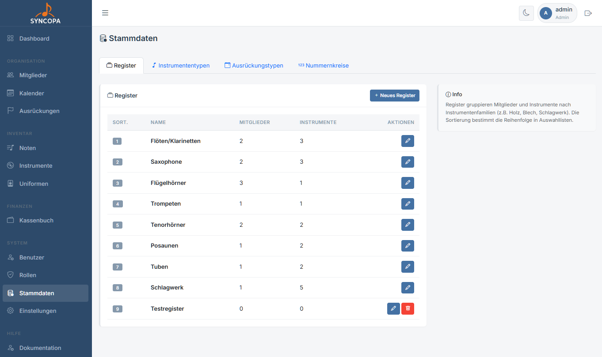
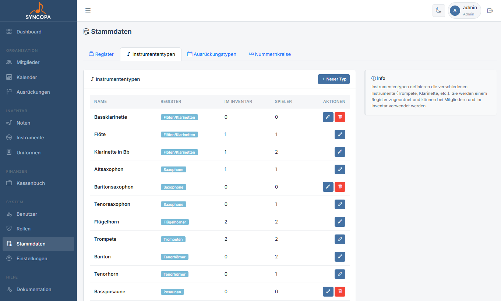
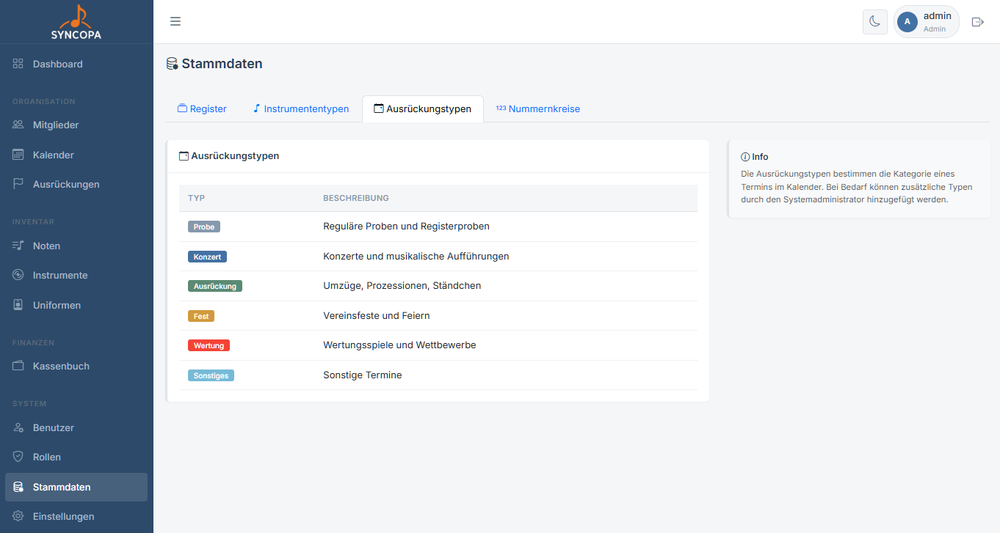
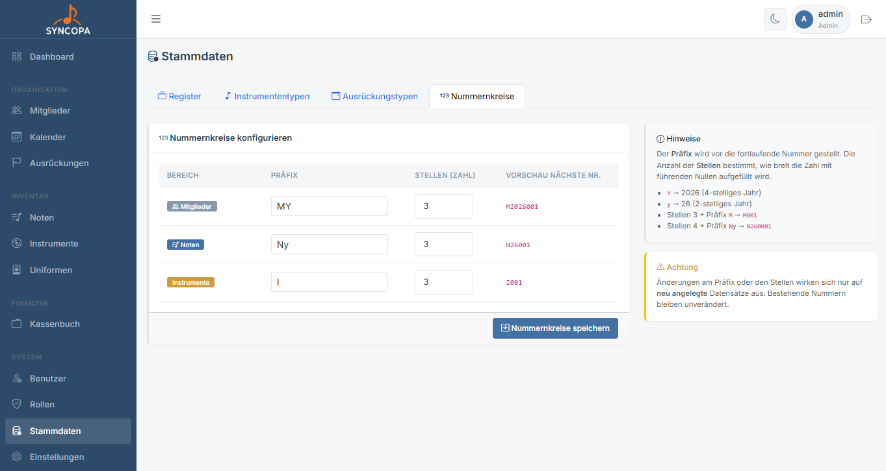

# Stammdaten

**Datei:** `stammdaten.php`  
**Berechtigung:** Nur **Admin**

Stammdaten sind die Grundkonfiguration der Anwendung – Werte die in Dropdowns und Auswahllisten verwendet werden.

---

## Was gehört zu den Stammdaten?

| Bereich | Beispielwerte |
|---|---|
| **Register** | Klarinette, Trompete, Flügelhorn, Posaune, Tuba, Schlagwerk |
| **Instrumententypen** | Trompete B, Klarinette Es, Tuba F, Schlagzeug |
| **Ausrückungstypen** | Probe, Konzert, Fest etc. |
| **Nummernkreise** | z.B. für Mitglieder, Noten |

---

## Register verwalten

Register sind die musikalischen Gruppen im Verein (z.B. nach Instrumentenfamilien).

1. Navigiere zu **Administration → Stammdaten → Register**
2. Klicke **+ Neues Register**
3. Name eingeben
4. Reihenfolge per Sortierung anpassen
5. **Speichern**

> ⚠️ **Hinweis:** Ein Register kann nur gelöscht werden, wenn ihm **keine Mitglieder** mehr zugeordnet sind.

---

## Instrumententypen verwalten

Instrumententypen definieren die verfügbaren Instrumentgattungen im Inventar.

1. Navigiere zu **Administration → Stammdaten → Instrumententypen**
2. Klicke **+ Neuer Instrumententyp**
3. Name und (Haupt-)Register eingeben
4. **Speichern**

---

## Ausrückungstypen

Kategorien für die Ausrückungen.

> ⚠️ **Hinweis:** Diese sind momentan noch fix im System hinterlegt. Ausrückungstypen Verwaltung folgt...

---

## Nummernkreise

Nummernkreise für die Mitglieder, Noten und Instrumente.

> ⚠️ **Hinweis:** Beschreibung in der rechten Tabelle

---

## Empfohlene Einrichtungsreihenfolge

Bevor Mitglieder und Instrumente angelegt werden, sollten die Stammdaten vollständig konfiguriert sein:

1. ✅ Register anlegen
2. ✅ Instrumententypen anlegen
3. ✅ Noten-Kategorien anlegen
4. ✅ Uniform-Kategorien anlegen
5. → Jetzt [Mitglieder](mitglieder.md) anlegen
