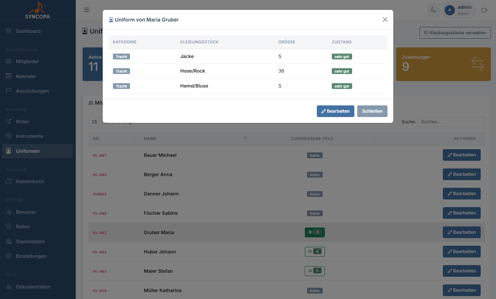
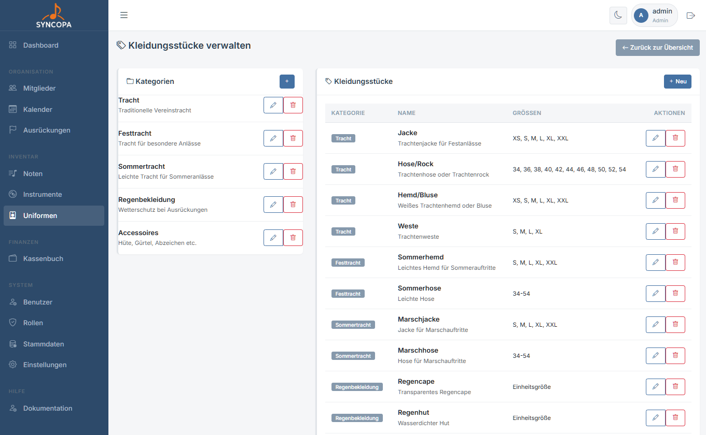
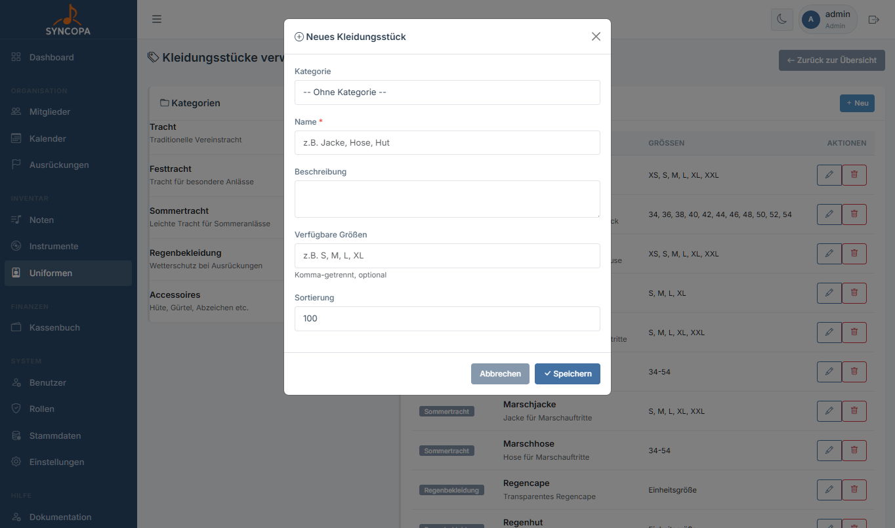
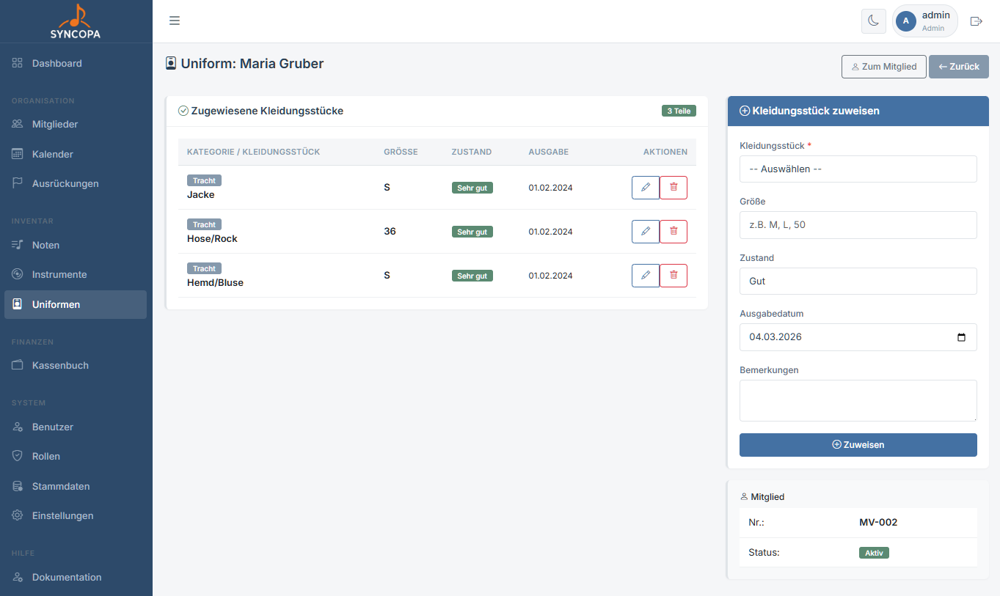

# Uniformen

**Datei:** `uniformen.php` / `uniform_kleidungsstuecke.php`  
**Berechtigung:** `uniformen – lesen`

Die Uniformverwaltung erfasst alle Kleidungsstücke des Vereins und ermöglicht die Ausgabe an Mitglieder.

Die Lagerverwaltung bzw. der Uniform Bestand ist aktuell noch nicht Verwaltbar, lediglich die ausgegebenen Kleidungsstücke und Accessoires. Coming soon...



---

## Struktur der Uniformverwaltung

Syncopa unterscheidet zwei Ebenen:

```
Uniforms-Kategorien (z.B. "Ausgehuniform", "Sommerkleidung")
  └── Kleidungsstücke (z.B. "Jacke Gr. 52", "Hose Gr. 48")
        └── Zuordnung zu Mitglied
```

---

## Kategorien verwalten

**Datei:** `uniform_kategorien.php`

Zu erreichen mit `Kleidungsstücke verwalten`



Kategorien sind übergeordnete Gruppen (z.B. „Trachtenanzug", „Sommeruniform").

1. Navigiere zu **Uniformen → Kategorien**
2. Klicke auf **+ Neue Kategorie**
3. Name eingeben → **Speichern**
4. Sortierung → niedrigste Zahl oben

---

## Kleidungsstücke verwalten

**Datei:** `uniform_kleidungsstuecke.php`



| Spalte | Beschreibung |
|---|---|
| Kategorie | Übergeordnete Gruppe |
| Name | z.B. „Jacke blau" |
| Beschreibung | Beschreibungstext |
| Verfügbare Größen | z.B.: S, M, L, XL |
| Sortierung | niedrigste Zahl oben |

---

## Uniform ausgeben

**Datei:** `uniform_mitglied.php`  
**Berechtigung:** `uniformen – schreiben`



1. Öffne die Liste der **Kleidungsstücke** bei Mitglied bearbeiten
2. Im Formular auf der rechten Seite ** Kleidungsstücke zuweisen**
3. alle Formularfelder ausfüllen bzw. auswählen
4. Trage das **Ausgabedatum** ein
5. Klicke **Zuweisen**

Das Kleidungsstück wird als `ausgegeben` markiert und erscheint in der Mitgliederdetailseite.

---
> 💡 **Info:** Die Lagerverwaltung bzw. der Uniform Bestand ist aktuell noch nicht Verwaltbar, lediglich die ausgegebenen Kleidungsstücke und Accessoires. Coming soon...

    ## Uniform zurücknehmen

    **Datei:** `uniform_zuruecknehmen.php`  
    **Berechtigung:** `uniformen – schreiben`

    > 📸 **Screenshot:** *Button „Zurücknehmen" neben ausgegebenen Kleidungsstücken in der Mitgliederdetailseite*

    1. Öffne die **Detailseite des Mitglieds**
    2. Gehe zum Reiter **Uniform**
    3. Klicke beim Kleidungsstück auf **„Zurücknehmen"**
    4. Optional: Zustandsnotiz hinterlegen
    5. Bestätigen

    Das Kleidungsstück ist wieder **verfügbar**.

---

