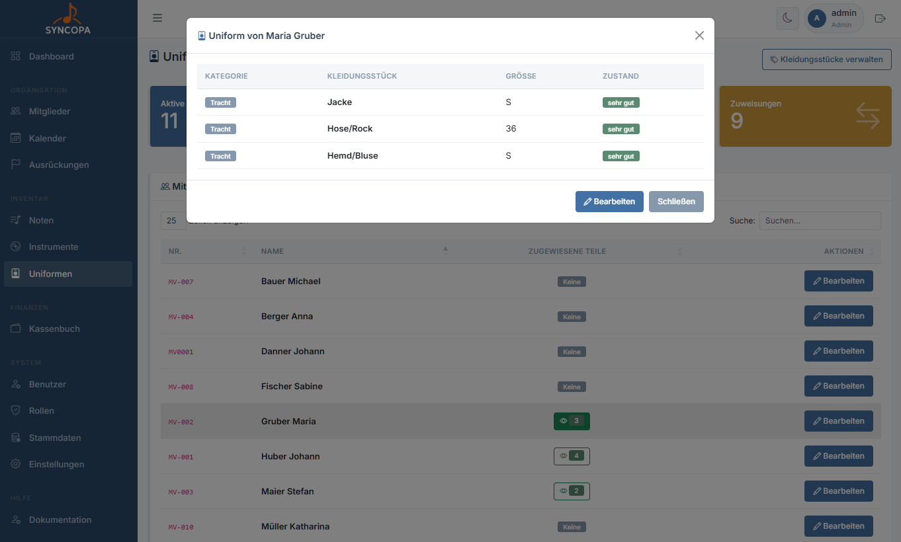
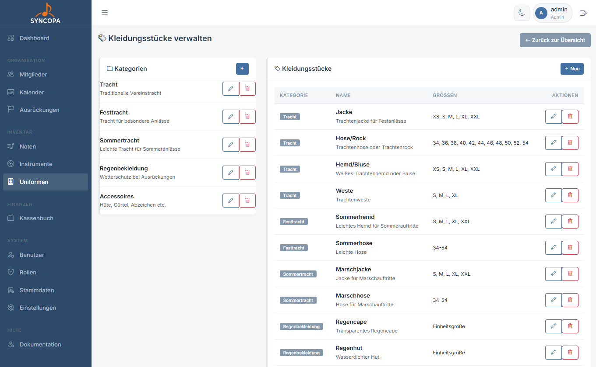
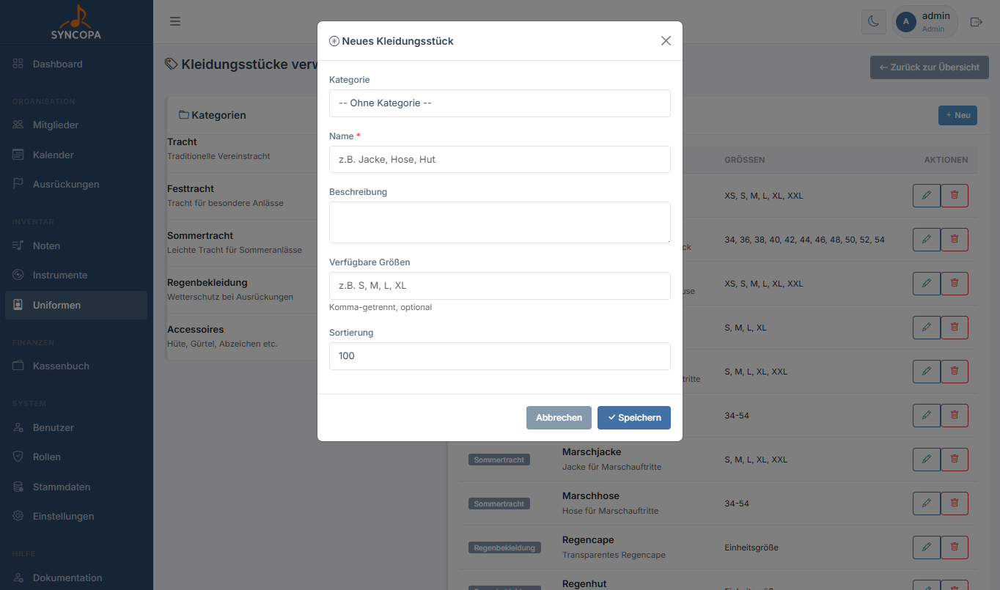
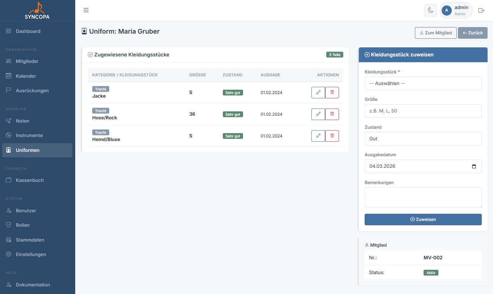

# Uniformen

**Datei:** `uniformen.php`  
**Berechtigung:** `uniformen – lesen`

Die Uniformverwaltung erfasst, welche Kleidungsstücke es im Verein gibt und wer welches Stück gerade trägt bzw. besitzt.



> 💡 **Info:** Eine echte Lager-/Bestandsverwaltung (z.B. „5 Jacken Gr. 50 auf Lager") gibt es aktuell nicht. Verwaltet werden ausschließlich die **Kleidungsstück-Typen** (z.B. „Jacke", „Hose") und die **Zuweisungen an einzelne Mitglieder**.

---

## Struktur der Uniformverwaltung

Syncopa unterscheidet drei Ebenen:

```
Kategorie (z.B. "Ausgehuniform", "Sommerkleidung")
  └── Kleidungsstück (z.B. "Jacke", "Hose", "Hut")
        └── Zuweisung an ein Mitglied (mit Größe, Zustand, Ausgabedatum)
```

---

## Übersicht

Die Startseite der Uniformverwaltung zeigt vier Kennzahlen sowie eine Liste aller aktiven Mitglieder:

| Kennzahl | Bedeutung |
|---|---|
| Aktive Mitglieder | Anzahl aktiver Vereinsmitglieder |
| Mit Uniform | Anzahl Mitglieder, denen mindestens ein Kleidungsstück zugewiesen ist |
| Kleidungsstücke | Anzahl angelegter Kleidungsstück-Typen |
| Zuweisungen | Anzahl aller Zuweisungen insgesamt |

In der Mitgliederliste sieht man pro Mitglied, wie viele Kleidungsstücke bereits zugewiesen sind:

1. Klicke auf die grüne Zahl bei **„Zugewiesene Teile"**, um eine Schnellübersicht als Popup zu öffnen
2. Klicke auf **„Bearbeiten"**, um zur vollständigen Uniform-Seite des Mitglieds zu wechseln

---

## Kategorien und Kleidungsstücke verwalten

**Datei:** `uniform_kleidungsstuecke.php`  
**Berechtigung:** `uniformen – schreiben`

Über den Button **„Kleidungsstücke verwalten"** auf der Übersichtsseite gelangt man zur zentralen Verwaltungsseite. Hier werden sowohl die Kategorien (linke Spalte) als auch die eigentlichen Kleidungsstücke (rechte Spalte) gepflegt.



### Kategorie anlegen

1. Klicke links bei **Kategorien** auf **„+"**
2. Name eingeben (z.B. „Festtracht", „Sommertracht", „Regenbekleidung")
3. Optional: Beschreibung und Sortierung (kleinere Zahl = weiter oben)
4. **Speichern**

### Kleidungsstück anlegen

**Datei:** `uniform_kleidungsstuecke.php`



1. Klicke rechts bei **Kleidungsstücke** auf **„+ Neu"**
2. Formular ausfüllen
3. **Speichern**

| Feld | Pflicht | Beschreibung |
|---|---|---|
| Kategorie | – | Übergeordnete Gruppe |
| Name | ✅ | z.B. „Jacke", „Hose", „Hut" |
| Beschreibung | – | Freitext |
| Verfügbare Größen | – | Komma-getrennt, z.B. `S, M, L, XL` |
| Sortierung | – | Kleinere Zahl = weiter oben |

Für jedes Kleidungsstück zeigt die Tabelle direkt an, wie viele Zuweisungen es je Größe schon gibt (z.B. „M: 3×, L: 5×") sowie einen Button **„Fehlend"** mit der Anzahl aktiver Mitglieder, die dieses Kleidungsstück noch nicht bekommen haben.

### Fehlende Mitglieder direkt versorgen

Klickt man bei einem Kleidungsstück auf **„Fehlend"**, öffnet sich eine Liste aller aktiven Mitglieder, die dieses Stück noch nicht zugewiesen bekommen haben. Direkt in dieser Liste kann man:

- **Größe**, **Zustand** und **Ausgabedatum** je Zeile eintragen und mit **„Zuweisen"** sofort zuordnen
- über **„Nicht benötigt"** ein Mitglied markieren, das dieses Kleidungsstück gar nicht braucht (z.B. weil es ein anderes Modell trägt) – damit taucht die Person nicht mehr in der Fehlend-Liste auf

> 💡 **Tipp:** Diese Fehlend-Liste ist der schnellste Weg, um vor einem Auftritt zu prüfen, ob wirklich alle Musiker:innen komplett eingekleidet sind.

---

## Uniform einem Mitglied zuweisen

**Datei:** `uniform_mitglied.php`  
**Berechtigung:** `uniformen – schreiben`



1. Öffne in der Übersicht bei einem Mitglied **„Bearbeiten"**
2. Wähle im Kasten **„Kleidungsstück zuweisen"** das gewünschte Kleidungsstück aus (nur Stücke, die die Person noch nicht hat, werden angezeigt)
3. Trage **Größe**, **Zustand** und **Ausgabedatum** ein
4. Optional: Bemerkung ergänzen
5. Klicke **„Zuweisen"**

### Formularfelder

| Feld | Pflicht | Beschreibung |
|---|---|---|
| Kleidungsstück | ✅ | Aus der Liste noch nicht zugewiesener Stücke |
| Größe | – | Freitext oder Auswahl aus S/M/L/XL/XXL |
| Zustand | – | `sehr gut` · `gut` · `befriedigend` · `schlecht` |
| Ausgabedatum | – | Standard: heutiges Datum |
| Bemerkungen | – | z.B. Besonderheiten zum Stück |

Das zugewiesene Kleidungsstück erscheint danach in der Liste **„Zugewiesene Kleidungsstücke"** auf derselben Seite sowie in der Mitgliederdetailseite unter dem Reiter **Uniform**.

---

## Zuweisung bearbeiten oder zurücknehmen

Auf derselben Seite (`uniform_mitglied.php`) kann jede bereits zugewiesene Zeile bearbeitet oder entfernt werden:

1. Klicke bei der Zeile auf das **Stift-Symbol**, um Größe, Zustand oder Bemerkung zu ändern → **Speichern**
2. Klicke auf das **Papierkorb-Symbol**, um das Kleidungsstück wieder zurückzunehmen
3. Bestätige die Sicherheitsabfrage

Das Kleidungsstück gilt danach wieder als nicht zugewiesen und taucht bei diesem Mitglied erneut in der Auswahlliste zum Zuweisen auf.

> ⚠️ **Achtung:** Das Entfernen einer Zuweisung löscht den Datensatz endgültig – es gibt keine Historie früherer Ausgaben zu einem Kleidungsstück.

---

## Berechtigungen im Überblick

| Aktion | Benötigte Berechtigung |
|---|---|
| Übersicht ansehen | `uniformen – lesen` |
| Kategorien/Kleidungsstücke anlegen und bearbeiten | `uniformen – schreiben` |
| Kleidungsstück zuweisen, bearbeiten | `uniformen – schreiben` |
| Kategorie/Kleidungsstück löschen, Zuweisung entfernen | `uniformen – loeschen` |

> ⚠️ **Achtung:** Eine Kategorie kann nur gelöscht werden, solange ihr keine Kleidungsstücke mehr zugeordnet sind.
